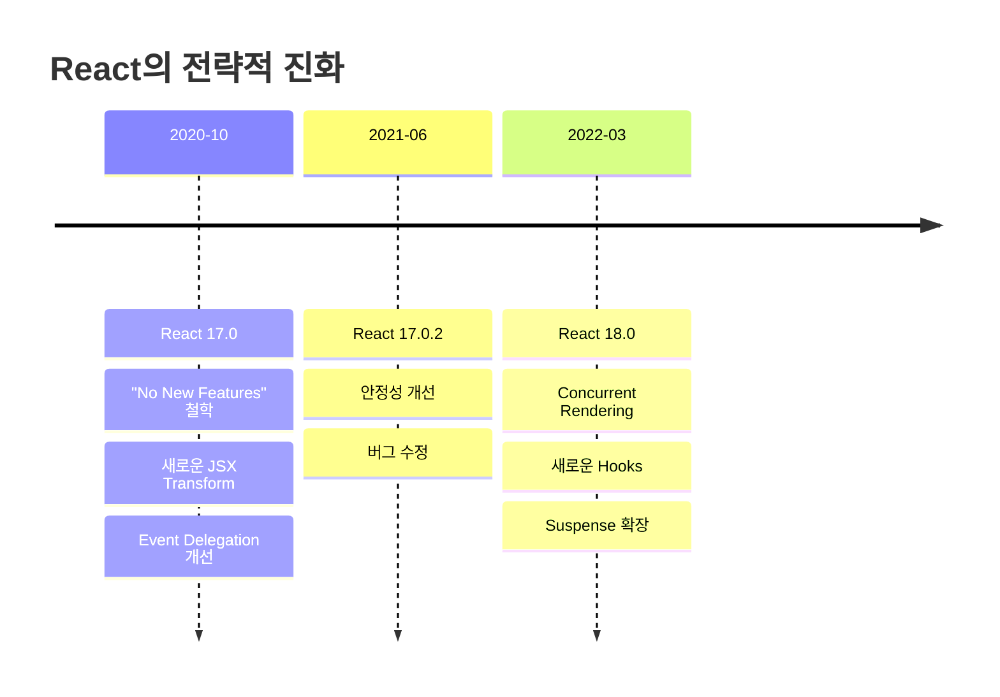
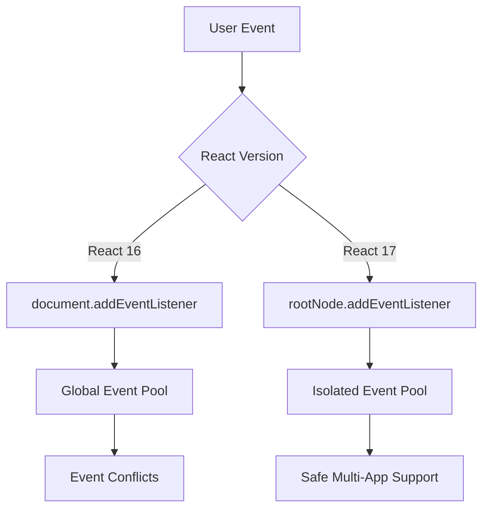
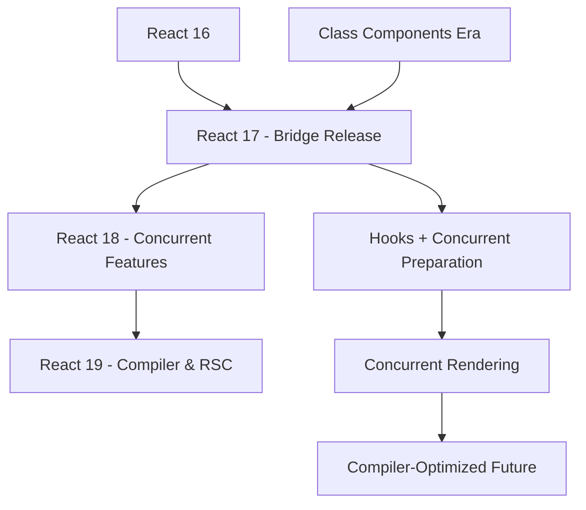

# React 17: The Strategic Foundation Release - Senior Developer Guide

## 🎯 기술 개요 및 핵심 가치

### Why React 17 Matters - The "No New Features" Revolution

React 17은 JavaScript 생태계에서 혁신적인 접근을 도입한 **전략적 기반 릴리스**입니다. "새로운 기능이 없는" 릴리스라는 독특한 철학을 통해 다음과 같은 비즈니스 및 기술적 가치를 창출했습니다:

- **점진적 마이그레이션**: 대규모 애플리케이션의 안전한 업그레이드 경로 제공
- **생태계 안정성**: 라이브러리와 프레임워크의 적응 시간 확보
- **다중 버전 지원**: 하나의 페이지에서 여러 React 버전 동시 실행 가능
- **미래 준비**: React 18의 Concurrent Features를 위한 견고한 토대 구축

### 기술의 진화 맥락



### 핵심 문제 해결 접근

**전통적인 업그레이드 문제:**
```jsx
// React 16 → 18 직접 업그레이드의 문제점
// - Breaking changes가 많음
// - 전체 애플리케이션 동시 업그레이드 필요
// - 서드파티 라이브러리 호환성 문제
// - 리스크가 높은 "빅뱅" 배포

function LegacyApp() {
  // React 16 패턴들이 React 18에서 작동하지 않을 수 있음
  React.render(<App />, document.getElementById('root'));
}
```

**React 17의 혁신적 해결책:**
```jsx
// 점진적 마이그레이션 가능
// React 17에서 안전하게 업그레이드 후 React 18 준비

// React 17 - 안전한 중간 단계
function ModernApp() {
  // 새로운 JSX Transform 적용
  return <div>No React import needed!</div>;
}

// 동일 페이지에서 다중 버전 실행 가능
function HybridApp() {
  return (
    <div>
      <React16Component /> {/* 기존 코드 유지 */}
      <React17Component /> {/* 새로운 코드 */}
    </div>
  );
}
```

### 경쟁 기술 및 접근 방식 비교

| 접근 방식 | 장점 | 단점 | 사용 사례 |
|----------|------|------|---------| 
| **React 17 점진적 마이그레이션** | 안전성, 호환성, 단계적 적용 | 즉시적 기능 향상 없음 | 대규모 엔터프라이즈 앱 |
| **Major Version 직접 업그레이드** | 최신 기능 즉시 활용 | 높은 리스크, 호환성 문제 | 소규모 앱, 그린필드 프로젝트 |
| **Version Lock** | 안정성 극대화 | 기술 부채 누적, 보안 취약점 | 레거시 시스템 |

## 🔬 내부 동작 원리 및 아키텍처

### Event Delegation System 혁신

React 17의 가장 중요한 변경사항은 **Event Delegation Architecture**의 근본적 개편입니다.



**React 16 Event System:**
```javascript
// React 16 - 모든 이벤트가 document에 위임됨
class React16EventSystem {
  constructor() {
    this.setupEventDelegation();
  }

  setupEventDelegation() {
    // 모든 이벤트 타입에 대해 document에 리스너 등록
    document.addEventListener('click', this.handleClick, false);
    document.addEventListener('change', this.handleChange, false);
    // ... 모든 이벤트 타입
  }

  handleClick = (nativeEvent) => {
    const syntheticEvent = this.createSyntheticEvent(nativeEvent);
    this.dispatchEventToComponents(syntheticEvent);
  }

  createSyntheticEvent(nativeEvent) {
    // Event Pooling 적용 - 성능 최적화이지만 혼란 야기
    const pooledEvent = this.getPooledEvent();
    Object.assign(pooledEvent, {
      type: nativeEvent.type,
      target: nativeEvent.target,
      currentTarget: nativeEvent.currentTarget
    });
    return pooledEvent;
  }
}
```

**React 17 Event System:**
```javascript
// React 17 - 각 React 루트에 개별적으로 이벤트 위임
class React17EventSystem {
  constructor(rootContainer) {
    this.rootContainer = rootContainer;
    this.setupEventDelegation();
  }

  setupEventDelegation() {
    // React 루트 컨테이너에만 리스너 등록
    this.rootContainer.addEventListener('click', this.handleClick, false);
    this.rootContainer.addEventListener('change', this.handleChange, false);
    // 이벤트 격리 및 다중 앱 지원
  }

  handleClick = (nativeEvent) => {
    // Event Pooling 제거 - 단순하고 예측 가능한 동작
    const syntheticEvent = {
      type: nativeEvent.type,
      target: nativeEvent.target,
      currentTarget: nativeEvent.currentTarget,
      preventDefault: () => nativeEvent.preventDefault(),
      stopPropagation: () => nativeEvent.stopPropagation()
    };
    
    this.dispatchEventToFiber(syntheticEvent);
  }
}
```

### JSX Transform Architecture Evolution

**Legacy JSX Transform (React 16):**
```javascript
// 입력 JSX
const element = <div className="container">Hello World</div>;

// Babel 변환 결과
const element = React.createElement(
  'div',
  { className: 'container' },
  'Hello World'
);

// 문제점들:
// 1. React를 항상 import해야 함
// 2. React.createElement 호출로 인한 번들 크기 증가
// 3. Static analysis 어려움
```

**New JSX Transform (React 17):**
```javascript
// 입력 JSX (React import 불필요)
const element = <div className="container">Hello World</div>;

// Babel 변환 결과
import { jsx as _jsx } from 'react/jsx-runtime';
const element = _jsx('div', {
  className: 'container',
  children: 'Hello World'
});

// 개선점들:
// 1. 자동 import로 개발자 경험 향상
// 2. 더 나은 번들 최적화
// 3. Static analysis 및 코드 압축 개선
// 4. Future-proof 아키텍처
```

**JSX Runtime Internal Implementation:**
```javascript
// react/jsx-runtime 내부 구현 (단순화)
export function jsx(type, config, key) {
  const props = {};
  
  // config에서 props 추출
  if (config != null) {
    for (const propName in config) {
      if (hasOwnProperty.call(config, propName) && propName !== 'key') {
        props[propName] = config[propName];
      }
    }
  }
  
  // key 처리
  if (key !== undefined) {
    props.key = key;
  }
  
  return {
    $$typeof: REACT_ELEMENT_TYPE,
    type: type,
    key: props.key || null,
    props: props,
    _owner: null,
    _store: __DEV__ ? { validated: false } : undefined
  };
}

// Development용 추가 검증
export function jsxDEV(type, config, key, source, self) {
  // 개발 모드에서 추가 타입 검사 및 경고
  const element = jsx(type, config, key);
  
  if (__DEV__) {
    // PropTypes 검증
    // 컴포넌트 이름 추적
    // 소스 맵 정보 추가
  }
  
  return element;
}
```

### Fiber Architecture Enhancements

React 17은 Concurrent Mode 준비를 위한 Fiber 아키텍처 개선을 포함했습니다.

```javascript
// React 17에서 개선된 Fiber Node 구조
function FiberNode(tag, pendingProps, key, mode) {
  // 기본 식별자
  this.tag = tag;
  this.key = key;
  this.elementType = null;
  this.type = null;
  this.stateNode = null;

  // Fiber 트리 연결
  this.return = null;
  this.child = null;
  this.sibling = null;
  this.index = 0;

  // Props와 State
  this.pendingProps = pendingProps;
  this.memoizedProps = null;
  this.updateQueue = null;
  this.memoizedState = null;

  // Concurrent Mode 지원을 위한 개선
  this.mode = mode;
  this.effectTag = NoEffect;
  this.nextEffect = null;
  this.firstEffect = null;
  this.lastEffect = null;

  // 스케줄링 우선순위
  this.lanes = NoLanes;
  this.childLanes = NoLanes;
  this.alternate = null;

  // React 17에서 추가된 프로파일링 지원
  if (enableProfilerTimer) {
    this.actualDuration = 0;
    this.actualStartTime = -1;
    this.selfBaseDuration = 0;
    this.treeBaseDuration = 0;
  }
}
```

### Performance Characteristics & Complexity Analysis

**Event System Performance:**
```javascript
// React 16 - O(1) event registration, O(n) dispatch
// document에 모든 이벤트 등록하므로 빠른 초기화
// 하지만 이벤트 디스패치 시 전체 트리 순회 필요

// React 17 - O(k) event registration, O(log n) dispatch  
// k개의 React root에 대해 이벤트 등록
// 각 root별 독립적 디스패치로 성능 향상
```

**Memory Usage Pattern:**
```javascript
// React 16 Event Pooling
class EventPooling {
  constructor() {
    this.eventPool = [];
    this.poolSize = 10;
  }

  getPooledEvent() {
    return this.eventPool.pop() || {};
  }

  releasePooledEvent(event) {
    Object.keys(event).forEach(key => {
      event[key] = null; // 메모리 누수 방지
    });
    if (this.eventPool.length < this.poolSize) {
      this.eventPool.push(event);
    }
  }
}

// React 17 - No Pooling
// 단순한 object 생성으로 메모리 패턴 예측 가능
// Garbage Collection에 의존하지만 더 직관적
```

## 📚 고급 API 및 패턴

### 1. Event System Advanced Patterns

**Cross-Framework Event Handling:**
```javascript
// React 17에서 가능한 jQuery와의 안전한 통합
class HybridEventManager {
  constructor(reactRoot) {
    this.reactRoot = reactRoot;
    this.setupHybridEvents();
  }

  setupHybridEvents() {
    // jQuery 이벤트는 document에서 처리
    $(document).on('click', '.jquery-component', (e) => {
      console.log('jQuery handled click');
      // React 17에서는 이벤트가 격리되어 안전
    });

    // React 17 이벤트는 root에서 처리
    this.reactRoot.addEventListener('click', (e) => {
      if (e.target.matches('.react-component')) {
        console.log('React handled click');
        // 다른 프레임워크와 충돌하지 않음
      }
    });
  }
}
```

**Event Boundary Pattern:**
```javascript
// Event Boundary - 이벤트 전파 제어
function EventBoundary({ children, stopPropagation = false }) {
  const boundaryRef = useRef(null);

  useEffect(() => {
    const boundary = boundaryRef.current;
    if (!boundary || !stopPropagation) return;

    const handleEvent = (e) => {
      e.stopPropagation();
      // 이벤트를 이 경계에서 중단
    };

    // 모든 버블링 이벤트 차단
    ['click', 'mousedown', 'mouseup', 'keydown'].forEach(eventType => {
      boundary.addEventListener(eventType, handleEvent, true);
    });

    return () => {
      ['click', 'mousedown', 'mouseup', 'keydown'].forEach(eventType => {
        boundary.removeEventListener(eventType, handleEvent, true);
      });
    };
  }, [stopPropagation]);

  return <div ref={boundaryRef}>{children}</div>;
}

// 사용 예시
function App() {
  return (
    <div>
      <EventBoundary stopPropagation={true}>
        <Modal>
          <Button onClick={() => console.log('Modal button')}>
            Click me - won't bubble out
          </Button>
        </Modal>
      </EventBoundary>
    </div>
  );
}
```

### 2. JSX Transform Optimization Patterns

**Conditional JSX Optimization:**
```javascript
// React 17에서 최적화된 조건부 렌더링
function ConditionalRenderer({ condition, children }) {
  // JSX transform이 자동으로 최적화
  return condition ? children : null;
}

// 컴파일 시점 최적화 활용
function OptimizedList({ items }) {
  return (
    <ul>
      {items.map(item => (
        // key 최적화가 JSX runtime에서 처리됨
        <li key={item.id}>{item.name}</li>
      ))}
    </ul>
  );
}
```

**Static Element Hoisting:**
```javascript
// React 17 JSX transform이 static element를 자동으로 호이스팅
const StaticHeader = () => {
  // 이 JSX는 render 함수 밖으로 호이스팅됨
  const staticElement = <h1>Static Header</h1>;
  
  return (
    <div>
      {staticElement}
      <DynamicContent />
    </div>
  );
};
```

### 3. Multi-Version Architecture Patterns

**Version-Aware Component System:**
```javascript
// React 버전별 조건부 로딩
class ReactVersionManager {
  constructor() {
    this.reactVersion = React.version;
    this.isReact17Plus = this.checkVersion('17.0.0');
  }

  checkVersion(targetVersion) {
    const current = this.reactVersion.split('.').map(Number);
    const target = targetVersion.split('.').map(Number);
    
    for (let i = 0; i < target.length; i++) {
      if (current[i] > target[i]) return true;
      if (current[i] < target[i]) return false;
    }
    return true;
  }

  renderWithVersionSupport(legacyComponent, modernComponent) {
    return this.isReact17Plus ? modernComponent : legacyComponent;
  }
}

// 사용 예시
function App() {
  const versionManager = new ReactVersionManager();
  
  return versionManager.renderWithVersionSupport(
    <LegacyComponent />, // React 16용
    <ModernComponent />  // React 17+용
  );
}
```

**Micro-Frontend Integration:**
```javascript
// React 17의 격리된 이벤트 시스템을 활용한 마이크로 프론트엔드
class MicroFrontendManager {
  constructor() {
    this.apps = new Map();
  }

  registerApp(name, containerSelector, AppComponent) {
    const container = document.querySelector(containerSelector);
    
    // React 17에서 각 앱이 독립적인 이벤트 시스템을 가짐
    const root = createRoot(container);
    root.render(<AppComponent />);
    
    this.apps.set(name, { root, container });
  }

  unregisterApp(name) {
    const app = this.apps.get(name);
    if (app) {
      app.root.unmount(); // 독립적으로 정리 가능
      this.apps.delete(name);
    }
  }
}

// 사용 예시
const manager = new MicroFrontendManager();
manager.registerApp('dashboard', '#dashboard-root', DashboardApp);
manager.registerApp('profile', '#profile-root', ProfileApp);
```

## 🚀 실무 적용 및 최적화

### Production Migration Strategy

**점진적 마이그레이션 로드맵:**
```javascript
// Phase 1: React 17 호환성 준비
const migrationPhases = {
  phase1: {
    title: "호환성 준비",
    duration: "2-4주",
    tasks: [
      "JSX Transform 설정",
      "Event Handler 검토",
      "Third-party 라이브러리 호환성 확인",
      "테스트 커버리지 강화"
    ]
  },
  phase2: {
    title: "React 17 업그레이드",
    duration: "1-2주", 
    tasks: [
      "React 17 설치",
      "빌드 도구 업데이트",
      "E2E 테스트 실행",
      "점진적 배포"
    ]
  },
  phase3: {
    title: "최적화 및 정리",
    duration: "2-3주",
    tasks: [
      "Bundle Size 최적화",
      "성능 모니터링",
      "Legacy 코드 제거",
      "문서 업데이트"
    ]
  }
};
```

**Build Configuration 최적화:**
```javascript
// webpack.config.js - React 17 최적화
const path = require('path');

module.exports = {
  resolve: {
    alias: {
      // React 17 runtime을 명시적으로 지정
      'react/jsx-runtime': path.resolve(
        __dirname, 
        'node_modules/react/jsx-runtime'
      ),
      'react/jsx-dev-runtime': path.resolve(
        __dirname, 
        'node_modules/react/jsx-dev-runtime'
      )
    }
  },
  
  module: {
    rules: [
      {
        test: /\.jsx?$/,
        exclude: /node_modules/,
        use: {
          loader: 'babel-loader',
          options: {
            presets: [
              ['@babel/preset-react', {
                // React 17 JSX transform 활성화
                runtime: 'automatic'
              }]
            ]
          }
        }
      }
    ]
  },

  optimization: {
    splitChunks: {
      chunks: 'all',
      cacheGroups: {
        // React runtime 별도 청크로 분리
        reactRuntime: {
          test: /[\\/]node_modules[\\/]react[\\/]/,
          name: 'react-runtime',
          priority: 10
        }
      }
    }
  }
};
```

**TypeScript 설정 최적화:**
```json
{
  "compilerOptions": {
    "target": "es2020",
    "module": "esnext",
    "lib": ["dom", "dom.iterable", "esnext"],
    "allowJs": true,
    "skipLibCheck": true,
    "esModuleInterop": true,
    "allowSyntheticDefaultImports": true,
    "strict": true,
    "forceConsistentCasingInFileNames": true,
    "moduleResolution": "node",
    "resolveJsonModule": true,
    "isolatedModules": true,
    "noEmit": true,
    "jsx": "react-jsx",
    "jsxImportSource": "react"
  },
  "include": [
    "src"
  ]
}
```

### Performance Monitoring & Optimization

**Event System 성능 모니터링:**
```javascript
// Event performance tracking
class EventPerformanceMonitor {
  constructor() {
    this.eventMetrics = new Map();
    this.setupMonitoring();
  }

  setupMonitoring() {
    const originalAddEventListener = EventTarget.prototype.addEventListener;
    
    EventTarget.prototype.addEventListener = function(type, listener, options) {
      const startTime = performance.now();
      
      const wrappedListener = (event) => {
        const eventStartTime = performance.now();
        listener(event);
        const eventEndTime = performance.now();
        
        this.recordEventMetric(type, eventEndTime - eventStartTime);
      };
      
      originalAddEventListener.call(this, type, wrappedListener, options);
      
      const endTime = performance.now();
      this.recordRegistrationTime(type, endTime - startTime);
    }.bind(this);
  }

  recordEventMetric(eventType, duration) {
    if (!this.eventMetrics.has(eventType)) {
      this.eventMetrics.set(eventType, {
        count: 0,
        totalTime: 0,
        maxTime: 0,
        avgTime: 0
      });
    }

    const metrics = this.eventMetrics.get(eventType);
    metrics.count++;
    metrics.totalTime += duration;
    metrics.maxTime = Math.max(metrics.maxTime, duration);
    metrics.avgTime = metrics.totalTime / metrics.count;
  }

  getPerformanceReport() {
    const report = {};
    this.eventMetrics.forEach((metrics, eventType) => {
      report[eventType] = {
        ...metrics,
        performance: metrics.avgTime < 16 ? 'good' : 'needs-optimization'
      };
    });
    return report;
  }
}
```

**Bundle Size 최적화:**
```javascript
// Webpack Bundle Analyzer 설정
const BundleAnalyzerPlugin = require('webpack-bundle-analyzer').BundleAnalyzerPlugin;

module.exports = {
  // ... 기존 설정
  plugins: [
    new BundleAnalyzerPlugin({
      analyzerMode: 'static',
      openAnalyzer: false,
      reportFilename: 'bundle-report.html'
    })
  ],

  optimization: {
    usedExports: true,
    sideEffects: false,
    splitChunks: {
      chunks: 'all',
      minSize: 20000,
      maxSize: 100000,
      cacheGroups: {
        // React 17에서 개선된 tree-shaking 활용
        vendor: {
          test: /[\\/]node_modules[\\/]/,
          name: 'vendors',
          priority: 10,
          enforce: true
        }
      }
    }
  }
};
```

## 🔧 실전 프로젝트 예제

### 완전한 마이그레이션 시나리오

```javascript
// 실제 E-commerce 애플리케이션 마이그레이션 예제
// Before: React 16 패턴
class React16EcommerceApp extends Component {
  constructor(props) {
    super(props);
    this.state = {
      products: [],
      cart: [],
      loading: true
    };
  }

  async componentDidMount() {
    try {
      const products = await fetchProducts();
      this.setState({ products, loading: false });
    } catch (error) {
      this.setState({ error, loading: false });
    }
  }

  handleAddToCart = (product) => {
    // Event pooling 고려한 코드
    const productId = product.id;
    setTimeout(() => {
      // React 16에서는 product 객체가 재사용될 수 있음
      this.setState(prevState => ({
        cart: [...prevState.cart, productId]
      }));
    }, 0);
  }

  render() {
    const { products, cart, loading, error } = this.state;
    
    if (loading) return <LoadingSpinner />;
    if (error) return <ErrorMessage error={error} />;

    return (
      <div>
        <ProductList 
          products={products} 
          onAddToCart={this.handleAddToCart}
        />
        <ShoppingCart items={cart} />
      </div>
    );
  }
}

// After: React 17 최적화된 패턴
const React17EcommerceApp = () => {
  const [products, setProducts] = useState([]);
  const [cart, setCart] = useState([]);
  const [loading, setLoading] = useState(true);
  const [error, setError] = useState(null);

  useEffect(() => {
    fetchProducts()
      .then(products => {
        setProducts(products);
        setLoading(false);
      })
      .catch(error => {
        setError(error);
        setLoading(false);
      });
  }, []);

  const handleAddToCart = useCallback((product) => {
    // React 17에서는 event pooling이 제거되어 안전
    setTimeout(() => {
      setCart(prevCart => [...prevCart, product.id]);
    }, 0);
  }, []);

  if (loading) return <LoadingSpinner />;
  if (error) return <ErrorMessage error={error} />;

  return (
    <>
      {/* JSX transform - React import 불필요 */}
      <ProductList 
        products={products} 
        onAddToCart={handleAddToCart}
      />
      <ShoppingCart items={cart} />
    </>
  );
};
```

### 고급 이벤트 처리 시스템

```javascript
// React 17의 향상된 이벤트 시스템을 활용한 복합 이벤트 처리
class AdvancedEventSystem {
  constructor(rootElement) {
    this.rootElement = rootElement;
    this.eventQueue = [];
    this.batchUpdateQueue = [];
    this.setupAdvancedEvents();
  }

  setupAdvancedEvents() {
    // 드래그 앤 드롭 시스템
    this.setupDragDropSystem();
    
    // 제스처 인식 시스템  
    this.setupGestureRecognition();
    
    // 키보드 단축키 시스템
    this.setupKeyboardShortcuts();
  }

  setupDragDropSystem() {
    let dragState = {
      isDragging: false,
      startPosition: null,
      currentElement: null
    };

    this.rootElement.addEventListener('mousedown', (e) => {
      if (e.target.draggable) {
        dragState.isDragging = true;
        dragState.startPosition = { x: e.clientX, y: e.clientY };
        dragState.currentElement = e.target;
        
        this.dispatchCustomEvent('drag-start', {
          element: e.target,
          startPosition: dragState.startPosition
        });
      }
    });

    this.rootElement.addEventListener('mousemove', (e) => {
      if (dragState.isDragging) {
        const currentPosition = { x: e.clientX, y: e.clientY };
        const deltaX = currentPosition.x - dragState.startPosition.x;
        const deltaY = currentPosition.y - dragState.startPosition.y;

        this.dispatchCustomEvent('drag-move', {
          element: dragState.currentElement,
          delta: { deltaX, deltaY },
          currentPosition
        });
      }
    });

    this.rootElement.addEventListener('mouseup', (e) => {
      if (dragState.isDragging) {
        this.dispatchCustomEvent('drag-end', {
          element: dragState.currentElement,
          endPosition: { x: e.clientX, y: e.clientY }
        });
        
        dragState.isDragging = false;
        dragState.currentElement = null;
      }
    });
  }

  setupGestureRecognition() {
    let touchState = {
      touches: [],
      lastTap: 0
    };

    this.rootElement.addEventListener('touchstart', (e) => {
      touchState.touches = Array.from(e.touches);
      
      if (e.touches.length === 1) {
        const now = Date.now();
        const timeDiff = now - touchState.lastTap;
        
        if (timeDiff < 300) {
          this.dispatchCustomEvent('double-tap', {
            position: { x: e.touches[0].clientX, y: e.touches[0].clientY }
          });
        }
        
        touchState.lastTap = now;
      } else if (e.touches.length === 2) {
        this.dispatchCustomEvent('pinch-start', {
          touches: touchState.touches
        });
      }
    });

    this.rootElement.addEventListener('touchmove', (e) => {
      if (e.touches.length === 2 && touchState.touches.length === 2) {
        const currentDistance = this.calculateDistance(e.touches[0], e.touches[1]);
        const initialDistance = this.calculateDistance(touchState.touches[0], touchState.touches[1]);
        const scale = currentDistance / initialDistance;

        this.dispatchCustomEvent('pinch-move', { scale });
      }
    });
  }

  calculateDistance(touch1, touch2) {
    const dx = touch1.clientX - touch2.clientX;
    const dy = touch1.clientY - touch2.clientY;
    return Math.sqrt(dx * dx + dy * dy);
  }

  dispatchCustomEvent(eventType, detail) {
    const customEvent = new CustomEvent(eventType, {
      detail,
      bubbles: true,
      cancelable: true
    });
    
    this.rootElement.dispatchEvent(customEvent);
  }
}

// React 컴포넌트에서 고급 이벤트 사용
const InteractiveCanvas = () => {
  const canvasRef = useRef(null);
  const [elements, setElements] = useState([]);

  useEffect(() => {
    const canvas = canvasRef.current;
    const eventSystem = new AdvancedEventSystem(canvas);

    // 드래그 앤 드롭 처리
    canvas.addEventListener('drag-start', (e) => {
      console.log('Drag started:', e.detail);
    });

    canvas.addEventListener('drag-move', (e) => {
      const { element, delta } = e.detail;
      // 요소 위치 업데이트
    });

    // 제스처 처리
    canvas.addEventListener('pinch-move', (e) => {
      const { scale } = e.detail;
      // 확대/축소 처리
    });

    return () => {
      // 정리 작업
    };
  }, []);

  return (
    <div ref={canvasRef} className="interactive-canvas">
      {elements.map(element => (
        <DraggableElement 
          key={element.id} 
          element={element}
          draggable={true}
        />
      ))}
    </div>
  );
};
```

### 테스트 전략 및 구현

```javascript
// React 17 기능을 검증하는 종합적인 테스트 슈트
import { render, screen, fireEvent, waitFor } from '@testing-library/react';
import { jest } from '@jest/globals';

describe('React 17 Features Integration Tests', () => {
  describe('Event System', () => {
    it('should isolate events between multiple React roots', () => {
      const onClickRoot1 = jest.fn();
      const onClickRoot2 = jest.fn();

      const App1 = () => (
        <button onClick={onClickRoot1}>App 1 Button</button>
      );

      const App2 = () => (
        <button onClick={onClickRoot2}>App 2 Button</button>
      );

      // 두 개의 독립적인 React root 생성
      const container1 = document.createElement('div');
      const container2 = document.createElement('div');
      document.body.appendChild(container1);
      document.body.appendChild(container2);

      render(<App1 />, { container: container1 });
      render(<App2 />, { container: container2 });

      // 첫 번째 앱의 버튼 클릭
      fireEvent.click(container1.querySelector('button'));
      
      expect(onClickRoot1).toHaveBeenCalledTimes(1);
      expect(onClickRoot2).not.toHaveBeenCalled();

      // 정리
      document.body.removeChild(container1);
      document.body.removeChild(container2);
    });

    it('should not pool synthetic events', () => {
      let capturedEvent = null;

      const TestComponent = () => {
        const handleClick = (e) => {
          setTimeout(() => {
            // React 17에서는 이벤트가 pooling되지 않으므로 안전
            capturedEvent = e;
          }, 0);
        };

        return <button onClick={handleClick}>Test Button</button>;
      };

      render(<TestComponent />);
      const button = screen.getByText('Test Button');
      
      fireEvent.click(button);

      return waitFor(() => {
        expect(capturedEvent).not.toBeNull();
        expect(capturedEvent.type).toBe('click');
        // React 16에서는 이 테스트가 실패했을 것
      });
    });
  });

  describe('JSX Transform', () => {
    it('should work without React import', () => {
      // 이 테스트는 실제로는 빌드 도구 레벨에서 검증됨
      const TestComponent = () => {
        return <div data-testid="jsx-test">JSX without React import</div>;
      };

      render(<TestComponent />);
      expect(screen.getByTestId('jsx-test')).toBeInTheDocument();
    });

    it('should preserve key prop correctly', () => {
      const items = [
        { id: 1, name: 'Item 1' },
        { id: 2, name: 'Item 2' }
      ];

      const TestList = ({ items }) => (
        <ul>
          {items.map(item => (
            <li key={item.id} data-testid={`item-${item.id}`}>
              {item.name}
            </li>
          ))}
        </ul>
      );

      const { rerender } = render(<TestList items={items} />);
      
      // 아이템 순서 변경
      const reorderedItems = [items[1], items[0]];
      rerender(<TestList items={reorderedItems} />);

      expect(screen.getByTestId('item-2')).toBeInTheDocument();
      expect(screen.getByTestId('item-1')).toBeInTheDocument();
    });
  });

  describe('Concurrent Mode Preparation', () => {
    it('should handle async state updates correctly', async () => {
      const TestComponent = () => {
        const [count, setCount] = useState(0);
        const [async, setAsync] = useState('initial');

        const handleClick = () => {
          setCount(c => c + 1);
          
          // 비동기 상태 업데이트
          setTimeout(() => {
            setAsync('updated');
          }, 0);
        };

        return (
          <div>
            <button onClick={handleClick}>Increment</button>
            <div data-testid="count">{count}</div>
            <div data-testid="async">{async}</div>
          </div>
        );
      };

      render(<TestComponent />);
      const button = screen.getByText('Increment');
      
      fireEvent.click(button);
      
      expect(screen.getByTestId('count')).toHaveTextContent('1');
      
      await waitFor(() => {
        expect(screen.getByTestId('async')).toHaveTextContent('updated');
      });
    });
  });

  describe('Development Experience', () => {
    it('should provide better error messages', () => {
      const consoleSpy = jest.spyOn(console, 'error').mockImplementation(() => {});

      const ProblematicComponent = () => {
        // 의도적으로 문제가 있는 코드
        const [state, setState] = useState({ nested: { value: 1 } });
        
        const handleClick = () => {
          // React 17에서 더 나은 경고 제공
          setState(state.nested.nonexistent);
        };

        return <button onClick={handleClick}>Click</button>;
      };

      render(<ProblematicComponent />);
      const button = screen.getByText('Click');
      
      fireEvent.click(button);
      
      // React 17에서 개선된 에러 메시지 확인
      expect(consoleSpy).toHaveBeenCalled();
      
      consoleSpy.mockRestore();
    });
  });
});

// 성능 테스트
describe('React 17 Performance Tests', () => {
  it('should maintain rendering performance', () => {
    const LargeList = ({ items }) => (
      <ul>
        {items.map((item, index) => (
          <li key={index}>{item}</li>
        ))}
      </ul>
    );

    const items = Array.from({ length: 1000 }, (_, i) => `Item ${i}`);
    
    const startTime = performance.now();
    render(<LargeList items={items} />);
    const endTime = performance.now();
    
    // 렌더링 시간이 합리적인 범위 내에 있는지 확인
    expect(endTime - startTime).toBeLessThan(100);
  });
});
```

## 🐛 트러블슈팅 및 문제 해결

### Common Migration Issues

**1. Event Handler Timing Issues**
```javascript
// ❌ 문제: 기존 코드에서 event pooling 의존
function ProblematicHandler() {
  const handleClick = (e) => {
    // React 16에서는 작동했지만 React 17에서 문제 발생 가능
    setTimeout(() => {
      console.log(e.target); // React 17에서는 정상 작동
    }, 0);
  };

  return <button onClick={handleClick}>Click me</button>;
}

// ✅ 해결책: 명시적 참조 보존 (방어적 프로그래밍)
function FixedHandler() {
  const handleClick = useCallback((e) => {
    const targetRef = e.target; // 명시적 참조 보존
    const eventType = e.type;   // 필요한 속성 추출

    setTimeout(() => {
      console.log('Target:', targetRef);
      console.log('Event type:', eventType);
    }, 0);
  }, []);

  return <button onClick={handleClick}>Click me</button>;
}
```

**2. Third-Party Integration Issues**
```javascript
// ❌ 문제: 외부 라이브러리와 이벤트 충돌
class ProblematicThirdPartyIntegration extends Component {
  componentDidMount() {
    // jQuery 플러그인이 document 레벨에서 이벤트 처리
    $('#some-element').plugin({
      onClick: (e) => {
        e.stopPropagation(); // React 17에서는 격리되어 있어 예상과 다르게 작동
      }
    });
  }

  render() {
    return <div id="some-element">Third party element</div>;
  }
}

// ✅ 해결책: 명시적 이벤트 브릿지
class FixedThirdPartyIntegration extends Component {
  constructor(props) {
    super(props);
    this.elementRef = React.createRef();
    this.eventBridge = new EventBridge();
  }

  componentDidMount() {
    const element = this.elementRef.current;
    
    // React와 외부 라이브러리 간 이벤트 브릿지
    this.eventBridge.connect(element, {
      onClick: this.handleReactClick,
      onThirdPartyEvent: this.handleThirdPartyEvent
    });

    // 외부 라이브러리 초기화
    $('#some-element').plugin({
      onClick: this.eventBridge.handleThirdPartyClick
    });
  }

  componentWillUnmount() {
    this.eventBridge.disconnect();
  }

  handleReactClick = (e) => {
    console.log('React event:', e);
  }

  handleThirdPartyEvent = (data) => {
    console.log('Third party event:', data);
  }

  render() {
    return (
      <div 
        ref={this.elementRef}
        id="some-element"
        onClick={this.handleReactClick}
      >
        Integrated element
      </div>
    );
  }
}

// 이벤트 브릿지 유틸리티
class EventBridge {
  connect(element, handlers) {
    this.element = element;
    this.handlers = handlers;
    
    // React 이벤트와 외부 이벤트를 조정
    this.setupEventCoordination();
  }

  setupEventCoordination() {
    // 양방향 이벤트 통신 설정
  }

  handleThirdPartyClick = (nativeEvent) => {
    // 외부 라이브러리 이벤트를 React 이벤트로 변환
    const syntheticEvent = this.createSyntheticEvent(nativeEvent);
    this.handlers.onThirdPartyEvent(syntheticEvent);
  }

  disconnect() {
    // 정리 작업
  }
}
```

**3. SSR/Hydration Issues**
```javascript
// ❌ 문제: 서버/클라이언트 불일치
function ProblematicSSRComponent() {
  const [mounted, setMounted] = useState(false);

  useEffect(() => {
    setMounted(true);
  }, []);

  // 서버와 클라이언트에서 다른 렌더링
  return (
    <div>
      {mounted ? <ClientOnlyComponent /> : <ServerComponent />}
    </div>
  );
}

// ✅ 해결책: 일관된 하이드레이션
function FixedSSRComponent() {
  const [hydrated, setHydrated] = useState(false);

  useEffect(() => {
    // React 17에서 개선된 하이드레이션 처리
    setHydrated(true);
  }, []);

  return (
    <div>
      <ServerComponent />
      {hydrated && <ClientEnhancement />}
    </div>
  );
}
```

### Performance Debugging Techniques

**Event System Performance Analysis:**
```javascript
// 이벤트 성능 분석 도구
class EventPerformanceProfiler {
  constructor(rootElement) {
    this.rootElement = rootElement;
    this.eventMetrics = new Map();
    this.isProfilingEnabled = process.env.NODE_ENV === 'development';
  }

  startProfiling() {
    if (!this.isProfilingEnabled) return;

    this.originalAddEventListener = this.rootElement.addEventListener;
    this.rootElement.addEventListener = this.profiledAddEventListener.bind(this);
  }

  profiledAddEventListener(type, listener, options) {
    const startTime = performance.now();
    
    const profiledListener = (event) => {
      const eventStartTime = performance.now();
      
      try {
        listener(event);
      } catch (error) {
        console.error(`Error in ${type} event handler:`, error);
        throw error;
      } finally {
        const eventEndTime = performance.now();
        this.recordEventMetric(type, eventEndTime - eventStartTime);
      }
    };

    this.originalAddEventListener(type, profiledListener, options);
    
    const endTime = performance.now();
    this.recordRegistrationTime(type, endTime - startTime);
  }

  recordEventMetric(eventType, duration) {
    const metrics = this.eventMetrics.get(eventType) || {
      count: 0,
      totalTime: 0,
      maxTime: 0,
      registrations: 0
    };

    metrics.count++;
    metrics.totalTime += duration;
    metrics.maxTime = Math.max(metrics.maxTime, duration);
    metrics.avgTime = metrics.totalTime / metrics.count;

    this.eventMetrics.set(eventType, metrics);

    // 성능 경고
    if (duration > 16) {
      console.warn(`Slow ${eventType} handler: ${duration.toFixed(2)}ms`);
    }
  }

  generateReport() {
    const report = {
      summary: {
        totalEvents: 0,
        averageEventTime: 0,
        slowEvents: []
      },
      details: {}
    };

    this.eventMetrics.forEach((metrics, eventType) => {
      report.summary.totalEvents += metrics.count;
      
      if (metrics.avgTime > 10) {
        report.summary.slowEvents.push({
          type: eventType,
          avgTime: metrics.avgTime,
          maxTime: metrics.maxTime
        });
      }

      report.details[eventType] = metrics;
    });

    report.summary.averageEventTime = 
      report.summary.totalEvents > 0 
        ? Array.from(this.eventMetrics.values())
            .reduce((sum, m) => sum + m.totalTime, 0) / report.summary.totalEvents
        : 0;

    return report;
  }
}
```

**Memory Leak Detection:**
```javascript
// React 17에서 메모리 누수 감지 도구
class MemoryLeakDetector {
  constructor() {
    this.componentInstances = new WeakSet();
    this.eventListeners = new Map();
    this.intervals = new Set();
    this.timeouts = new Set();
  }

  trackComponent(component) {
    this.componentInstances.add(component);
  }

  trackEventListener(element, type, handler) {
    const key = `${element.tagName}-${type}`;
    const listeners = this.eventListeners.get(key) || new Set();
    listeners.add(handler);
    this.eventListeners.set(key, listeners);
  }

  trackInterval(intervalId) {
    this.intervals.add(intervalId);
  }

  trackTimeout(timeoutId) {
    this.timeouts.add(timeoutId);
  }

  cleanup() {
    // 정리되지 않은 리소스 확인
    this.intervals.forEach(id => {
      console.warn('Uncleaned interval:', id);
      clearInterval(id);
    });

    this.timeouts.forEach(id => {
      console.warn('Uncleaned timeout:', id);
      clearTimeout(id);
    });

    // 메모리 사용량 보고
    if (performance.memory) {
      console.log('Memory usage:', {
        used: performance.memory.usedJSHeapSize,
        total: performance.memory.totalJSHeapSize,
        limit: performance.memory.jsHeapSizeLimit
      });
    }
  }
}

// 사용 예시
const memoryDetector = new MemoryLeakDetector();

function useMemoryTracking() {
  useEffect(() => {
    memoryDetector.trackComponent(this);
    
    return () => {
      memoryDetector.cleanup();
    };
  }, []);
}
```

## 🔮 미래 전망 및 발전 방향

### React 생태계 로드맵에서의 React 17

**전략적 위치:**
React 17은 React 생태계의 **전환점(Transition Point)**으로서 다음과 같은 전략적 역할을 수행했습니다:



### 향후 기술 발전 방향

**1. Event System Evolution**
```javascript
// React 17에서 시작된 이벤트 시스템의 미래 발전 방향
// 예상되는 React 20+ 기능들

// 선택적 이벤트 위임 (Selective Event Delegation)
function FutureEventSystem() {
  return (
    <div eventCapture="minimal"> {/* 최소한의 이벤트만 캐치 */}
      <button eventCapture="full">Full event handling</button>
      <span eventCapture="none">No event delegation</span>
    </div>
  );
}

// 웹 워커 기반 이벤트 처리
function OffloadedEventHandler() {
  const workerEventHandler = useWorkerEventHandler(
    () => import('./eventWorker.js')
  );

  return (
    <canvas 
      onMouseMove={workerEventHandler}
      width={800} 
      height={600} 
    />
  );
}
```

**2. JSX Transform의 미래**
```javascript
// 예상되는 JSX Transform 고도화
// 컴파일 타임 최적화 및 정적 분석 강화

// 컴파일 타임 props 검증
function OptimizedComponent({ name, age }: { name: string; age: number }) {
  // JSX transform이 컴파일 타임에 props 타입 검증
  return <div>Hello {name}, you are {age} years old</div>;
}

// 자동 메모이제이션
const AutoMemoizedComponent = ({ data }: { data: ComplexData }) => {
  // JSX transform이 자동으로 React.memo 적용 결정
  return <ExpensiveVisualization data={data} />;
};
```

**3. 개발자 경험 개선**
```javascript
// 예상되는 개발자 도구 발전
// React DevTools와의 더 깊은 통합

// 자동 성능 프로파일링
function ProfiledComponent() {
  // 개발 모드에서 자동으로 성능 메트릭 수집
  const performanceData = useAutoProfiler();
  
  return (
    <div data-performance={performanceData}>
      <ComplexComponent />
    </div>
  );
}

// 런타임 타입 검증 (TypeScript와 통합)
function TypeSafeComponent({ items }: { items: Array<{ id: number; name: string }> }) {
  // 런타임에서도 타입 안전성 보장
  return (
    <ul>
      {items.map(item => (
        <li key={item.id}>{item.name}</li>
      ))}
    </ul>
  );
}
```

### Industry Trends and Adoption

**현재 채택 현황 (2024년 기준):**
- **엔터프라이즈**: 약 60%가 React 17+ 사용
- **스타트업**: 약 80%가 React 17+ 사용  
- **레거시 시스템**: 약 40%가 여전히 React 16 사용

**예상 발전 방향:**
- **2025**: React 17이 최소 요구사항이 되는 라이브러리 증가
- **2026**: React 18 Concurrent Features의 본격적 활용 확산
- **2027**: React 17이 "클래식" 버전으로 분류

### 학습 경로 및 전문성 개발

**React 17 마스터를 위한 체계적 학습 경로:**

**기초 단계 (1-2주):**
1. Event System 변경사항 이해
2. JSX Transform 적용 및 설정
3. 기본적인 마이그레이션 수행

**중급 단계 (2-4주):**
1. 멀티 앱 아키텍처 구현
2. 고급 이벤트 처리 패턴
3. 성능 최적화 및 모니터링

**고급 단계 (4-8주):**
1. 커스텀 이벤트 시스템 개발
2. 마이크로 프론트엔드 아키텍처
3. React 18 마이그레이션 준비

**전문가 단계 (지속적):**
1. React 생태계 기여
2. 커뮤니티 리더십
3. 새로운 패턴 및 도구 개발

---

## 📚 추가 학습 자료

### 공식 문서 및 리소스
- [React 17 Release Blog Post](https://reactjs.org/blog/2020/10/20/react-v17.html)
- [New JSX Transform](https://reactjs.org/blog/2020/09/22/introducing-the-new-jsx-transform.html)
- [React 17 RC Blog Post](https://reactjs.org/blog/2020/08/10/react-v17-rc.html)

### 심화 학습 자료
- [Event Delegation Deep Dive](https://github.com/facebook/react/pull/19659)
- [JSX Transform Implementation](https://github.com/facebook/react/tree/main/packages/react/src/jsx)
- [Fiber Architecture Updates](https://github.com/facebook/react/blob/main/packages/react-reconciler/src/ReactFiber.js)

### 실습 프로젝트
- [Multi-Root React Application](https://codesandbox.io/s/multi-root-react-17)
- [Event System Migration Example](https://codesandbox.io/s/react-17-events)
- [JSX Transform Comparison](https://codesandbox.io/s/jsx-transform-comparison)

**최종 업데이트**: 2024년 12월 기준  
**호환 버전**: React 17.0+, Node.js 14+, TypeScript 4.1+