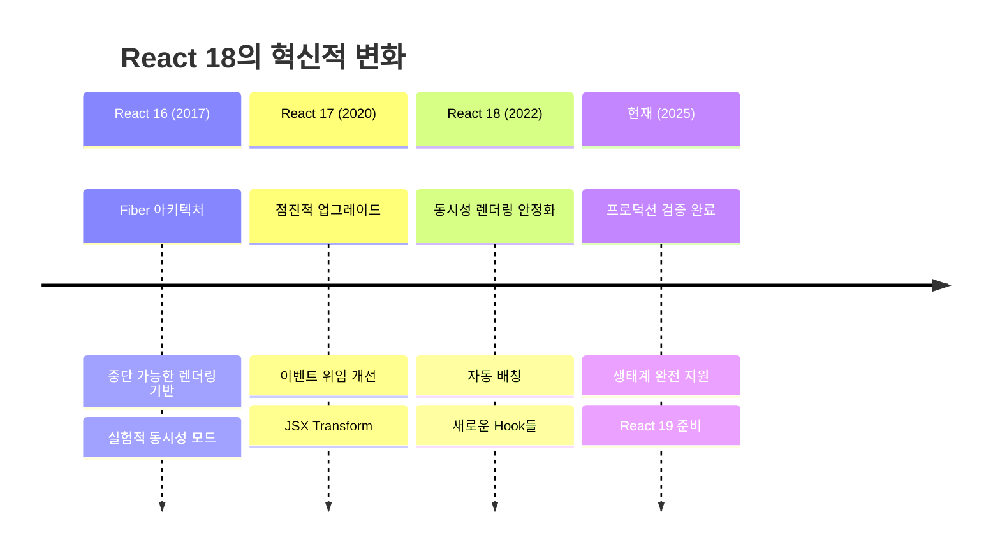

# React 18 가이드

:::info 문서 개요
**Target**: 3+ 년 경력 시니어 React 개발자  
**Depth**: 내부 구조부터 실무 최적화까지  
**Update**: 2025년 8월 최신 정보 기준 (React 18.3.1)
:::

## 🎯 기술 개요 및 핵심 가치

### Why React 18 Matters

React 18은 **동시성 렌더링(Concurrent Rendering)**의 안정화로 React 생태계에 혁신을 가져왔습니다:

- **사용자 경험 혁신**: 중단 가능한 렌더링으로 항상 반응하는 UI
- **성능 최적화**: 자동 배칭과 우선순위 기반 렌더링
- **개발자 경험**: 새로운 Hook과 디버깅 도구
- **생태계 발전**: Next.js, Testing Library 등 전면적 지원

### 기술의 진화



### 핵심 문제 해결

React 18의 Concurrent Features는 현대 웹 애플리케이션이 직면한 가장 중요한 성능 문제들을 해결합니다. 전통적인 동기식 렌더링의 한계를 극복하여, 사용자 경험을 근본적으로 개선합니다.

**동시성 렌더링의 핵심 개념**

동시성 렌더링(Concurrent Rendering)은 React가 여러 작업을 동시에 준비하고, 우선순위에 따라 작업을 중단하고 재개할 수 있는 능력을 의미합니다. 이는 다음과 같은 원칙에 기반합니다:

1. **중단 가능한 렌더링**: 렌더링 작업을 중간에 멈추고 더 중요한 작업을 먼저 처리
2. **우선순위 기반 스케줄링**: 사용자 상호작용 > 데이터 업데이트 > 배경 작업 순으로 우선순위 부여
3. **부분적 하이드레이션**: 필요한 부분만 선택적으로 하이드레이션
4. **시간 분할**: 긴 작업을 작은 단위로 나누어 브라우저가 다른 작업을 수행할 수 있도록 함

**1. UI 블로킹 문제 해결**

전통적인 React 애플리케이션에서 가장 흔한 문제 중 하나는 대용량 데이터 처리나 복잡한 계산으로 인한 UI 블로킹입니다. React 18은 이 문제를 근본적으로 해결합니다:
```javascript
// React 17까지 - 블로킹 렌더링
function SearchResults({ query }) {
  const [results, setResults] = useState([]);
  
  // 대용량 검색 시 UI가 멈춤
  useEffect(() => {
    const filtered = heavyFilterOperation(allData, query);
    setResults(filtered); // UI 블로킹 발생
  }, [query]);
  
  return <ResultList results={results} />;
}

// React 18 - 논블로킹 렌더링
function SearchResults({ query }) {
  const [results, setResults] = useState([]);
  const [isPending, startTransition] = useTransition();
  const deferredQuery = useDeferredValue(query);
  
  // 긴급하지 않은 업데이트로 표시
  useEffect(() => {
    startTransition(() => {
      const filtered = heavyFilterOperation(allData, deferredQuery);
      setResults(filtered); // 백그라운드에서 처리
    });
  }, [deferredQuery]);
  
  return (
    <div>
      <input value={query} /> {/* 항상 반응적 */}
      {isPending && <Spinner />}
      <ResultList results={results} />
    </div>
  );
}
```

**2. 렌더링 배칭 최적화**
```javascript
// React 17 - 제한된 배칭
function handleClick() {
  setTimeout(() => {
    setCount(count + 1); // 리렌더링 #1
    setFlag(!flag);      // 리렌더링 #2 (배칭되지 않음)
  }, 1000);
}

// React 18 - 자동 배칭
function handleClick() {
  setTimeout(() => {
    setCount(count + 1); // 배칭됨
    setFlag(!flag);      // 배칭됨 (1번의 리렌더링만 발생)
  }, 1000);
}
```

### 경쟁 기술 비교

| 기능 | React 18 | Vue 3 | Angular 16 | Svelte 4 |
|-----|----------|--------|------------|----------|
| **동시성 렌더링** | ✅ 완전 지원 | 🔸 부분 지원 | ❌ 미지원 | ❌ 미지원 |
| **자동 배칭** | ✅ 모든 컨텍스트 | ✅ 네이티브 | 🔸 Zone.js 의존 | ✅ 네이티브 |  
| **SSR 스트리밍** | ✅ Suspense 통합 | 🔸 실험적 | ❌ 미지원 | 🔸 SvelteKit |
| **개발 도구** | ✅ 최고 수준 | ✅ 우수 | ✅ 우수 | 🔸 기본적 |

## 🔬 내부 동작 원리 및 아키텍처

### Fiber 아키텍처 심화

React 18의 **Fiber 재조정자**는 동시성 렌더링의 핵심입니다:

```javascript
// Fiber 노드 구조 (React 18 개선사항)
const FiberNode = {
  // 기본 정보
  type: 'div',
  key: null,
  elementType: 'div',
  
  // Fiber 트리 구조
  child: null,      // 첫 번째 자식
  sibling: null,    // 다음 형제
  return: null,     // 부모 (return 키워드와 구분)
  
  // 상태 관리
  memoizedState: null,    // Hook 상태 연결 리스트
  pendingProps: null,     // 새로운 props
  memoizedProps: null,    // 이전 props
  
  // 작업 우선순위 (React 18 핵심)
  lanes: 0,              // 현재 작업의 우선순위
  childLanes: 0,         // 자식들의 우선순위
  
  // 더블 버퍼링
  alternate: null,        // 작업 중인 Fiber (current <-> workInProgress)
  
  // 효과 추적
  flags: 0,              // 사이드 이펙트 플래그
  subtreeFlags: 0,       // 서브트리 이펙트 플래그
  
  // React 18 신규
  actualDuration: 0,     // 실제 렌더링 시간
  selfBaseDuration: 0,   // 기준 렌더링 시간
};
```

**우선순위 기반 스케줄링 (Lane Model)**
```javascript
// React 18의 Lane 시스템
const Lanes = {
  NoLanes: 0,
  NoLane: 0,
  
  // 동기 우선순위 (가장 높음)
  SyncLane: 0b0000000000000000000000000000001,
  
  // 입력 연속 우선순위
  InputContinuousHydrationLane: 0b0000000000000000000000000000010,
  InputContinuousLane: 0b0000000000000000000000000000100,
  
  // 기본 우선순위
  DefaultHydrationLane: 0b0000000000000000000000000001000,
  DefaultLane: 0b0000000000000000000000000010000,
  
  // 전환 우선순위 (Transition)
  TransitionHydrationLane: 0b0000000000000000000000000100000,
  TransitionLane1: 0b0000000000000000000000001000000,
  TransitionLane2: 0b0000000000000000000000010000000,
  // ... 더 많은 전환 레인들
  
  // 지연 우선순위
  RetryLane1: 0b0000000000000100000000000000000,
  RetryLane2: 0b0000000000001000000000000000000,
  
  // 유휴 우선순위 (가장 낮음)
  IdleHydrationLane: 0b0001000000000000000000000000000,
  IdleLane: 0b0010000000000000000000000000000,
  
  // 오프스크린 우선순위
  OffscreenLane: 0b1000000000000000000000000000000,
};

// 우선순위 결정 로직
function getHighestPriorityLanes(lanes) {
  // 가장 높은 우선순위 레인 찾기
  const inputDiscreteLanes = InputDiscreteLane & lanes;
  if (inputDiscreteLanes !== NoLanes) {
    return inputDiscreteLanes;
  }
  
  const inputContinuousLanes = InputContinuousLane & lanes;
  if (inputContinuousLanes !== NoLanes) {
    return inputContinuousLanes;
  }
  
  const defaultLanes = DefaultLane & lanes;
  if (defaultLanes !== NoLanes) {
    return defaultLanes;
  }
  
  // 전환 레인 확인
  const transitionLanes = TransitionLanes & lanes;
  if (transitionLanes !== NoLanes) {
    return getHighestPriorityTransitionLane(transitionLanes);
  }
  
  return lanes;
}
```

### Time Slicing 구현

```javascript
// React 18의 시간 분할 렌더링
const FRAME_TIME = 5; // 5ms per frame

let frameDeadline = 0;
let yieldInterval = FRAME_TIME;

function shouldYield() {
  // 현재 시간이 프레임 데드라인을 초과했는지 확인
  return getCurrentTime() >= frameDeadline;
}

function workLoopConcurrent() {
  // 동시성 작업 루프
  while (workInProgress !== null && !shouldYield()) {
    performUnitOfWork(workInProgress);
  }
  
  // 시간이 다 되면 중단하고 스케줄러에게 제어권 반환
  if (workInProgress !== null) {
    // 더 할 작업이 있음을 알림
    return RootIncomplete;
  } else {
    // 모든 작업 완료
    return RootCompleted;
  }
}

// 스케줄러와의 통합
function ensureRootIsScheduled(root, currentTime) {
  const nextLanes = getNextLanes(root, root === workInProgressRoot ? workInProgressRootRenderLanes : NoLanes);
  
  if (nextLanes === NoLanes) {
    // 할 일이 없음
    return;
  }
  
  const newCallbackPriority = getHighestPriorityLane(nextLanes);
  
  if (newCallbackPriority === SyncLane) {
    // 동기 렌더링
    scheduleSyncCallback(performSyncWorkOnRoot.bind(null, root));
  } else {
    // 비동기 렌더링 (시간 분할)
    const schedulerPriorityLevel = lanePriorityToSchedulerPriority(newCallbackPriority);
    scheduleCallback(
      schedulerPriorityLevel,
      performConcurrentWorkOnRoot.bind(null, root)
    );
  }
}
```

### 중단 가능한 렌더링

```javascript
// 렌더링 중단 및 재개 메커니즘
function performConcurrentWorkOnRoot(root) {
  const originalCallbackNode = root.callbackNode;
  
  // 렌더 단계 시작
  let exitStatus = renderRootConcurrent(root, lanes);
  
  if (exitStatus !== RootInProgress) {
    if (exitStatus === RootErrored) {
      // 에러 발생 시 동기 렌더링으로 전환
      exitStatus = renderRootSync(root, lanes);
    }
    
    if (exitStatus === RootFatalErrored) {
      throw new Error('Fatal error during rendering');
    }
    
    // 커밋 단계
    finishConcurrentRender(root, exitStatus, lanes);
  }
  
  // 더 많은 작업이 남아있다면 새로운 작업 스케줄
  ensureRootIsScheduled(root, getCurrentTime());
  
  // 콜백이 변경되었다면 원래 작업은 취소됨
  if (root.callbackNode === originalCallbackNode) {
    // 같은 작업을 계속 수행
    return performConcurrentWorkOnRoot.bind(null, root);
  }
  
  return null;
}

// 중단점 확인
function performUnitOfWork(fiber) {
  const current = fiber.alternate;
  
  let next;
  if (enableProfilerTimer && (fiber.mode & ProfileMode) !== NoMode) {
    startProfilerTimer(fiber);
    next = beginWork(current, fiber, renderLanes);
    stopProfilerTimer(fiber);
  } else {
    next = beginWork(current, fiber, renderLanes);
  }
  
  fiber.memoizedProps = fiber.pendingProps;
  
  if (next === null) {
    // 자식이 없으면 이 서브트리 완료
    completeUnitOfWork(fiber);
  } else {
    workInProgress = next;
  }
}
```

### 성능 특성 분석

**Time Complexity:**
- **Concurrent Rendering**: O(n) - 중단 가능하지만 총 시간은 동일
- **Priority Scheduling**: O(log n) - 우선순위 큐 관리
- **Lane Calculation**: O(1) - 비트 연산

**Memory Complexity:**
- **Double Buffering**: 2 × O(n) - current + workInProgress 트리
- **Lane Tracking**: O(1) - 비트 필드로 압축
- **Scheduler Queue**: O(m) - 대기 중인 작업 수

**Trade-offs:**
```javascript
// 메모리 vs 반응성 트레이드오프
function LargeList({ items, searchQuery }) {
  const [isPending, startTransition] = useTransition();
  const [filteredItems, setFilteredItems] = useState(items);
  const deferredQuery = useDeferredValue(searchQuery);
  
  useEffect(() => {
    // 메모리: 중간 상태들을 더 오래 보관
    // 반응성: 입력이 즉시 처리됨
    startTransition(() => {
      const filtered = items.filter(item => 
        item.name.toLowerCase().includes(deferredQuery.toLowerCase())
      );
      setFilteredItems(filtered);
    });
  }, [items, deferredQuery]);
  
  return (
    <div>
      {/* 항상 반응적인 입력 */}
      <input value={searchQuery} onChange={handleSearch} />
      
      {/* 지연된 필터링 결과 */}
      {isPending && <LoadingSpinner />}
      <VirtualizedList items={filteredItems} />
    </div>
  );
}
```

## 📚 고급 API 및 패턴

### useTransition 심화 활용

**1. 복잡한 상태 전환 관리**
```typescript
interface TransitionState<T> {
  data: T;
  isPending: boolean;
  error: Error | null;
  startTime: number;
  endTime?: number;
}

function useAsyncTransition<T>(
  asyncFn: () => Promise<T>,
  initialData: T
) {
  const [isPending, startTransition] = useTransition();
  const [state, setState] = useState<TransitionState<T>>({
    data: initialData,
    isPending: false,
    error: null,
    startTime: 0
  });

  const execute = useCallback(async () => {
    const startTime = performance.now();
    
    startTransition(() => {
      setState(prev => ({
        ...prev,
        isPending: true,
        error: null,
        startTime
      }));
    });

    try {
      const result = await asyncFn();
      
      startTransition(() => {
        setState(prev => ({
          ...prev,
          data: result,
          isPending: false,
          endTime: performance.now()
        }));
      });
    } catch (error) {
      startTransition(() => {
        setState(prev => ({
          ...prev,
          error: error as Error,
          isPending: false,
          endTime: performance.now()
        }));
      });
    }
  }, [asyncFn]);

  return {
    ...state,
    execute,
    duration: state.endTime ? state.endTime - state.startTime : null
  };
}

// 사용 예제
function DataFetcher() {
  const fetchData = useCallback(
    () => fetch('/api/heavy-data').then(r => r.json()),
    []
  );
  
  const { data, isPending, error, execute, duration } = useAsyncTransition(
    fetchData,
    []
  );

  return (
    <div>
      <button onClick={execute} disabled={isPending}>
        {isPending ? '로딩 중...' : '데이터 로드'}
      </button>
      
      {duration && <p>로딩 시간: {duration.toFixed(2)}ms</p>}
      {error && <div className="error">{error.message}</div>}
      <DataList data={data} />
    </div>
  );
}
```

**2. 우선순위 기반 상태 관리**
```typescript
type Priority = 'urgent' | 'normal' | 'low';

function usePrioritizedState<T>(initialValue: T) {
  const [urgentState, setUrgentState] = useState(initialValue);
  const [normalState, setNormalState] = useState(initialValue);
  const [lowState, setLowState] = useState(initialValue);
  
  const [, startTransition] = useTransition();
  const deferredLowState = useDeferredValue(lowState);

  const setValue = useCallback((value: T, priority: Priority = 'normal') => {
    switch (priority) {
      case 'urgent':
        // 즉시 업데이트 (동기)
        setUrgentState(value);
        break;
        
      case 'normal':
        // 일반 업데이트
        setNormalState(value);
        break;
        
      case 'low':
        // 지연된 업데이트
        startTransition(() => {
          setLowState(value);
        });
        break;
    }
  }, []);

  // 가장 높은 우선순위의 값 반환
  const currentValue = urgentState !== initialValue 
    ? urgentState 
    : normalState !== initialValue 
      ? normalState 
      : deferredLowState;

  return [currentValue, setValue] as const;
}

// 실시간 검색 컴포넌트에서 활용
function SmartSearch() {
  const [query, setQuery] = usePrioritizedState('');
  const [results, setResults] = useState([]);

  // 입력은 긴급 우선순위
  const handleInputChange = (e: React.ChangeEvent<HTMLInputElement>) => {
    setQuery(e.target.value, 'urgent');
  };

  // 검색은 낮은 우선순위
  useEffect(() => {
    if (query) {
      searchAPI(query).then(results => {
        setResults(results);
      });
    }
  }, [query]);

  return (
    <div>
      <input 
        value={query} 
        onChange={handleInputChange}
        placeholder="검색어 입력..." 
      />
      <SearchResults results={results} />
    </div>
  );
}
```

### useDeferredValue 고급 패턴

**1. 적응형 디퍼링**
```typescript
function useAdaptiveDeferredValue<T>(
  value: T,
  options: {
    timeout?: number;
    condition?: (value: T) => boolean;
  } = {}
) {
  const { timeout = 5000, condition } = options;
  const deferredValue = useDeferredValue(value);
  const [forceUpdate, setForceUpdate] = useState(0);
  
  useEffect(() => {
    // 조건에 따라 강제 업데이트
    if (condition && condition(value) && value !== deferredValue) {
      const timer = setTimeout(() => {
        setForceUpdate(prev => prev + 1);
      }, timeout);
      
      return () => clearTimeout(timer);
    }
  }, [value, deferredValue, condition, timeout]);
  
  // 강제 업데이트가 발생하면 최신 값 반환
  return forceUpdate > 0 ? value : deferredValue;
}

// 긴급한 업데이트가 필요한 경우를 위한 사용 예
function CriticalDataDisplay({ data, isUrgent }) {
  const adaptiveData = useAdaptiveDeferredValue(data, {
    timeout: 1000,
    condition: () => isUrgent
  });

  return (
    <div>
      {isUrgent && <div className="urgent-indicator">긴급 업데이트</div>}
      <DataVisualization data={adaptiveData} />
    </div>
  );
}
```

**2. 계층적 디퍼링**
```typescript
function useLayeredDeferredValue<T>(
  value: T,
  layers: number = 2
): T[] {
  const [deferredValues, setDeferredValues] = useState<T[]>([]);
  
  // 첫 번째 레이어는 즉시 업데이트
  const layer1 = value;
  const layer2 = useDeferredValue(layer1);
  const layer3 = useDeferredValue(layer2);
  
  useEffect(() => {
    const values = [layer1];
    if (layers > 1) values.push(layer2);
    if (layers > 2) values.push(layer3);
    
    setDeferredValues(values.slice(0, layers));
  }, [layer1, layer2, layer3, layers]);
  
  return deferredValues;
}

// 점진적 품질 향상을 위한 사용 예
function ProgressiveImageGallery({ images, searchQuery }) {
  const [thumbnailQuery, previewQuery, fullQuery] = useLayeredDeferredValue(
    searchQuery, 
    3
  );

  const thumbnails = useImageSearch(thumbnailQuery, 'thumbnail');
  const previews = useImageSearch(previewQuery, 'preview');
  const fullImages = useImageSearch(fullQuery, 'full');

  return (
    <div className="image-gallery">
      {/* 가장 빠른 응답: 썸네일 */}
      <ThumbnailGrid images={thumbnails} />
      
      {/* 중간 품질: 미리보기 */}
      <PreviewOverlay images={previews} />
      
      {/* 최고 품질: 전체 이미지 */}
      <FullImageModal images={fullImages} />
    </div>
  );
}
```

### Suspense 고급 패턴

**1. 중첩된 Suspense 경계**
```typescript
// 계층적 로딩 전략
function NestedSuspenseApp() {
  return (
    // 전체 앱 레벨 Suspense
    <Suspense fallback={<AppSkeleton />}>
      <AppLayout>
        <Header />
        
        {/* 페이지 레벨 Suspense */}
        <Suspense fallback={<PageSkeleton />}>
          <MainContent>
            
            {/* 섹션 레벨 Suspense */}
            <Suspense fallback={<SectionSkeleton />}>
              <PrimarySection />
            </Suspense>
            
            <Suspense fallback={<SectionSkeleton />}>
              <SecondarySection />
            </Suspense>
            
            {/* 컴포넌트 레벨 Suspense */}
            <Suspense fallback={<ComponentSkeleton />}>
              <LazyWidget />
            </Suspense>
            
          </MainContent>
        </Suspense>
        
        <Footer />
      </AppLayout>
    </Suspense>
  );
}
```

**2. 조건부 Suspense**
```typescript
function ConditionalSuspense({ 
  condition, 
  children, 
  fallback,
  timeout = 5000 
}: {
  condition: boolean;
  children: React.ReactNode;
  fallback: React.ReactNode;
  timeout?: number;
}) {
  const [shouldShowFallback, setShouldShowFallback] = useState(false);
  const [startTime] = useState(() => Date.now());

  useEffect(() => {
    if (condition) {
      const timer = setTimeout(() => {
        setShouldShowFallback(true);
      }, timeout);
      
      return () => clearTimeout(timer);
    } else {
      setShouldShowFallback(false);
    }
  }, [condition, timeout]);

  if (condition && shouldShowFallback) {
    return <>{fallback}</>;
  }

  return condition ? (
    <Suspense fallback={fallback}>
      {children}
    </Suspense>
  ) : (
    <>{children}</>
  );
}

// 네트워크 상태에 따른 사용 예
function AdaptiveDataLoader({ children }) {
  const isSlowConnection = useNetworkStatus();
  
  return (
    <ConditionalSuspense
      condition={isSlowConnection}
      fallback={<DetailedLoadingSpinner />}
      timeout={1000}
    >
      {children}
    </ConditionalSuspense>
  );
}
```

### 자동 배칭 제어

```typescript
// 배칭 제어를 위한 커스텀 Hook
function useControlledBatching() {
  const [batchedUpdates, setBatchedUpdates] = useState([]);
  const [, forceUpdate] = useReducer(x => x + 1, 0);

  const addUpdate = useCallback((update) => {
    setBatchedUpdates(prev => [...prev, update]);
  }, []);

  const flushUpdates = useCallback(() => {
    // flushSync를 사용하여 즉시 동기 업데이트
    flushSync(() => {
      batchedUpdates.forEach(update => update());
      setBatchedUpdates([]);
    });
  }, [batchedUpdates]);

  const scheduleUpdate = useCallback((update) => {
    // 다음 틱에서 배칭된 업데이트 실행
    startTransition(() => {
      update();
    });
  }, []);

  return {
    addUpdate,
    flushUpdates,
    scheduleUpdate,
    pendingCount: batchedUpdates.length
  };
}

// 게임이나 애니메이션에서 사용
function GameStateManager() {
  const { addUpdate, flushUpdates, pendingCount } = useControlledBatching();
  const [gameState, setGameState] = useState(initialGameState);

  const queueStateChange = useCallback((change) => {
    addUpdate(() => {
      setGameState(prev => ({ ...prev, ...change }));
    });
  }, [addUpdate]);

  // 프레임마다 모든 업데이트를 한 번에 처리
  useEffect(() => {
    const gameLoop = () => {
      if (pendingCount > 0) {
        flushUpdates();
      }
      requestAnimationFrame(gameLoop);
    };
    
    const rafId = requestAnimationFrame(gameLoop);
    return () => cancelAnimationFrame(rafId);
  }, [flushUpdates, pendingCount]);

  return {
    gameState,
    queueStateChange
  };
}
```

## 🚀 실무 적용 및 최적화

### Production 고려사항

**1. 성능 모니터링 시스템**
```typescript
// React 18 전용 성능 메트릭 수집기
class React18PerformanceMonitor {
  private metrics: Map<string, PerformanceEntry[]> = new Map();
  private transitionMetrics: Map<string, TransitionMetric[]> = new Map();

  startTransitionMeasurement(name: string) {
    performance.mark(`transition-${name}-start`);
    return () => {
      performance.mark(`transition-${name}-end`);
      performance.measure(
        `transition-${name}`,
        `transition-${name}-start`,
        `transition-${name}-end`
      );
      
      const entry = performance.getEntriesByName(`transition-${name}`)[0];
      this.recordTransitionMetric(name, {
        duration: entry.duration,
        startTime: entry.startTime,
        type: 'transition'
      });
    };
  }

  measureConcurrentFeature<T>(
    featureName: string,
    operation: () => Promise<T>
  ): Promise<T> {
    const startTime = performance.now();
    
    return operation().then(result => {
      const endTime = performance.now();
      this.recordMetric(featureName, {
        duration: endTime - startTime,
        startTime,
        type: 'concurrent-feature'
      });
      return result;
    });
  }

  // Concurrent Features별 성능 추적
  trackSuspensePerformance(boundary: string) {
    const startTime = performance.now();
    
    return {
      onResolve: () => {
        const resolveTime = performance.now();
        this.recordMetric(`suspense-${boundary}`, {
          duration: resolveTime - startTime,
          type: 'suspense-resolve'
        });
      },
      onFallback: () => {
        const fallbackTime = performance.now();
        this.recordMetric(`suspense-${boundary}-fallback`, {
          duration: fallbackTime - startTime,
          type: 'suspense-fallback'
        });
      }
    };
  }

  // 메모리 사용량 모니터링
  measureMemoryUsage(component: string) {
    if ('memory' in performance) {
      const memory = (performance as any).memory;
      this.recordMetric(`memory-${component}`, {
        usedJSHeapSize: memory.usedJSHeapSize,
        totalJSHeapSize: memory.totalJSHeapSize,
        jsHeapSizeLimit: memory.jsHeapSizeLimit,
        type: 'memory-usage'
      });
    }
  }

  private recordMetric(key: string, data: any) {
    if (!this.metrics.has(key)) {
      this.metrics.set(key, []);
    }
    this.metrics.get(key)!.push(data);
  }

  private recordTransitionMetric(key: string, data: TransitionMetric) {
    if (!this.transitionMetrics.has(key)) {
      this.transitionMetrics.set(key, []);
    }
    this.transitionMetrics.get(key)!.push(data);
  }

  exportMetrics() {
    return {
      performance: Object.fromEntries(this.metrics),
      transitions: Object.fromEntries(this.transitionMetrics),
      timestamp: Date.now()
    };
  }
}

// 사용 예제
function usePerformanceTracking(componentName: string) {
  const [monitor] = useState(() => new React18PerformanceMonitor());
  
  const trackTransition = useCallback((name: string) => {
    return monitor.startTransitionMeasurement(`${componentName}-${name}`);
  }, [monitor, componentName]);
  
  const trackSuspense = useCallback((boundary: string) => {
    return monitor.trackSuspensePerformance(`${componentName}-${boundary}`);
  }, [monitor, componentName]);

  useEffect(() => {
    monitor.measureMemoryUsage(componentName);
  }, [monitor, componentName]);

  return { trackTransition, trackSuspense, monitor };
}
```

**2. 메모리 누수 방지 패턴**
```typescript
// React 18에서 메모리 누수가 감지되지 않는 문제 해결
class ComponentLifecycleTracker {
  private mountedComponents = new Set<string>();
  private componentRefs = new WeakMap<React.Component | Function, string>();

  register(componentId: string, componentInstance?: any) {
    this.mountedComponents.add(componentId);
    
    if (componentInstance) {
      this.componentRefs.set(componentInstance, componentId);
    }
    
    return () => {
      this.mountedComponents.delete(componentId);
    };
  }

  isMounted(componentId: string): boolean {
    return this.mountedComponents.has(componentId);
  }

  warnIfLeaked() {
    if (this.mountedComponents.size > 0) {
      console.warn(
        `Potential memory leak detected: ${this.mountedComponents.size} components not properly unmounted`,
        Array.from(this.mountedComponents)
      );
    }
  }
}

const lifecycleTracker = new ComponentLifecycleTracker();

// 메모리 누수 방지 Hook
function useMemoryLeakPrevention(componentName: string) {
  const componentId = useId();
  const fullComponentId = `${componentName}-${componentId}`;
  
  useEffect(() => {
    const cleanup = lifecycleTracker.register(fullComponentId);
    return cleanup;
  }, [fullComponentId]);

  const safeSetState = useCallback(<T>(
    setter: React.Dispatch<React.SetStateAction<T>>
  ) => {
    return (value: T | ((prev: T) => T)) => {
      if (lifecycleTracker.isMounted(fullComponentId)) {
        setter(value);
      } else {
        console.warn(`Attempted to update state on unmounted component: ${fullComponentId}`);
      }
    };
  }, [fullComponentId]);

  const safeAsyncOperation = useCallback(async <T>(
    operation: () => Promise<T>
  ): Promise<T | null> => {
    try {
      const result = await operation();
      
      if (lifecycleTracker.isMounted(fullComponentId)) {
        return result;
      } else {
        console.warn(`Async operation completed on unmounted component: ${fullComponentId}`);
        return null;
      }
    } catch (error) {
      if (lifecycleTracker.isMounted(fullComponentId)) {
        throw error;
      }
      return null;
    }
  }, [fullComponentId]);

  return { safeSetState, safeAsyncOperation };
}

// 사용 예제
function DataFetchingComponent() {
  const [data, setData] = useState(null);
  const { safeSetState, safeAsyncOperation } = useMemoryLeakPrevention('DataFetching');
  const safeSetData = safeSetState(setData);

  useEffect(() => {
    safeAsyncOperation(async () => {
      const response = await fetch('/api/data');
      return response.json();
    }).then(result => {
      if (result) {
        safeSetData(result);
      }
    });
  }, [safeAsyncOperation, safeSetData]);

  return <div>{data ? <DataDisplay data={data} /> : 'Loading...'}</div>;
}
```

**3. 에러 경계 최적화**
```typescript
// React 18 최적화된 에러 경계
interface React18ErrorBoundaryState {
  hasError: boolean;
  error: Error | null;
  errorInfo: React.ErrorInfo | null;
  retryCount: number;
  lastErrorTime: number;
}

class React18ErrorBoundary extends React.Component<
  React.PropsWithChildren<{
    fallback: React.ComponentType<any>;
    onError?: (error: Error, errorInfo: React.ErrorInfo) => void;
    enableRetry?: boolean;
    maxRetries?: number;
  }>,
  React18ErrorBoundaryState
> {
  private retryTimeout: NodeJS.Timeout | null = null;

  constructor(props: any) {
    super(props);
    this.state = {
      hasError: false,
      error: null,
      errorInfo: null,
      retryCount: 0,
      lastErrorTime: 0
    };
  }

  static getDerivedStateFromError(error: Error): Partial<React18ErrorBoundaryState> {
    return {
      hasError: true,
      error,
      lastErrorTime: Date.now()
    };
  }

  componentDidCatch(error: Error, errorInfo: React.ErrorInfo) {
    this.setState(prev => ({ ...prev, errorInfo }));
    
    // 에러 리포팅 (React 18 특화 정보 포함)
    this.props.onError?.(error, {
      ...errorInfo,
      // React 18 추가 정보
      concurrent: true,
      fiberArchitecture: 'react-18',
      suspenseContext: this.getSuspenseContext(),
      transitionContext: this.getTransitionContext()
    });
  }

  private getSuspenseContext() {
    // Suspense 관련 컨텍스트 정보 수집
    return {
      suspenseBoundaries: document.querySelectorAll('[data-suspense-boundary]').length,
      fallbacksActive: document.querySelectorAll('[data-suspense-fallback]').length
    };
  }

  private getTransitionContext() {
    // Transition 관련 컨텍스트 정보 수집
    return {
      pendingTransitions: document.querySelectorAll('[data-transition-pending]').length
    };
  }

  handleRetry = () => {
    const { maxRetries = 3 } = this.props;
    
    if (this.state.retryCount < maxRetries) {
      // 점진적 백오프로 재시도
      const delay = Math.min(1000 * Math.pow(2, this.state.retryCount), 10000);
      
      this.retryTimeout = setTimeout(() => {
        this.setState(prev => ({
          hasError: false,
          error: null,
          errorInfo: null,
          retryCount: prev.retryCount + 1
        }));
      }, delay);
    }
  };

  componentWillUnmount() {
    if (this.retryTimeout) {
      clearTimeout(this.retryTimeout);
    }
  }

  render() {
    if (this.state.hasError) {
      const FallbackComponent = this.props.fallback;
      const canRetry = this.props.enableRetry && 
                      this.state.retryCount < (this.props.maxRetries ?? 3);
      
      return (
        <FallbackComponent
          error={this.state.error}
          errorInfo={this.state.errorInfo}
          retry={canRetry ? this.handleRetry : undefined}
          retryCount={this.state.retryCount}
        />
      );
    }

    return this.props.children;
  }
}

// 사용을 위한 래퍼 컴포넌트
function withReact18ErrorBoundary<P extends object>(
  WrappedComponent: React.ComponentType<P>,
  errorBoundaryProps?: Partial<React.ComponentProps<typeof React18ErrorBoundary>>
) {
  return function WithErrorBoundaryComponent(props: P) {
    return (
      <React18ErrorBoundary
        fallback={DefaultErrorFallback}
        enableRetry={true}
        maxRetries={3}
        {...errorBoundaryProps}
      >
        <WrappedComponent {...props} />
      </React18ErrorBoundary>
    );
  };
}
```

### Scalability 전략

**1. 대규모 애플리케이션 상태 관리**
```typescript
// React 18 Concurrent Features를 활용한 상태 관리
interface ConcurrentStateManager<T> {
  getState(): T;
  setState(updater: (state: T) => T, priority?: 'urgent' | 'normal' | 'background'): void;
  subscribe(listener: (state: T) => void): () => void;
  getSnapshot(): T;
}

class React18StateManager<T> implements ConcurrentStateManager<T> {
  private state: T;
  private listeners = new Set<(state: T) => void>();
  private urgentListeners = new Set<(state: T) => void>();
  private backgroundQueue: Array<(state: T) => T> = [];

  constructor(initialState: T) {
    this.state = initialState;
  }

  getState(): T {
    return this.state;
  }

  setState(
    updater: (state: T) => T, 
    priority: 'urgent' | 'normal' | 'background' = 'normal'
  ): void {
    switch (priority) {
      case 'urgent':
        // 즉시 동기 업데이트
        flushSync(() => {
          this.state = updater(this.state);
          this.urgentListeners.forEach(listener => listener(this.state));
          this.listeners.forEach(listener => listener(this.state));
        });
        break;
        
      case 'normal':
        // 일반 업데이트
        this.state = updater(this.state);
        this.listeners.forEach(listener => listener(this.state));
        break;
        
      case 'background':
        // 백그라운드 큐에 추가
        this.backgroundQueue.push(updater);
        this.scheduleBackgroundUpdate();
        break;
    }
  }

  private scheduleBackgroundUpdate = debounce(() => {
    startTransition(() => {
      while (this.backgroundQueue.length > 0) {
        const updater = this.backgroundQueue.shift()!;
        this.state = updater(this.state);
      }
      this.listeners.forEach(listener => listener(this.state));
    });
  }, 100);

  subscribe(listener: (state: T) => void): () => void {
    this.listeners.add(listener);
    return () => {
      this.listeners.delete(listener);
    };
  }

  subscribeUrgent(listener: (state: T) => void): () => void {
    this.urgentListeners.add(listener);
    return () => {
      this.urgentListeners.delete(listener);
    };
  }

  getSnapshot(): T {
    return this.state;
  }
}

// React Hook 통합
function useReact18State<T>(
  manager: React18StateManager<T>
): [T, (updater: (state: T) => T, priority?: 'urgent' | 'normal' | 'background') => void] {
  const state = useSyncExternalStore(
    manager.subscribe.bind(manager),
    manager.getSnapshot.bind(manager),
    manager.getSnapshot.bind(manager)
  );

  return [state, manager.setState.bind(manager)];
}

// 사용 예제
const appStateManager = new React18StateManager({
  user: null,
  notifications: [],
  ui: { theme: 'light', sidebar: false }
});

function UserDashboard() {
  const [appState, setAppState] = useReact18State(appStateManager);

  const handleUserUpdate = (newUser) => {
    // 사용자 정보는 즉시 업데이트
    setAppState(state => ({ ...state, user: newUser }), 'urgent');
  };

  const handleThemeChange = (theme) => {
    // UI 변경은 일반 우선순위
    setAppState(state => ({ 
      ...state, 
      ui: { ...state.ui, theme } 
    }), 'normal');
  };

  const handleNotificationRead = (notificationId) => {
    // 알림 읽음 처리는 백그라운드
    setAppState(state => ({
      ...state,
      notifications: state.notifications.map(n => 
        n.id === notificationId ? { ...n, read: true } : n
      )
    }), 'background');
  };

  return (
    <div>
      <UserProfile user={appState.user} onUpdate={handleUserUpdate} />
      <ThemeSelector theme={appState.ui.theme} onChange={handleThemeChange} />
      <NotificationCenter 
        notifications={appState.notifications} 
        onRead={handleNotificationRead}
      />
    </div>
  );
}
```

**2. 컴포넌트 분할 최적화**
```typescript
// Concurrent Features를 활용한 스마트 코드 분할
function useLazyComponentWithTransition<T extends React.ComponentType<any>>(
  importFn: () => Promise<{ default: T }>,
  options: {
    preload?: boolean;
    retryCount?: number;
    timeout?: number;
  } = {}
) {
  const { preload = false, retryCount = 3, timeout = 10000 } = options;
  const [Component, setComponent] = useState<T | null>(null);
  const [error, setError] = useState<Error | null>(null);
  const [isLoading, setIsLoading] = useState(false);
  const [, startTransition] = useTransition();

  const loadComponent = useCallback(async (attempt = 0): Promise<void> => {
    if (Component) return;

    setIsLoading(true);
    setError(null);

    try {
      const timeoutPromise = new Promise<never>((_, reject) => {
        setTimeout(() => reject(new Error('Component load timeout')), timeout);
      });

      const module = await Promise.race([importFn(), timeoutPromise]);
      
      startTransition(() => {
        setComponent(() => module.default);
        setIsLoading(false);
      });
    } catch (err) {
      if (attempt < retryCount) {
        // 지수 백오프로 재시도
        const delay = Math.min(1000 * Math.pow(2, attempt), 5000);
        setTimeout(() => loadComponent(attempt + 1), delay);
      } else {
        startTransition(() => {
          setError(err as Error);
          setIsLoading(false);
        });
      }
    }
  }, [Component, importFn, retryCount, timeout]);

  useEffect(() => {
    if (preload) {
      loadComponent();
    }
  }, [loadComponent, preload]);

  return { Component, loadComponent, isLoading, error };
}

// 사용 예제
function FeatureSection({ isVisible }) {
  const { 
    Component: HeavyFeature, 
    loadComponent, 
    isLoading, 
    error 
  } = useLazyComponentWithTransition(
    () => import('./HeavyFeatureComponent'),
    { 
      preload: isVisible, 
      retryCount: 3,
      timeout: 8000 
    }
  );

  useEffect(() => {
    if (isVisible && !HeavyFeature) {
      loadComponent();
    }
  }, [isVisible, HeavyFeature, loadComponent]);

  if (!isVisible) return null;

  if (error) {
    return (
      <div className="error-state">
        <p>기능을 로드할 수 없습니다.</p>
        <button onClick={() => loadComponent()}>다시 시도</button>
      </div>
    );
  }

  if (isLoading || !HeavyFeature) {
    return <FeatureSkeleton />;
  }

  return (
    <Suspense fallback={<FeatureSkeleton />}>
      <HeavyFeature />
    </Suspense>
  );
}
```

### Monitoring & Debugging

**1. React 18 DevTools 활용**
```typescript
// 개발 환경에서 Concurrent Features 디버깅
function useReact18Debug(componentName: string) {
  const [debugInfo, setDebugInfo] = useState({
    renderCount: 0,
    lastRenderTime: 0,
    transitionCount: 0,
    suspenseCount: 0
  });

  // 렌더링 추적
  useEffect(() => {
    setDebugInfo(prev => ({
      ...prev,
      renderCount: prev.renderCount + 1,
      lastRenderTime: Date.now()
    }));
  });

  // Transition 추적
  const debugStartTransition = useCallback((callback: () => void) => {
    setDebugInfo(prev => ({ ...prev, transitionCount: prev.transitionCount + 1 }));
    
    console.log(`[${componentName}] Starting transition #${debugInfo.transitionCount + 1}`);
    
    const [, originalStartTransition] = useTransition();
    originalStartTransition(() => {
      console.log(`[${componentName}] Executing transition callback`);
      callback();
    });
  }, [componentName, debugInfo.transitionCount]);

  // Suspense 추적
  const debugSuspense = useCallback((resource: Promise<any>, label: string) => {
    setDebugInfo(prev => ({ ...prev, suspenseCount: prev.suspenseCount + 1 }));
    
    console.log(`[${componentName}] Suspending for: ${label}`);
    
    resource
      .then(() => console.log(`[${componentName}] Resolved: ${label}`))
      .catch(err => console.error(`[${componentName}] Rejected: ${label}`, err));

    return resource;
  }, [componentName]);

  // DevTools 프로파일러 통합
  useEffect(() => {
    if (typeof window !== 'undefined' && window.__REACT_DEVTOOLS_GLOBAL_HOOK__) {
      window.__REACT_DEVTOOLS_GLOBAL_HOOK__.onScheduleFiberRoot(
        1,
        { tag: 3, type: componentName },
        0
      );
    }
  }, [componentName]);

  return {
    debugInfo,
    debugStartTransition,
    debugSuspense
  };
}
```

## 🔧 실전 프로젝트 예제

### Complete Blog Platform Implementation

**1. Article Editor with Concurrent Features**
```typescript
// components/ArticleEditor.tsx
import React, { useState, useCallback, useMemo, Suspense } from 'react';
import { useTransition, useDeferredValue } from 'react';

interface Article {
  id: string;
  title: string;
  content: string;
  tags: string[];
  published: boolean;
}

function ArticleEditor({ initialArticle }: { initialArticle: Article }) {
  const [article, setArticle] = useState(initialArticle);
  const [isPending, startTransition] = useTransition();
  
  // 실시간 미리보기를 위한 지연된 값
  const deferredContent = useDeferredValue(article.content);
  
  // 자동 저장을 위한 지연된 값
  const deferredArticle = useDeferredValue(article);

  // 즉시 반응하는 제목 변경
  const handleTitleChange = useCallback((e: React.ChangeEvent<HTMLInputElement>) => {
    const newTitle = e.target.value;
    // 긴급 업데이트: 타이핑은 즉시 반영
    setArticle(prev => ({ ...prev, title: newTitle }));
  }, []);

  // 비긴급 콘텐츠 변경
  const handleContentChange = useCallback((newContent: string) => {
    // 전환으로 표시하여 백그라운드에서 처리
    startTransition(() => {
      setArticle(prev => ({ ...prev, content: newContent }));
    });
  }, []);

  // 태그 변경
  const handleTagsChange = useCallback((newTags: string[]) => {
    startTransition(() => {
      setArticle(prev => ({ ...prev, tags: newTags }));
    });
  }, []);

  // 자동 저장 (5초마다)
  useAutoSave(deferredArticle, 5000);

  return (
    <div className="article-editor">
      <div className="editor-header">
        <input
          type="text"
          value={article.title}
          onChange={handleTitleChange}
          placeholder="제목을 입력하세요..."
          className="title-input"
        />
        
        <div className="editor-status">
          {isPending && <span className="pending">편집 중...</span>}
          <AutoSaveIndicator />
        </div>
      </div>

      <div className="editor-body">
        <div className="editor-pane">
          <Suspense fallback={<EditorSkeleton />}>
            <MarkdownEditor
              content={article.content}
              onChange={handleContentChange}
            />
          </Suspense>
          
          <Suspense fallback={<TagsSkeleton />}>
            <TagsEditor
              tags={article.tags}
              onChange={handleTagsChange}
            />
          </Suspense>
        </div>

        <div className="preview-pane">
          <Suspense fallback={<PreviewSkeleton />}>
            <ArticlePreview content={deferredContent} />
          </Suspense>
        </div>
      </div>
    </div>
  );
}

// 자동 저장 Hook
function useAutoSave(data: any, delay: number) {
  const [isSaving, setIsSaving] = useState(false);
  const [lastSaved, setLastSaved] = useState<Date | null>(null);
  const [, startTransition] = useTransition();

  const saveData = useCallback(async (dataToSave: any) => {
    setIsSaving(true);
    
    try {
      await saveArticle(dataToSave);
      
      startTransition(() => {
        setLastSaved(new Date());
        setIsSaving(false);
      });
    } catch (error) {
      console.error('Auto-save failed:', error);
      setIsSaving(false);
    }
  }, []);

  useEffect(() => {
    const timer = setTimeout(() => {
      if (data && !isSaving) {
        saveData(data);
      }
    }, delay);

    return () => clearTimeout(timer);
  }, [data, delay, isSaving, saveData]);

  return { isSaving, lastSaved };
}

// 마크다운 에디터 (지연 로딩)
const MarkdownEditor = React.lazy(() => 
  import('./MarkdownEditor').then(module => ({
    default: module.MarkdownEditor
  }))
);

// 실시간 미리보기
function ArticlePreview({ content }: { content: string }) {
  const [isPending, startTransition] = useTransition();
  const [html, setHtml] = useState('');

  // 마크다운 변환 (백그라운드에서 처리)
  useEffect(() => {
    startTransition(() => {
      import('marked').then(({ marked }) => {
        const convertedHtml = marked(content);
        setHtml(convertedHtml);
      });
    });
  }, [content]);

  return (
    <div className="article-preview">
      <div className="preview-header">
        <h3>미리보기</h3>
        {isPending && <span className="converting">변환 중...</span>}
      </div>
      
      <div 
        className="preview-content"
        dangerouslySetInnerHTML={{ __html: html }}
      />
    </div>
  );
}

// 자동 저장 상태 표시
function AutoSaveIndicator() {
  const { isSaving, lastSaved } = useAutoSave();
  
  if (isSaving) {
    return <span className="saving">저장 중...</span>;
  }
  
  if (lastSaved) {
    return (
      <span className="saved">
        마지막 저장: {formatRelativeTime(lastSaved)}
      </span>
    );
  }
  
  return <span className="unsaved">저장되지 않음</span>;
}
```

**2. Article List with Virtual Scrolling**
```typescript
// components/ArticleList.tsx
import { useTransition, useDeferredValue, Suspense } from 'react';
import { FixedSizeList as List } from 'react-window';

interface ArticleListProps {
  searchQuery: string;
  category: string;
  sortBy: 'date' | 'popularity' | 'title';
}

function ArticleList({ searchQuery, category, sortBy }: ArticleListProps) {
  const [isPending, startTransition] = useTransition();
  
  // 검색어는 즉시 반응하지만, 필터링은 지연
  const deferredQuery = useDeferredValue(searchQuery);
  const deferredCategory = useDeferredValue(category);
  const deferredSortBy = useDeferredValue(sortBy);

  // 필터링된 기사 목록
  const filteredArticles = useArticleFilter({
    query: deferredQuery,
    category: deferredCategory,
    sortBy: deferredSortBy
  });

  const handleCategoryChange = useCallback((newCategory: string) => {
    startTransition(() => {
      // URL 업데이트나 상태 변경
      updateCategory(newCategory);
    });
  }, []);

  return (
    <div className="article-list">
      <div className="list-header">
        <SearchInput 
          value={searchQuery} 
          placeholder="기사 검색..."
        />
        
        <div className="filters">
          <CategorySelector 
            value={category}
            onChange={handleCategoryChange}
          />
          
          <SortSelector 
            value={sortBy}
            onChange={(sortBy) => startTransition(() => updateSortBy(sortBy))}
          />
        </div>
        
        {isPending && <LoadingIndicator />}
      </div>

      <div className="list-content">
        <Suspense fallback={<ArticleListSkeleton />}>
          <VirtualizedArticleList 
            articles={filteredArticles}
            searchQuery={deferredQuery}
          />
        </Suspense>
      </div>
    </div>
  );
}

// 가상화된 기사 목록
function VirtualizedArticleList({ 
  articles, 
  searchQuery 
}: { 
  articles: Article[]; 
  searchQuery: string;
}) {
  const [, startTransition] = useTransition();
  const containerRef = useRef<HTMLDivElement>(null);
  
  // 기사 아이템 렌더러
  const ArticleItem = useCallback(({ index, style }: any) => {
    const article = articles[index];
    
    return (
      <div style={style}>
        <Suspense fallback={<ArticleItemSkeleton />}>
          <ArticleCard 
            article={article}
            searchQuery={searchQuery}
            onSelect={(article) => {
              startTransition(() => {
                navigateToArticle(article.id);
              });
            }}
          />
        </Suspense>
      </div>
    );
  }, [articles, searchQuery]);

  // 무한 스크롤 구현
  const loadMoreArticles = useCallback(() => {
    startTransition(() => {
      loadNextPage();
    });
  }, []);

  const onScroll = useCallback(({ scrollTop, scrollHeight, clientHeight }: any) => {
    // 하단 근처에서 추가 로딩
    if (scrollHeight - scrollTop <= clientHeight * 1.2) {
      loadMoreArticles();
    }
  }, [loadMoreArticles]);

  return (
    <div ref={containerRef} className="virtualized-list">
      <List
        height={600}
        itemCount={articles.length}
        itemSize={120}
        onScroll={onScroll}
      >
        {ArticleItem}
      </List>
    </div>
  );
}

// 기사 카드 컴포넌트
function ArticleCard({ 
  article, 
  searchQuery, 
  onSelect 
}: {
  article: Article;
  searchQuery: string;
  onSelect: (article: Article) => void;
}) {
  const [isHovered, setIsHovered] = useState(false);
  const [, startTransition] = useTransition();

  // 검색어 하이라이팅
  const highlightedTitle = useMemo(() => {
    if (!searchQuery) return article.title;
    
    const regex = new RegExp(`(${searchQuery})`, 'gi');
    return article.title.replace(regex, '<mark>$1</mark>');
  }, [article.title, searchQuery]);

  const handleClick = useCallback(() => {
    startTransition(() => {
      onSelect(article);
    });
  }, [article, onSelect]);

  return (
    <article 
      className={`article-card ${isHovered ? 'hovered' : ''}`}
      onMouseEnter={() => setIsHovered(true)}
      onMouseLeave={() => setIsHovered(false)}
      onClick={handleClick}
    >
      <div className="article-thumbnail">
        <Suspense fallback={<ThumbnailSkeleton />}>
          <LazyThumbnail src={article.thumbnailUrl} alt={article.title} />
        </Suspense>
      </div>
      
      <div className="article-content">
        <h3 
          className="article-title"
          dangerouslySetInnerHTML={{ __html: highlightedTitle }}
        />
        
        <p className="article-excerpt">
          {article.excerpt}
        </p>
        
        <div className="article-meta">
          <span className="author">{article.author}</span>
          <span className="date">{formatDate(article.publishedAt)}</span>
          <div className="tags">
            {article.tags.slice(0, 3).map(tag => (
              <span key={tag} className="tag">{tag}</span>
            ))}
          </div>
        </div>
      </div>
      
      {isHovered && (
        <div className="article-actions">
          <button className="action-button">북마크</button>
          <button className="action-button">공유</button>
        </div>
      )}
    </article>
  );
}

// 지연 로딩 썸네일
const LazyThumbnail = React.memo(({ src, alt }: { src: string; alt: string }) => {
  const [isLoaded, setIsLoaded] = useState(false);
  const [, startTransition] = useTransition();

  const handleLoad = useCallback(() => {
    startTransition(() => {
      setIsLoaded(true);
    });
  }, []);

  return (
    <div className="thumbnail-container">
      {!isLoaded && <ThumbnailSkeleton />}
      
    </div>
  );
});

// 기사 필터링 Hook
function useArticleFilter({ query, category, sortBy }: {
  query: string;
  category: string;
  sortBy: string;
}) {
  const [articles, setArticles] = useState<Article[]>([]);
  const [isLoading, setIsLoading] = useState(false);

  useEffect(() => {
    setIsLoading(true);
    
    // 백그라운드에서 필터링 수행
    startTransition(() => {
      const filtered = filterAndSortArticles({ query, category, sortBy });
      setArticles(filtered);
      setIsLoading(false);
    });
  }, [query, category, sortBy]);

  return { articles, isLoading };
}
```

### Code Review Checklist

React 18 프로젝트 코드 리뷰 시 확인해야 할 핵심 포인트들:

**1. Concurrent Features 사용**
- [ ] `useTransition`이 적절한 곳에 사용되었는지 (비긴급 업데이트)
- [ ] `useDeferredValue`가 올바르게 적용되었는지 (UI 응답성)
- [ ] `Suspense` 경계가 적절히 설정되었는지
- [ ] 우선순위가 명확히 구분되었는지 (긴급 vs 비긴급)

**2. Performance Optimization**
- [ ] 자동 배칭이 올바르게 활용되고 있는지
- [ ] 불필요한 `flushSync` 사용이 없는지
- [ ] 메모리 누수 방지 코드가 구현되어 있는지
- [ ] 적절한 에러 경계가 설정되어 있는지

**3. Migration Concerns**
- [ ] `createRoot` API를 사용하고 있는지
- [ ] 업데이트된 TypeScript 타입을 사용하고 있는지
- [ ] Strict Mode 이중 렌더링을 고려했는지
- [ ] React DevTools와 호환되는 구조인지

**4. Testing & Debugging**
- [ ] React Testing Library 최신 버전을 사용하는지
- [ ] 테스트에서 Concurrent Features를 고려했는지
- [ ] 개발 환경에서 적절한 디버깅 도구를 사용하는지
- [ ] 프로덕션 모니터링이 설정되어 있는지

## 🐛 트러블슈팅 및 문제 해결

### Common Pitfalls

**1. Strict Mode 이중 렌더링 문제**
```typescript
// ❌ 문제가 있는 코드 - 사이드 이펙트가 두 번 실행됨
function ProblematicComponent() {
  useEffect(() => {
    // 개발 모드에서 두 번 실행됨!
    analyticsTracker.track('component-mounted');
    
    const subscription = apiService.subscribe(data => {
      setData(data);
    });
    
    // cleanup이 테스트를 위해 실행된 후 다시 실행됨
    return () => {
      subscription.unsubscribe();
    };
  }, []);
  
  return <div>Content</div>;
}

// ✅ 올바른 패턴 - 멱등성 보장
function CorrectComponent() {
  const hasTracked = useRef(false);
  
  useEffect(() => {
    // 중복 추적 방지
    if (!hasTracked.current) {
      analyticsTracker.track('component-mounted');
      hasTracked.current = true;
    }
    
    const subscription = apiService.subscribe(data => {
      setData(data);
    });
    
    return () => {
      subscription.unsubscribe();
      // cleanup에서 플래그 리셋하지 않음 (실제 언마운트가 아닐 수 있음)
    };
  }, []);
  
  return <div>Content</div>;
}
```

**2. Transition 남용 문제**
```typescript
// ❌ 잘못된 사용 - 모든 것을 Transition으로
function BadTransitionUsage() {
  const [isPending, startTransition] = useTransition();
  
  const handleUserInput = (e) => {
    // 사용자 입력을 Transition으로 처리하면 응답성이 떨어짐
    startTransition(() => {
      setValue(e.target.value);
    });
  };
  
  return (
    <input 
      onChange={handleUserInput} 
      value={value}
      disabled={isPending} // 사용자가 타이핑할 수 없게 됨!
    />
  );
}

// ✅ 올바른 사용 - 긴급성에 따른 구분
function CorrectTransitionUsage() {
  const [inputValue, setInputValue] = useState('');
  const [searchResults, setSearchResults] = useState([]);
  const [isPending, startTransition] = useTransition();
  const deferredQuery = useDeferredValue(inputValue);
  
  // 즉시 반응해야 하는 입력
  const handleInputChange = (e) => {
    setInputValue(e.target.value);
  };
  
  // 비긴급한 검색 결과 업데이트
  useEffect(() => {
    if (deferredQuery) {
      startTransition(() => {
        performSearch(deferredQuery).then(setSearchResults);
      });
    }
  }, [deferredQuery]);
  
  return (
    <div>
      <input 
        onChange={handleInputChange} 
        value={inputValue} // 항상 반응적
        placeholder="검색..."
      />
      {isPending && <LoadingSpinner />}
      <SearchResults results={searchResults} />
    </div>
  );
}
```

**3. Suspense 경계 설정 오류**
```typescript
// ❌ 너무 높은 레벨의 Suspense
function BadSuspenseStructure() {
  return (
    <Suspense fallback={<div>전체 앱 로딩 중...</div>}>
      <Header />
      <MainContent />
      <Sidebar />
      <Footer />
    </Suspense>
  );
  // 문제: 하나의 지연 로딩 컴포넌트 때문에 전체 앱이 로딩 상태가 됨
}

// ✅ 적절한 세분화된 Suspense 경계
function CorrectSuspenseStructure() {
  return (
    <div>
      <Header /> {/* 항상 즉시 표시 */}
      
      <div className="main-layout">
        <Suspense fallback={<MainContentSkeleton />}>
          <MainContent />
        </Suspense>
        
        <Suspense fallback={<SidebarSkeleton />}>
          <Sidebar />
        </Suspense>
      </div>
      
      <Footer /> {/* 항상 즉시 표시 */}
    </div>
  );
}
```

### Debug Techniques

**1. Concurrent Features 디버깅**
```typescript
// 개발 도구를 위한 디버깅 Hook
function useReact18DevTools(componentName: string) {
  const renderInfo = useRef({
    renderCount: 0,
    transitionCount: 0,
    suspenseCount: 0,
    lastRenderTime: Date.now()
  });

  // 렌더링 추적
  useEffect(() => {
    renderInfo.current.renderCount++;
    renderInfo.current.lastRenderTime = Date.now();
    
    if (process.env.NODE_ENV === 'development') {
      console.log(`[${componentName}] Render #${renderInfo.current.renderCount}`);
    }
  });

  // Transition 래퍼
  const debugTransition = useCallback((callback: () => void, label?: string) => {
    renderInfo.current.transitionCount++;
    
    if (process.env.NODE_ENV === 'development') {
      console.log(`[${componentName}] Starting transition: ${label || 'unlabeled'}`);
      console.time(`transition-${componentName}-${label}`);
    }
    
    const [, startTransition] = useTransition();
    startTransition(() => {
      callback();
      
      if (process.env.NODE_ENV === 'development') {
        console.timeEnd(`transition-${componentName}-${label}`);
      }
    });
  }, [componentName]);

  // Suspense 디버깅
  const debugSuspense = useCallback(<T>(
    promise: Promise<T>, 
    label: string
  ): Promise<T> => {
    renderInfo.current.suspenseCount++;
    
    if (process.env.NODE_ENV === 'development') {
      console.log(`[${componentName}] Suspending for: ${label}`);
      console.time(`suspense-${componentName}-${label}`);
    }
    
    return promise
      .then(result => {
        if (process.env.NODE_ENV === 'development') {
          console.timeEnd(`suspense-${componentName}-${label}`);
          console.log(`[${componentName}] Resumed from: ${label}`);
        }
        return result;
      })
      .catch(error => {
        if (process.env.NODE_ENV === 'development') {
          console.timeEnd(`suspense-${componentName}-${label}`);
          console.error(`[${componentName}] Suspense error in: ${label}`, error);
        }
        throw error;
      });
  }, [componentName]);

  return {
    renderInfo: renderInfo.current,
    debugTransition,
    debugSuspense
  };
}

// 사용 예제
function DebuggableComponent() {
  const { renderInfo, debugTransition, debugSuspense } = useReact18DevTools('DebuggableComponent');
  const [data, setData] = useState(null);

  const handleExpensiveOperation = () => {
    debugTransition(() => {
      const result = performHeavyCalculation();
      setData(result);
    }, 'heavy-calculation');
  };

  const loadAsyncData = async () => {
    const promise = fetch('/api/data').then(r => r.json());
    const result = await debugSuspense(promise, 'api-data');
    setData(result);
  };

  return (
    <div>
      <div className="debug-info">
        Renders: {renderInfo.renderCount} | 
        Transitions: {renderInfo.transitionCount} | 
        Suspends: {renderInfo.suspenseCount}
      </div>
      
      <button onClick={handleExpensiveOperation}>
        Heavy Operation
      </button>
      
      <button onClick={loadAsyncData}>
        Load Data
      </button>
      
      {data && <DataDisplay data={data} />}
    </div>
  );
}
```

**2. Performance Issue 분석**
```typescript
// React 18 전용 성능 분석기
class React18PerformanceProfiler {
  private measurements = new Map<string, PerformanceMeasurement[]>();
  private observers: PerformanceObserver[] = [];

  constructor() {
    this.initializeObservers();
  }

  private initializeObservers() {
    // Long Task 관찰
    const longTaskObserver = new PerformanceObserver((list) => {
      for (const entry of list.getEntries()) {
        this.recordMeasurement('long-task', {
          duration: entry.duration,
          startTime: entry.startTime,
          name: entry.name
        });
        
        // 5ms 이상의 작업 경고
        if (entry.duration > 5) {
          console.warn(`Long task detected: ${entry.duration.toFixed(2)}ms`);
        }
      }
    });

    try {
      longTaskObserver.observe({ entryTypes: ['longtask'] });
      this.observers.push(longTaskObserver);
    } catch (e) {
      console.warn('Long task observation not supported');
    }

    // Layout Shift 관찰
    const layoutShiftObserver = new PerformanceObserver((list) => {
      for (const entry of list.getEntries()) {
        this.recordMeasurement('layout-shift', {
          value: (entry as any).value,
          sources: (entry as any).sources?.length || 0
        });
      }
    });

    try {
      layoutShiftObserver.observe({ entryTypes: ['layout-shift'] });
      this.observers.push(layoutShiftObserver);
    } catch (e) {
      console.warn('Layout shift observation not supported');
    }
  }

  measureTransition(name: string): () => void {
    const startTime = performance.now();
    performance.mark(`transition-${name}-start`);

    return () => {
      performance.mark(`transition-${name}-end`);
      performance.measure(`transition-${name}`, `transition-${name}-start`, `transition-${name}-end`);
      
      const entry = performance.getEntriesByName(`transition-${name}`)[0];
      this.recordMeasurement('transition', {
        name,
        duration: entry.duration,
        startTime: startTime
      });

      // 긴 전환 경고
      if (entry.duration > 100) {
        console.warn(`Slow transition detected: ${name} took ${entry.duration.toFixed(2)}ms`);
      }
    };
  }

  measureSuspense(name: string, promise: Promise<any>): Promise<any> {
    const startTime = performance.now();
    
    return promise
      .then(result => {
        const endTime = performance.now();
        this.recordMeasurement('suspense', {
          name,
          duration: endTime - startTime,
          status: 'resolved'
        });
        return result;
      })
      .catch(error => {
        const endTime = performance.now();
        this.recordMeasurement('suspense', {
          name,
          duration: endTime - startTime,
          status: 'rejected',
          error: error.message
        });
        throw error;
      });
  }

  private recordMeasurement(type: string, data: any) {
    if (!this.measurements.has(type)) {
      this.measurements.set(type, []);
    }
    
    this.measurements.get(type)!.push({
      timestamp: Date.now(),
      ...data
    });
  }

  getReport(): PerformanceReport {
    const report: PerformanceReport = {
      longTasks: this.measurements.get('long-task') || [],
      layoutShifts: this.measurements.get('layout-shift') || [],
      transitions: this.measurements.get('transition') || [],
      suspense: this.measurements.get('suspense') || [],
      summary: {
        totalLongTasks: (this.measurements.get('long-task') || []).length,
        avgTransitionTime: this.calculateAverage('transition', 'duration'),
        avgSuspenseTime: this.calculateAverage('suspense', 'duration'),
        cumulativeLayoutShift: this.calculateSum('layout-shift', 'value')
      }
    };

    return report;
  }

  private calculateAverage(type: string, field: string): number {
    const measurements = this.measurements.get(type) || [];
    if (measurements.length === 0) return 0;
    
    const sum = measurements.reduce((acc, m) => acc + (m[field] || 0), 0);
    return sum / measurements.length;
  }

  private calculateSum(type: string, field: string): number {
    const measurements = this.measurements.get(type) || [];
    return measurements.reduce((acc, m) => acc + (m[field] || 0), 0);
  }

  cleanup() {
    this.observers.forEach(observer => observer.disconnect());
    this.measurements.clear();
  }
}

// 사용 예제
const performanceProfiler = new React18PerformanceProfiler();

function PerformanceAwareComponent() {
  const [data, setData] = useState([]);
  const [isPending, startTransition] = useTransition();

  const handleHeavyUpdate = () => {
    const endMeasurement = performanceProfiler.measureTransition('heavy-update');
    
    startTransition(() => {
      const result = processLargeDataset();
      setData(result);
      endMeasurement();
    });
  };

  const loadData = async () => {
    const promise = fetch('/api/heavy-data').then(r => r.json());
    const data = await performanceProfiler.measureSuspense('data-load', promise);
    setData(data);
  };

  // 정기적으로 성능 리포트 생성
  useEffect(() => {
    const interval = setInterval(() => {
      const report = performanceProfiler.getReport();
      console.log('Performance Report:', report);
    }, 30000);

    return () => clearInterval(interval);
  }, []);

  return (
    <div>
      <button onClick={handleHeavyUpdate} disabled={isPending}>
        Heavy Update
      </button>
      <button onClick={loadData}>Load Data</button>
      <DataVisualization data={data} />
    </div>
  );
}
```

### Migration Guide

**React 17에서 React 18로 단계적 마이그레이션:**

```bash
# 1. 패키지 업데이트
npm install react@18 react-dom@18 @types/react@18 @types/react-dom@18

# 2. 테스팅 라이브러리 업데이트
npm install @testing-library/react@13 @testing-library/jest-dom@5

# 3. Next.js 업데이트 (필요시)
npm install next@13 # 또는 최신 버전
```

**코드 변경사항:**
```typescript
// 1. ReactDOM.render → createRoot
// Before (React 17)
import ReactDOM from 'react-dom';
ReactDOM.render(<App />, document.getElementById('root'));

// After (React 18)
import { createRoot } from 'react-dom/client';
const container = document.getElementById('root');
const root = createRoot(container);
root.render(<App />);

// 2. TypeScript 타입 업데이트
// Before
interface Props {
  children: React.ReactNode; // 명시적 선언 필요
}

// After - React 18의 개선된 타입 추론
interface Props {
  children?: React.ReactNode; // 더 엄격한 타입 체크
}

// 3. 테스트 코드 업데이트
// Before (React 17)
import { render } from '@testing-library/react';

test('renders component', () => {
  render(<MyComponent />);
  // ...
});

// After (React 18) - 기본적으로 동일하지만 더 나은 concurrent 지원
import { render } from '@testing-library/react';

test('renders component', async () => {
  render(<MyComponent />);
  // Suspense나 Transition 테스트 시 비동기 처리 필요할 수 있음
  await waitFor(() => {
    expect(screen.getByText('Expected Text')).toBeInTheDocument();
  });
});

// 4. 메모리 누수 방지 패턴 적용
function MigratedComponent() {
  const isMountedRef = useRef(true);
  
  useEffect(() => {
    return () => {
      isMountedRef.current = false;
    };
  }, []);

  const safeSetState = useCallback((setter, value) => {
    if (isMountedRef.current) {
      setter(value);
    }
  }, []);

  // 기존 로직에 safe wrapper 적용
  useEffect(() => {
    fetchData().then(data => {
      safeSetState(setData, data);
    });
  }, [safeSetState]);

  return <div>Content</div>;
}
```

## 🔮 미래 전망 및 발전 방향

### Roadmap

**React 19로의 진화 경로:**
- **Server Components**: React 18에서 실험적이었던 기능이 React 19에서 안정화
- **use() Hook**: Promise와 Context를 통합적으로 처리하는 새로운 Hook
- **React Compiler**: 자동 최적화를 통한 개발자 경험 개선
- **Actions**: 서버와의 통신을 더 선언적으로 처리

### Experimental Features

**현재 실험 중인 기능들 (React 18 기준):**
```typescript
// 1. Server Components (Next.js에서 먼저 구현됨)
// app/ServerComponent.js
async function ServerComponent() {
  const data = await fetch('https://api.example.com/data');
  return <div>{data.title}</div>;
}

// 2. Offscreen API (백그라운드 렌더링)
function OffscreenTabExample() {
  const [activeTab, setActiveTab] = useState(0);

  return (
    <div>
      <TabButtons activeTab={activeTab} onTabChange={setActiveTab} />
      
      {/* 비활성 탭도 백그라운드에서 준비 */}
      <Offscreen mode={activeTab === 0 ? 'visible' : 'hidden'}>
        <ExpensiveTab1 />
      </Offscreen>
      
      <Offscreen mode={activeTab === 1 ? 'visible' : 'hidden'}>
        <ExpensiveTab2 />
      </Offscreen>
    </div>
  );
}

// 3. Selective Hydration
function SelectiveHydrationApp() {
  return (
    <html>
      <body>
        <Header /> {/* 즉시 하이드레이션 */}
        
        <Suspense fallback={<Spinner />}>
          <MainContent /> {/* 우선순위에 따라 하이드레이션 */}
        </Suspense>
        
        <Suspense fallback={<Spinner />}>
          <Sidebar /> {/* 나중에 하이드레이션 */}
        </Suspense>
      </body>
    </html>
  );
}
```

### Industry Trends

**2025년 React 18 채택 현황:**
1. **프로덕션 검증 완료**: 대부분의 주요 서비스에서 안정적으로 사용
2. **생태계 완전 지원**: Next.js, Remix, Gatsby 등 모든 프레임워크 지원
3. **도구 체인 최적화**: DevTools, Testing Library, Linting 도구 완전 호환
4. **교육 자료 풍부**: 공식 문서, 튜토리얼, 커뮤니티 가이드 확산

### Learning Path

**React 18 마스터를 위한 단계별 학습:**

**1. 기본 Concurrent Features 이해**
- useTransition과 우선순위 개념
- useDeferredValue와 지연 렌더링
- Suspense 경계 설계 패턴
- 자동 배칭의 동작 원리

**2. 고급 성능 최적화**
- React DevTools Profiler 활용
- 메모리 누수 감지 및 방지
- 번들 최적화 및 코드 분할
- SSR 성능 최적화

**3. 실무 프로젝트 적용**
- 대규모 애플리케이션 아키텍처 설계
- 상태 관리 라이브러리와의 통합
- 테스팅 전략 수립
- 모니터링 및 디버깅 시스템 구축

**4. 생태계 통합**
- Next.js 13+ App Router 활용
- TypeScript 고급 패턴 적용
- CI/CD 파이프라인 최적화
- React 19 마이그레이션 준비

---

:::tip 마무리
React 18은 동시성 렌더링이라는 혁신적인 패러다임으로 React의 새로운 시대를 열었습니다. useTransition, useDeferredValue, Suspense의 개선, 그리고 자동 배칭을 통해 사용자 경험과 개발자 경험 모두를 크게 향상시켰습니다.

시니어 개발자로서 이러한 변화를 이해하고 실무에 적절히 적용하는 것은 현대적인 React 애플리케이션 개발의 핵심입니다. 특히 우선순위 기반 렌더링과 Time Slicing을 통한 성능 최적화는 사용자가 체감할 수 있는 실질적인 개선을 가져다줍니다.

React 19로의 발전을 준비하면서, React 18의 견고한 기반 위에서 더욱 혁신적인 개발을 이어가시길 바랍니다! 🚀
:::