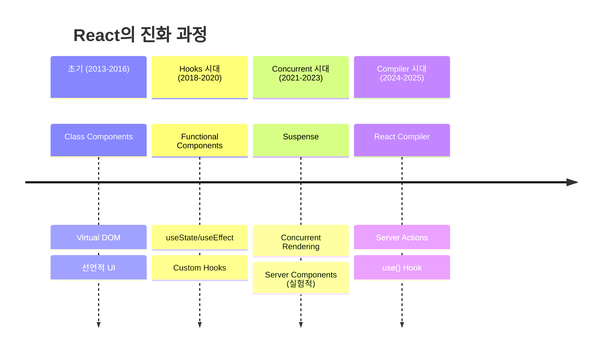

# React 19 가이드

:::info 문서 개요
**Target**: 3+ 년 경력 시니어 React 개발자  
**Depth**: 내부 구조부터 실무 최적화까지  
**Update**: 2025년 8월 최신 버전 기준 (React 19.1.0)
:::

## 🎯 기술 개요 및 핵심 가치

### Why React 19 Matters

React 19는 단순한 기능 추가가 아닌 **패러다임 시프트**를 제시합니다:

- **서버 중심 아키텍처**: Server Components와 Server Actions의 안정화
- **컴파일 타임 최적화**: React Compiler를 통한 자동 성능 최적화  
- **선언적 비동기 처리**: `use()` Hook으로 복잡한 상태 관리 단순화
- **프레임워크 우선 접근**: Create React App 대신 프로덕션 프레임워크 중심

### 기술의 진화



### 핵심 문제 해결

**1. 성능 최적화 자동화**
```javascript
// React 18까지 - 수동 최적화 필요
const ExpensiveComponent = memo(({ items, filter }) => {
  const filteredItems = useMemo(() => 
    items.filter(item => item.category === filter)
  , [items, filter]);
  
  const handleClick = useCallback((id) => {
    onItemClick(id);
  }, [onItemClick]);
  
  return <ItemList items={filteredItems} onClick={handleClick} />;
});

// React 19 + Compiler - 자동 최적화
function ExpensiveComponent({ items, filter, onItemClick }) {
  // 컴파일러가 자동으로 메모화
  const filteredItems = items.filter(item => item.category === filter);
  const handleClick = (id) => onItemClick(id);
  
  return <ItemList items={filteredItems} onClick={handleClick} />;
}
```

**2. 서버-클라이언트 경계 최적화**
```javascript
// 서버에서 실행 (데이터 페칭)
async function ProductListServer() {
  const products = await db.products.findMany();
  
  return (
    <div>
      {products.map(product => (
        <ProductCard key={product.id} product={product} />
      ))}
      <AddToCartButton productId={product.id} /> {/* 클라이언트 */}
    </div>
  );
}

// 클라이언트에서 실행 (상호작용)
'use client';
function AddToCartButton({ productId }) {
  const [state, action, isPending] = useActionState(addToCart, null);
  
  return (
    <form action={action}>
      <input type="hidden" name="productId" value={productId} />
      <button disabled={isPending}>
        {isPending ? '추가 중...' : '장바구니 담기'}
      </button>
    </form>
  );
}
```

### 경쟁 기술 비교

| 기능 | React 19 | Vue 3 | Angular 18 | Svelte 5 |
|-----|----------|--------|------------|----------|
| **컴파일 타임 최적화** | ✅ Compiler | ❌ 런타임 | 🔸 AOT 제한적 | ✅ 네이티브 |
| **서버 컴포넌트** | ✅ 안정화 | ❌ 미지원 | ❌ 미지원 | ❌ 미지원 |  
| **선언적 비동기** | ✅ use() Hook | 🔸 Suspense 제한 | 🔸 Observable | ❌ 미지원 |
| **TypeScript 통합** | ✅ 개선된 추론 | ✅ 우수 | ✅ 네이티브 | ✅ 우수 |

## 🔬 내부 동작 원리 및 아키텍처

### Fiber 아키텍처 심화

React 19는 여전히 **Fiber 재조정자**를 사용하지만, 다음과 같은 개선사항이 있습니다:

```javascript
// Fiber 노드 구조 (간소화된 표현)
const FiberNode = {
  type: 'div',                    // 컴포넌트 타입
  props: { className: 'card' },   // props 객체
  child: null,                    // 첫 번째 자식 참조
  sibling: null,                  // 다음 형제 참조
  return: null,                   // 부모 참조
  effectTag: 'UPDATE',            // 작업 유형
  alternate: null,                // 이전 Fiber 참조 (더블 버퍼링)
  memoizedState: null,            // Hook 상태
  pendingProps: null,             // 새로운 props
  memoizedProps: null,            // 이전 props
  lanes: 0,                       // 우선순위 레인
};
```

**우선순위 기반 스케줄링 (Lane Model)**
```javascript
// 레인 우선순위 (높음 → 낮음)
const Lanes = {
  SyncLane: 1,              // 동기 업데이트 (사용자 입력)
  InputContinuousLane: 2,   // 연속 입력 (드래그, 스크롤)
  DefaultLane: 16,          // 일반 업데이트 
  TransitionLane: 64,       // 전환 애니메이션
  IdleLane: 536870912,      // 유휴 시간 작업
};

function schedulePriorityUpdate(lane, callback) {
  if (lane === SyncLane) {
    // 즉시 실행
    flushSyncWork(callback);
  } else {
    // 스케줄러에 위임
    scheduleCallback(priorityForLane(lane), callback);
  }
}
```

### React Compiler 내부 구조

**컴파일 단계:**
```javascript
// 1. AST 분석 단계
function analyzeComponent(ast) {
  const dependencies = extractDependencies(ast);
  const sideEffects = analyzeSideEffects(ast);
  const memoizationCandidates = findMemoizationPoints(ast);
  
  return {
    canOptimize: !hasDynamicScope(ast),
    memoPoints: memoizationCandidates,
    dependencies: dependencies
  };
}

// 2. 최적화 변환 단계
function transformComponent(analysis) {
  return {
    memoizedComputations: insertUseMemo(analysis.memoPoints),
    memoizedCallbacks: insertUseCallback(analysis.callbacks),
    skipEffects: optimizeEffects(analysis.effects)
  };
}

// 3. 코드 생성 단계
function generateOptimizedCode(transformedAST) {
  return {
    optimizedComponent: generateComponent(transformedAST),
    metadata: generateMetadata(transformedAST),
    sourceMap: generateSourceMap(transformedAST)
  };
}
```

**메모이제이션 휴리스틱:**
```javascript
// 컴파일러가 자동으로 감지하는 패턴들
const MEMOIZATION_PATTERNS = {
  // 복잡한 계산
  expensiveComputation: (node) => {
    return hasLoops(node) || hasRecursion(node) || hasComplexMath(node);
  },
  
  // 객체/배열 생성
  objectCreation: (node) => {
    return isObjectExpression(node) || isArrayExpression(node);
  },
  
  // 함수 생성
  functionCreation: (node) => {
    return isFunctionExpression(node) || isArrowFunction(node);
  },
  
  // 조건부 렌더링
  conditionalRender: (node) => {
    return hasConditionalJSX(node);
  }
};
```

### use() Hook 내부 구현

```javascript
// use() Hook의 내부 구조 (간소화)
function use(usable) {
  const currentDispatcher = ReactCurrentDispatcher.current;
  
  if (usable !== null && typeof usable === 'object') {
    if (typeof usable.then === 'function') {
      // Promise 처리
      return useThenable(usable);
    } else if (usable.$$typeof === REACT_CONTEXT_TYPE) {
      // Context 처리
      return currentDispatcher.readContext(usable);
    }
  }
  
  throw new Error('use() can only be called with a Promise or Context');
}

function useThenable(thenable) {
  const status = thenable._reactInternalStatus;
  
  switch (status) {
    case 'fulfilled':
      return thenable._reactInternalResult;
    case 'rejected':
      throw thenable._reactInternalResult;
    default:
      // Suspense 트리거
      throw thenable;
  }
}
```

### 성능 특성 분석

**Time Complexity:**
- **Reconciliation**: O(n) - 선형 시간
- **Priority Queue**: O(log n) - 스케줄링
- **Memo Cache Lookup**: O(1) - 해시맵

**Memory Complexity:**
- **Fiber Tree**: O(n) - 컴포넌트 수에 비례
- **Hook State**: O(h) - Hook 개수에 비례  
- **Compiler Cache**: O(c) - 컴파일된 컴포넌트 수에 비례

**Trade-offs:**
```javascript
// 메모리 vs 성능 트레이드오프
const ComponentWithMemo = memo(({ data }) => {
  // 메모리: 이전 props와 결과를 캐시에 저장
  // 성능: 리렌더링 방지로 CPU 절약
  const processedData = useMemo(() => {
    return expensiveProcessing(data); // CPU 집약적 작업
  }, [data]);
  
  return <ExpensiveVisualization data={processedData} />;
});

// 컴파일러 자동 최적화 (React 19)
function ComponentWithCompiler({ data }) {
  // 컴파일러가 자동으로 메모화 결정
  // - 작은 데이터: 메모화 하지 않음 (오버헤드 > 이익)
  // - 큰 데이터: 자동 메모화 적용
  const processedData = expensiveProcessing(data);
  
  return <ExpensiveVisualization data={processedData} />;
}
```

## 📚 고급 API 및 패턴

### useActionState 고급 패턴

**1. 복잡한 상태 관리**
```typescript
type FormState = {
  status: 'idle' | 'pending' | 'success' | 'error';
  data: any | null;
  errors: Record<string, string[]>;
  metadata: {
    submittedAt?: Date;
    attempts: number;
    validationLevel: 'client' | 'server';
  };
};

const initialState: FormState = {
  status: 'idle',
  data: null,
  errors: {},
  metadata: { attempts: 0, validationLevel: 'client' }
};

async function complexFormAction(
  prevState: FormState, 
  formData: FormData
): Promise<FormState> {
  const newState: FormState = {
    ...prevState,
    status: 'pending',
    metadata: {
      ...prevState.metadata,
      attempts: prevState.metadata.attempts + 1,
      submittedAt: new Date(),
      validationLevel: 'server'
    }
  };

  try {
    // 1. 클라이언트 검증
    const clientValidation = validateClientSide(formData);
    if (!clientValidation.valid) {
      return {
        ...newState,
        status: 'error',
        errors: clientValidation.errors,
        metadata: { ...newState.metadata, validationLevel: 'client' }
      };
    }

    // 2. 서버 검증 및 처리
    const serverResult = await processOnServer(formData);
    if (!serverResult.success) {
      return {
        ...newState,
        status: 'error',
        errors: serverResult.errors,
        metadata: { ...newState.metadata, validationLevel: 'server' }
      };
    }

    // 3. 성공 처리
    return {
      status: 'success',
      data: serverResult.data,
      errors: {},
      metadata: { ...newState.metadata, validationLevel: 'server' }
    };

  } catch (error) {
    return {
      ...newState,
      status: 'error',
      errors: { _form: ['서버 오류가 발생했습니다.'] },
      metadata: { ...newState.metadata, validationLevel: 'server' }
    };
  }
}

// 사용 예제
function AdvancedForm() {
  const [state, action, isPending] = useActionState(complexFormAction, initialState);
  
  const isDisabled = isPending || state.status === 'pending';
  const showRetry = state.metadata.attempts > 0 && state.status === 'error';
  
  return (
    <form action={action}>
      <input 
        name="email" 
        disabled={isDisabled}
        aria-invalid={!!state.errors.email}
        aria-describedby={state.errors.email ? "email-errors" : undefined}
      />
      
      {state.errors.email && (
        <div id="email-errors" role="alert">
          {state.errors.email.map((error, index) => (
            <p key={index}>{error}</p>
          ))}
        </div>
      )}
      
      <button disabled={isDisabled}>
        {isPending ? '처리 중...' : showRetry ? '다시 시도' : '제출'}
      </button>
      
      {/* 메타데이터 표시 */}
      <div className="form-metadata">
        <p>시도 횟수: {state.metadata.attempts}</p>
        <p>검증 수준: {state.metadata.validationLevel}</p>
        {state.metadata.submittedAt && (
          <p>마지막 제출: {state.metadata.submittedAt.toLocaleString()}</p>
        )}
      </div>
    </form>
  );
}
```

**2. Optimistic Updates with Rollback**
```typescript
type OptimisticState<T> = {
  data: T;
  optimisticUpdates: Map<string, T>;
  pendingActions: Set<string>;
};

function useOptimisticAction<T>(
  initialData: T,
  action: (prevData: T, input: any) => Promise<T>
) {
  const [state, setState] = useState<OptimisticState<T>>({
    data: initialData,
    optimisticUpdates: new Map(),
    pendingActions: new Set()
  });

  const executeAction = useCallback(async (input: any, optimisticValue?: T) => {
    const actionId = generateActionId();
    
    // Optimistic update
    if (optimisticValue) {
      setState(prev => ({
        ...prev,
        optimisticUpdates: new Map(prev.optimisticUpdates).set(actionId, optimisticValue),
        pendingActions: new Set(prev.pendingActions).add(actionId)
      }));
    }

    try {
      const result = await action(state.data, input);
      
      // Success: commit optimistic update
      setState(prev => {
        const newUpdates = new Map(prev.optimisticUpdates);
        const newPending = new Set(prev.pendingActions);
        newUpdates.delete(actionId);
        newPending.delete(actionId);
        
        return {
          data: result,
          optimisticUpdates: newUpdates,
          pendingActions: newPending
        };
      });
      
      return result;
    } catch (error) {
      // Rollback optimistic update
      setState(prev => {
        const newUpdates = new Map(prev.optimisticUpdates);
        const newPending = new Set(prev.pendingActions);
        newUpdates.delete(actionId);
        newPending.delete(actionId);
        
        return {
          ...prev,
          optimisticUpdates: newUpdates,
          pendingActions: newPending
        };
      });
      
      throw error;
    }
  }, [action, state.data]);

  // 현재 표시될 데이터 (원본 + optimistic updates)
  const displayData = useMemo(() => {
    let result = state.data;
    for (const optimisticValue of state.optimisticUpdates.values()) {
      result = mergeData(result, optimisticValue);
    }
    return result;
  }, [state.data, state.optimisticUpdates]);

  return {
    data: displayData,
    executeAction,
    hasPendingActions: state.pendingActions.size > 0
  };
}
```

### use() Hook 고급 패턴

**1. Resource Pool Pattern**
```typescript
class ResourcePool<T> {
  private pool: Map<string, Promise<T>> = new Map();
  private cache: Map<string, T> = new Map();
  
  async get(key: string, factory: () => Promise<T>): Promise<T> {
    // 캐시에서 확인
    if (this.cache.has(key)) {
      return Promise.resolve(this.cache.get(key)!);
    }
    
    // 진행 중인 요청 확인
    if (this.pool.has(key)) {
      return this.pool.get(key)!;
    }
    
    // 새로운 요청 시작
    const promise = factory().then(result => {
      this.cache.set(key, result);
      this.pool.delete(key);
      return result;
    });
    
    this.pool.set(key, promise);
    return promise;
  }
  
  invalidate(key: string) {
    this.cache.delete(key);
    this.pool.delete(key);
  }
  
  prefetch(key: string, factory: () => Promise<T>) {
    if (!this.cache.has(key) && !this.pool.has(key)) {
      this.get(key, factory);
    }
  }
}

// 글로벌 리소스 풀
const apiResourcePool = new ResourcePool<any>();

function useApiResource(endpoint: string, params: any = {}) {
  const cacheKey = `${endpoint}?${JSON.stringify(params)}`;
  
  const dataPromise = useMemo(() => 
    apiResourcePool.get(cacheKey, () => 
      fetch(`${endpoint}?${new URLSearchParams(params)}`).then(r => r.json())
    ), [cacheKey]
  );
  
  // use() Hook으로 Promise 해결
  return use(dataPromise);
}

// 사용 예제
function ProductDetails({ productId }: { productId: number }) {
  const product = useApiResource('/api/products', { id: productId });
  const reviews = useApiResource('/api/reviews', { productId });
  
  return (
    <div>
      <h1>{product.name}</h1>
      <p>{product.description}</p>
      <ReviewsList reviews={reviews} />
    </div>
  );
}

function ProductPage({ productId }: { productId: number }) {
  // 관련 데이터 사전 로딩
  useEffect(() => {
    apiResourcePool.prefetch('/api/products', { id: productId });
    apiResourcePool.prefetch('/api/reviews', { productId });
  }, [productId]);
  
  return (
    <Suspense fallback={<ProductSkeleton />}>
      <ProductDetails productId={productId} />
    </Suspense>
  );
}
```

**2. Streaming Data Pattern**
```typescript
class StreamingResource<T> {
  private stream: ReadableStream<T>;
  private reader: ReadableStreamDefaultReader<T>;
  private buffer: T[] = [];
  private subscribers: Set<(data: T[]) => void> = new Set();
  
  constructor(streamFactory: () => ReadableStream<T>) {
    this.stream = streamFactory();
    this.reader = this.stream.getReader();
    this.startReading();
  }
  
  private async startReading() {
    try {
      while (true) {
        const { done, value } = await this.reader.read();
        
        if (done) break;
        
        this.buffer.push(value);
        this.notifySubscribers();
      }
    } catch (error) {
      console.error('Stream error:', error);
    }
  }
  
  private notifySubscribers() {
    this.subscribers.forEach(callback => callback([...this.buffer]));
  }
  
  subscribe(callback: (data: T[]) => void) {
    this.subscribers.add(callback);
    callback([...this.buffer]); // 현재 데이터 즉시 전송
    
    return () => this.subscribers.delete(callback);
  }
  
  getSnapshot() {
    return [...this.buffer];
  }
}

function useStreamingData<T>(streamFactory: () => ReadableStream<T>) {
  const [resource] = useState(() => new StreamingResource(streamFactory));
  const [data, setData] = useState<T[]>([]);
  
  useEffect(() => {
    const unsubscribe = resource.subscribe(setData);
    return unsubscribe;
  }, [resource]);
  
  return data;
}

// 실시간 로그 스트리밍 예제
function LogViewer({ logStream }: { logStream: ReadableStream<LogEntry> }) {
  const logs = useStreamingData(() => logStream);
  
  return (
    <div className="log-viewer">
      {logs.map((log, index) => (
        <div key={index} className={`log-entry log-${log.level}`}>
          <span className="timestamp">{log.timestamp}</span>
          <span className="message">{log.message}</span>
        </div>
      ))}
    </div>
  );
}
```

### Server Components 고급 패턴

**1. Composite Server Components**
```typescript
// 서버 컴포넌트 조합 패턴
async function ProductPage({ productId }: { productId: string }) {
  // 병렬 데이터 페칭
  const [product, reviews, relatedProducts] = await Promise.all([
    getProduct(productId),
    getProductReviews(productId),
    getRelatedProducts(productId)
  ]);

  return (
    <div className="product-page">
      <ProductHero product={product} />
      <div className="content-grid">
        <ProductDetails product={product} />
        <Suspense fallback={<ReviewsSkeleton />}>
          <ReviewsSection reviews={reviews} />
        </Suspense>
        <Suspense fallback={<RelatedProductsSkeleton />}>
          <RelatedProducts products={relatedProducts} />
        </Suspense>
      </div>
      {/* 클라이언트 인터랙션 */}
      <ClientInteractions productId={productId} />
    </div>
  );
}

// 조건부 서버 컴포넌트
async function ConditionalContent({ 
  userId, 
  features 
}: { 
  userId: string; 
  features: FeatureFlags;
}) {
  const user = await getUser(userId);
  
  if (features.enableBetaUI && user.betaTester) {
    return <BetaProductInterface user={user} />;
  }
  
  if (user.premiumMember) {
    return <PremiumProductInterface user={user} />;
  }
  
  return <StandardProductInterface user={user} />;
}

// 데이터 변형 서버 컴포넌트
async function TransformedData({ rawDataId }: { rawDataId: string }) {
  const rawData = await getRawData(rawDataId);
  
  // 서버에서 데이터 변형 처리
  const processedData = await Promise.all([
    processAnalytics(rawData),
    generateInsights(rawData),
    createVisualizations(rawData)
  ]);
  
  return (
    <DataDashboard 
      analytics={processedData[0]}
      insights={processedData[1]}
      visualizations={processedData[2]}
    />
  );
}
```

**2. Progressive Enhancement Pattern**
```typescript
// 점진적 향상을 위한 하이브리드 패턴
function EnhancedForm({ initialData }: { initialData: FormData }) {
  const [state, action, isPending] = useActionState(
    submitFormAction, 
    { data: initialData, errors: {} }
  );
  
  return (
    <form 
      action={action}
      // JavaScript 없이도 작동하는 fallback
      method="POST" 
      encType="multipart/form-data"
    >
      <input 
        name="name" 
        defaultValue={state.data.name}
        required
        aria-invalid={!!state.errors.name}
      />
      
      {/* Progressive enhancement */}
      <ClientSideValidation 
        fieldName="name" 
        serverErrors={state.errors.name} 
      />
      
      <button disabled={isPending}>
        {isPending ? '저장 중...' : '저장'}
      </button>
      
      {/* JavaScript 없는 환경을 위한 상태 표시 */}
      <noscript>
        {state.errors.name && (
          <div className="error">{state.errors.name}</div>
        )}
      </noscript>
    </form>
  );
}

// 클라이언트 컴포넌트 (점진적 향상)
'use client';
function ClientSideValidation({ 
  fieldName, 
  serverErrors 
}: { 
  fieldName: string; 
  serverErrors?: string[];
}) {
  const [clientErrors, setClientErrors] = useState<string[]>([]);
  const [isDirty, setIsDirty] = useState(false);
  
  const handleValidation = useCallback((value: string) => {
    const errors = validateField(fieldName, value);
    setClientErrors(errors);
  }, [fieldName]);
  
  // 서버 에러와 클라이언트 에러 병합
  const allErrors = useMemo(() => {
    const errors = isDirty ? clientErrors : [];
    return serverErrors ? [...errors, ...serverErrors] : errors;
  }, [clientErrors, serverErrors, isDirty]);
  
  return allErrors.length > 0 ? (
    <div className="validation-errors" role="alert">
      {allErrors.map((error, index) => (
        <p key={index}>{error}</p>
      ))}
    </div>
  ) : null;
}
```

## 🚀 실무 적용 및 최적화

### Production 고려사항

**1. 번들 사이즈 최적화**
```javascript
// React 19 트리 셰이킹 최적화
// package.json
{
  "sideEffects": false,
  "module": "dist/index.esm.js",
  "exports": {
    ".": {
      "import": "./dist/index.esm.js",
      "require": "./dist/index.cjs.js"
    },
    "./server": {
      "import": "./dist/server.esm.js",
      "require": "./dist/server.cjs.js"
    }
  }
}

// 조건부 import를 통한 코드 분할
const LazyAdminPanel = lazy(() => 
  import('./AdminPanel').then(module => ({
    default: module.AdminPanel
  }))
);

function App() {
  const user = use(getCurrentUser());
  
  return (
    <div>
      <MainContent />
      {user.role === 'admin' && (
        <Suspense fallback={<AdminPanelSkeleton />}>
          <LazyAdminPanel />
        </Suspense>
      )}
    </div>
  );
}

// 서버 컴포넌트용 번들 분리
// next.config.js
module.exports = {
  experimental: {
    serverComponentsExternalPackages: [
      'heavy-server-only-package',
      '@aws-sdk/client-s3'
    ]
  },
  webpack: (config, { isServer }) => {
    if (isServer) {
      // 서버 전용 최적화
      config.externals.push('canvas', 'sharp');
    }
    return config;
  }
};
```

**2. 메모리 관리**
```typescript
// 메모리 누수 방지 패턴
class ResourceManager {
  private resources = new Map<string, any>();
  private timers = new Set<NodeJS.Timeout>();
  private subscriptions = new Set<() => void>();
  
  addResource(key: string, resource: any) {
    // 이전 리소스 정리
    if (this.resources.has(key)) {
      this.cleanup(key);
    }
    
    this.resources.set(key, resource);
  }
  
  addTimer(timer: NodeJS.Timeout) {
    this.timers.add(timer);
    return () => {
      clearTimeout(timer);
      this.timers.delete(timer);
    };
  }
  
  addSubscription(unsubscribe: () => void) {
    this.subscriptions.add(unsubscribe);
    return () => {
      unsubscribe();
      this.subscriptions.delete(unsubscribe);
    };
  }
  
  cleanup(key?: string) {
    if (key) {
      const resource = this.resources.get(key);
      if (resource && typeof resource.cleanup === 'function') {
        resource.cleanup();
      }
      this.resources.delete(key);
    } else {
      // 전체 정리
      for (const resource of this.resources.values()) {
        if (typeof resource.cleanup === 'function') {
          resource.cleanup();
        }
      }
      this.resources.clear();
      
      this.timers.forEach(timer => clearTimeout(timer));
      this.timers.clear();
      
      this.subscriptions.forEach(unsubscribe => unsubscribe());
      this.subscriptions.clear();
    }
  }
}

// 컴포넌트에서 사용
function useResourceManager() {
  const [manager] = useState(() => new ResourceManager());
  
  useEffect(() => {
    return () => manager.cleanup();
  }, [manager]);
  
  return manager;
}

function DataVisualization({ dataSource }: { dataSource: string }) {
  const manager = useResourceManager();
  
  useEffect(() => {
    const subscription = dataSource.subscribe(data => {
      // 데이터 처리
      setData(data);
    });
    
    manager.addSubscription(() => subscription.unsubscribe());
  }, [dataSource, manager]);
  
  const data = use(fetchVisualizationData(dataSource));
  
  return <Chart data={data} />;
}
```

**3. 에러 경계와 복구 전략**
```typescript
// 향상된 에러 경계
interface ErrorInfo {
  componentStack: string;
  errorBoundary: string;
  eventType: string;
}

class ProductionErrorBoundary extends Component<
  PropsWithChildren<{ fallback: ComponentType<any> }>,
  { hasError: boolean; error: Error | null; errorId: string | null }
> {
  private retryCount = 0;
  private maxRetries = 3;
  
  constructor(props: any) {
    super(props);
    this.state = { 
      hasError: false, 
      error: null, 
      errorId: null 
    };
  }
  
  static getDerivedStateFromError(error: Error) {
    const errorId = generateErrorId();
    return { 
      hasError: true, 
      error, 
      errorId 
    };
  }
  
  componentDidCatch(error: Error, errorInfo: ErrorInfo) {
    // 에러 로깅 및 모니터링
    reportError({
      error,
      errorInfo,
      errorId: this.state.errorId!,
      userId: getCurrentUserId(),
      sessionId: getSessionId(),
      buildVersion: process.env.BUILD_VERSION,
      timestamp: new Date().toISOString()
    });
    
    // 자동 복구 시도
    if (this.retryCount < this.maxRetries) {
      setTimeout(() => {
        this.retryCount++;
        this.setState({ hasError: false, error: null, errorId: null });
      }, 1000 * this.retryCount); // 점진적 백오프
    }
  }
  
  render() {
    if (this.state.hasError) {
      const FallbackComponent = this.props.fallback;
      return (
        <FallbackComponent 
          error={this.state.error}
          errorId={this.state.errorId}
          retry={() => this.setState({ hasError: false, error: null, errorId: null })}
          canRetry={this.retryCount < this.maxRetries}
        />
      );
    }
    
    return this.props.children;
  }
}

// 스마트 폴백 컴포넌트
function SmartFallback({ 
  error, 
  errorId, 
  retry, 
  canRetry 
}: {
  error: Error;
  errorId: string;
  retry: () => void;
  canRetry: boolean;
}) {
  const [isRetrying, setIsRetrying] = useState(false);
  
  const handleRetry = async () => {
    setIsRetrying(true);
    await new Promise(resolve => setTimeout(resolve, 500));
    retry();
    setIsRetrying(false);
  };
  
  // 에러 유형별 맞춤 처리
  if (error.name === 'ChunkLoadError') {
    return (
      <div className="error-boundary chunk-load-error">
        <h2>앱 업데이트가 있습니다</h2>
        <p>새로운 버전을 로드하려면 페이지를 새로고침해주세요.</p>
        <button onClick={() => window.location.reload()}>
          새로고침
        </button>
      </div>
    );
  }
  
  if (error.message.includes('Network')) {
    return (
      <div className="error-boundary network-error">
        <h2>연결 문제가 발생했습니다</h2>
        <p>인터넷 연결을 확인하고 다시 시도해주세요.</p>
        {canRetry && (
          <button onClick={handleRetry} disabled={isRetrying}>
            {isRetrying ? '재시도 중...' : '다시 시도'}
          </button>
        )}
      </div>
    );
  }
  
  return (
    <div className="error-boundary generic-error">
      <h2>예상치 못한 오류가 발생했습니다</h2>
      <details>
        <summary>오류 세부사항</summary>
        <pre>{error.stack}</pre>
        <p>오류 ID: {errorId}</p>
      </details>
      {canRetry && (
        <button onClick={handleRetry} disabled={isRetrying}>
          {isRetrying ? '복구 중...' : '복구 시도'}
        </button>
      )}
    </div>
  );
}
```

### Scalability 전략

**1. 대규모 애플리케이션 아키텍처**
```typescript
// 마이크로 프론트엔드 패턴
interface MicroFrontendConfig {
  name: string;
  entry: string;
  routes: string[];
  permissions: string[];
}

class MicroFrontendOrchestrator {
  private loadedModules = new Map<string, any>();
  private loadingPromises = new Map<string, Promise<any>>();
  
  async loadMicroFrontend(config: MicroFrontendConfig): Promise<any> {
    if (this.loadedModules.has(config.name)) {
      return this.loadedModules.get(config.name);
    }
    
    if (this.loadingPromises.has(config.name)) {
      return this.loadingPromises.get(config.name);
    }
    
    const loadingPromise = this.loadModule(config);
    this.loadingPromises.set(config.name, loadingPromise);
    
    try {
      const module = await loadingPromise;
      this.loadedModules.set(config.name, module);
      this.loadingPromises.delete(config.name);
      return module;
    } catch (error) {
      this.loadingPromises.delete(config.name);
      throw error;
    }
  }
  
  private async loadModule(config: MicroFrontendConfig) {
    // 동적 import를 통한 마이크로 프론트엔드 로딩
    const module = await import(/* webpackIgnore: true */ config.entry);
    
    // 모듈 초기화
    if (typeof module.init === 'function') {
      await module.init({
        baseUrl: window.location.origin,
        apiEndpoint: process.env.REACT_APP_API_ENDPOINT,
        permissions: config.permissions
      });
    }
    
    return module;
  }
  
  async preload(configs: MicroFrontendConfig[]) {
    return Promise.allSettled(
      configs.map(config => this.loadMicroFrontend(config))
    );
  }
}

// React 19 서버 컴포넌트와 통합
async function MicroFrontendContainer({ 
  configId, 
  routePath 
}: { 
  configId: string; 
  routePath: string;
}) {
  const config = await getMicroFrontendConfig(configId);
  const userPermissions = await getCurrentUserPermissions();
  
  // 권한 검사
  const hasPermission = config.permissions.every(permission => 
    userPermissions.includes(permission)
  );
  
  if (!hasPermission) {
    return <UnauthorizedAccess />;
  }
  
  return (
    <Suspense fallback={<MicroFrontendSkeleton />}>
      <DynamicMicroFrontend config={config} routePath={routePath} />
    </Suspense>
  );
}

'use client';
function DynamicMicroFrontend({ 
  config, 
  routePath 
}: { 
  config: MicroFrontendConfig; 
  routePath: string;
}) {
  const [orchestrator] = useState(() => new MicroFrontendOrchestrator());
  
  const modulePromise = useMemo(() => 
    orchestrator.loadMicroFrontend(config),
    [orchestrator, config]
  );
  
  const MicroFrontendModule = use(modulePromise);
  
  return <MicroFrontendModule.default route={routePath} />;
}
```

**2. 상태 관리 확장**
```typescript
// 분산 상태 관리 시스템
interface StateSlice<T> {
  name: string;
  initialState: T;
  actions: Record<string, (state: T, payload: any) => T>;
  selectors: Record<string, (state: T) => any>;
  middleware?: Array<(action: any, state: T) => T>;
}

class DistributedStateManager {
  private slices = new Map<string, StateSlice<any>>();
  private subscribers = new Map<string, Set<(state: any) => void>>();
  private state = new Map<string, any>();
  private actionHistory: Array<{ action: string; timestamp: number; sliceName: string }> = [];
  
  registerSlice<T>(slice: StateSlice<T>) {
    this.slices.set(slice.name, slice);
    this.state.set(slice.name, slice.initialState);
    this.subscribers.set(slice.name, new Set());
  }
  
  dispatch(sliceName: string, actionName: string, payload: any) {
    const slice = this.slices.get(sliceName);
    if (!slice) throw new Error(`Slice ${sliceName} not found`);
    
    const action = slice.actions[actionName];
    if (!action) throw new Error(`Action ${actionName} not found in slice ${sliceName}`);
    
    const currentState = this.state.get(sliceName);
    let newState = action(currentState, payload);
    
    // 미들웨어 적용
    if (slice.middleware) {
      for (const middleware of slice.middleware) {
        newState = middleware({ type: actionName, payload }, newState);
      }
    }
    
    this.state.set(sliceName, newState);
    
    // 액션 히스토리 기록
    this.actionHistory.push({
      action: `${sliceName}/${actionName}`,
      timestamp: Date.now(),
      sliceName
    });
    
    // 구독자들에게 알림
    const subscribers = this.subscribers.get(sliceName);
    if (subscribers) {
      subscribers.forEach(callback => callback(newState));
    }
  }
  
  select<T>(sliceName: string, selectorName?: string): T {
    const slice = this.slices.get(sliceName);
    if (!slice) throw new Error(`Slice ${sliceName} not found`);
    
    const state = this.state.get(sliceName);
    
    if (selectorName) {
      const selector = slice.selectors[selectorName];
      return selector ? selector(state) : state;
    }
    
    return state;
  }
  
  subscribe(sliceName: string, callback: (state: any) => void) {
    const subscribers = this.subscribers.get(sliceName);
    if (subscribers) {
      subscribers.add(callback);
      return () => subscribers.delete(callback);
    }
    return () => {};
  }
  
  // 시간 여행 디버깅
  replayActions(until?: number) {
    // 상태 초기화
    for (const [sliceName, slice] of this.slices) {
      this.state.set(sliceName, slice.initialState);
    }
    
    // 액션 재실행
    const actionsToReplay = until 
      ? this.actionHistory.slice(0, until)
      : this.actionHistory;
    
    actionsToReplay.forEach(({ action, sliceName }) => {
      const [, actionName] = action.split('/');
      // 원본 payload는 별도로 저장해야 함 (간소화를 위해 생략)
      // this.dispatch(sliceName, actionName, originalPayload);
    });
  }
}

// React Hook 통합
function useDistributedState<T>(
  stateManager: DistributedStateManager,
  sliceName: string,
  selectorName?: string
): [T, (actionName: string, payload: any) => void] {
  const [state, setState] = useState<T>(() => 
    stateManager.select(sliceName, selectorName)
  );
  
  useEffect(() => {
    const unsubscribe = stateManager.subscribe(sliceName, (newState) => {
      const selectedState = selectorName 
        ? stateManager.select(sliceName, selectorName)
        : newState;
      setState(selectedState);
    });
    
    return unsubscribe;
  }, [stateManager, sliceName, selectorName]);
  
  const dispatch = useCallback((actionName: string, payload: any) => {
    stateManager.dispatch(sliceName, actionName, payload);
  }, [stateManager, sliceName]);
  
  return [state, dispatch];
}
```

### Monitoring & Debugging

**1. Performance Monitoring**
```typescript
// React 19 전용 성능 모니터링
class React19PerformanceMonitor {
  private metrics = new Map<string, PerformanceMetric>();
  private observers: PerformanceObserver[] = [];
  
  constructor() {
    this.initializeObservers();
  }
  
  private initializeObservers() {
    // Long Task 모니터링
    const longTaskObserver = new PerformanceObserver((list) => {
      for (const entry of list.getEntries()) {
        this.recordMetric('longTask', {
          duration: entry.duration,
          startTime: entry.startTime,
          type: 'longTask'
        });
      }
    });
    
    try {
      longTaskObserver.observe({ entryTypes: ['longtask'] });
      this.observers.push(longTaskObserver);
    } catch (e) {
      console.warn('Long task monitoring not supported');
    }
    
    // Layout Shift 모니터링
    const layoutShiftObserver = new PerformanceObserver((list) => {
      for (const entry of list.getEntries()) {
        this.recordMetric('layoutShift', {
          value: (entry as any).value,
          sources: (entry as any).sources,
          type: 'layoutShift'
        });
      }
    });
    
    try {
      layoutShiftObserver.observe({ entryTypes: ['layout-shift'] });
      this.observers.push(layoutShiftObserver);
    } catch (e) {
      console.warn('Layout shift monitoring not supported');
    }
  }
  
  // React 컴포넌트 성능 측정
  measureComponent<T>(
    componentName: string, 
    renderFn: () => T,
    options: { trackRerender?: boolean; trackProps?: boolean } = {}
  ): T {
    const startTime = performance.now();
    
    try {
      const result = renderFn();
      
      const endTime = performance.now();
      const duration = endTime - startTime;
      
      this.recordMetric(`component.${componentName}`, {
        duration,
        startTime,
        type: 'component-render',
        ...options
      });
      
      // React DevTools와 연동
      if (typeof window !== 'undefined' && window.__REACT_DEVTOOLS_GLOBAL_HOOK__) {
        window.__REACT_DEVTOOLS_GLOBAL_HOOK__.onCommitFiberRoot(
          null,
          { current: { alternate: null } },
          null,
          false
        );
      }
      
      return result;
    } catch (error) {
      this.recordMetric(`component.${componentName}.error`, {
        error: error.message,
        type: 'component-error',
        startTime
      });
      throw error;
    }
  }
  
  // Server Component 성능 측정
  async measureServerComponent<T>(
    componentName: string,
    serverFn: () => Promise<T>
  ): Promise<T> {
    const startTime = performance.now();
    
    try {
      const result = await serverFn();
      
      const endTime = performance.now();
      const duration = endTime - startTime;
      
      this.recordMetric(`server-component.${componentName}`, {
        duration,
        startTime,
        type: 'server-component-render'
      });
      
      return result;
    } catch (error) {
      this.recordMetric(`server-component.${componentName}.error`, {
        error: error.message,
        type: 'server-component-error',
        startTime
      });
      throw error;
    }
  }
  
  // 메모리 사용량 모니터링
  measureMemoryUsage(label: string) {
    if ('memory' in performance) {
      const memory = (performance as any).memory;
      this.recordMetric(`memory.${label}`, {
        usedJSHeapSize: memory.usedJSHeapSize,
        totalJSHeapSize: memory.totalJSHeapSize,
        jsHeapSizeLimit: memory.jsHeapSizeLimit,
        type: 'memory-usage'
      });
    }
  }
  
  private recordMetric(key: string, data: any) {
    const existing = this.metrics.get(key) || { count: 0, total: 0, samples: [] };
    
    existing.count++;
    if (data.duration) {
      existing.total += data.duration;
      existing.average = existing.total / existing.count;
    }
    
    existing.samples.push({
      ...data,
      timestamp: Date.now()
    });
    
    // 샘플 수 제한 (메모리 누수 방지)
    if (existing.samples.length > 100) {
      existing.samples = existing.samples.slice(-50);
    }
    
    this.metrics.set(key, existing);
  }
  
  getMetrics() {
    return Object.fromEntries(this.metrics);
  }
  
  exportMetrics() {
    const metrics = this.getMetrics();
    
    // 서버로 전송하거나 로컬 스토리지에 저장
    fetch('/api/metrics', {
      method: 'POST',
      headers: { 'Content-Type': 'application/json' },
      body: JSON.stringify({
        metrics,
        userAgent: navigator.userAgent,
        timestamp: Date.now(),
        url: window.location.href
      })
    }).catch(console.error);
  }
  
  cleanup() {
    this.observers.forEach(observer => observer.disconnect());
    this.observers = [];
    this.metrics.clear();
  }
}

// Hook으로 사용
function usePerformanceMonitor(componentName: string) {
  const [monitor] = useState(() => new React19PerformanceMonitor());
  
  const measureRender = useCallback(<T>(renderFn: () => T) => {
    return monitor.measureComponent(componentName, renderFn);
  }, [monitor, componentName]);
  
  const measureAsync = useCallback(async <T>(asyncFn: () => Promise<T>) => {
    return monitor.measureServerComponent(componentName, asyncFn);
  }, [monitor, componentName]);
  
  useEffect(() => {
    return () => monitor.cleanup();
  }, [monitor]);
  
  return { measureRender, measureAsync, getMetrics: () => monitor.getMetrics() };
}
```

## 🔧 실전 프로젝트 예제

### Complete E-commerce Implementation

**1. Product Catalog with Server Components**
```typescript
// app/products/page.tsx (Server Component)
import { Suspense } from 'react';
import { getProducts, getCategories, getFeaturedProducts } from '@/lib/api';
import ProductGrid from './components/ProductGrid';
import CategoryFilter from './components/CategoryFilter';
import FeaturedProducts from './components/FeaturedProducts';

type SearchParams = {
  category?: string;
  sort?: 'price' | 'name' | 'rating';
  page?: string;
};

export default async function ProductsPage({ 
  searchParams 
}: { 
  searchParams: SearchParams 
}) {
  const page = parseInt(searchParams.page || '1');
  const category = searchParams.category;
  const sort = searchParams.sort || 'name';

  // 병렬 데이터 페칭
  const [products, categories, featuredProducts] = await Promise.all([
    getProducts({ category, sort, page, limit: 20 }),
    getCategories(),
    page === 1 ? getFeaturedProducts(4) : Promise.resolve([])
  ]);

  return (
    <div className="products-page">
      <h1>상품 카탈로그</h1>
      
      {/* 서버에서 렌더링된 카테고리 필터 */}
      <CategoryFilter 
        categories={categories} 
        selectedCategory={category} 
      />
      
      {/* 첫 페이지에만 추천 상품 표시 */}
      {page === 1 && featuredProducts.length > 0 && (
        <section className="featured-section">
          <h2>추천 상품</h2>
          <Suspense fallback={<FeaturedProductsSkeleton />}>
            <FeaturedProducts products={featuredProducts} />
          </Suspense>
        </section>
      )}
      
      {/* 메인 상품 그리드 */}
      <section className="main-products">
        <Suspense fallback={<ProductGridSkeleton />}>
          <ProductGrid 
            products={products} 
            currentPage={page}
            category={category}
            sort={sort}
          />
        </Suspense>
      </section>
    </div>
  );
}

// components/ProductGrid.tsx (Server Component)
import { Product } from '@/types/product';
import ProductCard from './ProductCard';
import Pagination from './Pagination';

interface ProductGridProps {
  products: {
    data: Product[];
    totalPages: number;
    currentPage: number;
  };
  currentPage: number;
  category?: string;
  sort: string;
}

export default function ProductGrid({ 
  products, 
  currentPage, 
  category, 
  sort 
}: ProductGridProps) {
  return (
    <div className="product-grid">
      <div className="grid grid-cols-1 md:grid-cols-2 lg:grid-cols-4 gap-6">
        {products.data.map(product => (
          <ProductCard key={product.id} product={product} />
        ))}
      </div>
      
      <Pagination 
        currentPage={currentPage}
        totalPages={products.totalPages}
        category={category}
        sort={sort}
      />
    </div>
  );
}

// components/ProductCard.tsx (Hybrid Component)
import { Product } from '@/types/product';
import { AddToCartButton } from './AddToCartButton';
import Image from 'next/image';
import Link from 'next/link';

interface ProductCardProps {
  product: Product;
}

export default function ProductCard({ product }: ProductCardProps) {
  return (
    <div className="product-card">
      {/* 서버에서 렌더링 */}
      <Link href={`/products/${product.id}`}>
        <div className="product-image">
          <Image
            src={product.imageUrl}
            alt={product.name}
            width={300}
            height={300}
            priority={false}
          />
          {product.discount > 0 && (
            <div className="discount-badge">
              {product.discount}% OFF
            </div>
          )}
        </div>
        
        <div className="product-info">
          <h3 className="product-name">{product.name}</h3>
          <p className="product-description">{product.shortDescription}</p>
          
          <div className="price-section">
            {product.discount > 0 && (
              <span className="original-price">
                ₩{product.originalPrice.toLocaleString()}
              </span>
            )}
            <span className="current-price">
              ₩{product.price.toLocaleString()}
            </span>
          </div>
          
          <div className="rating">
            ⭐ {product.rating.toFixed(1)} ({product.reviewCount})
          </div>
        </div>
      </Link>
      
      {/* 클라이언트 인터랙션 */}
      <AddToCartButton productId={product.id} />
    </div>
  );
}
```

**2. Shopping Cart with Actions**
```typescript
// components/AddToCartButton.tsx (Client Component)
'use client';
import { useActionState, useOptimistic } from 'react';
import { addToCartAction } from '@/lib/actions/cart';

interface AddToCartButtonProps {
  productId: number;
}

export function AddToCartButton({ productId }: AddToCartButtonProps) {
  const [state, action, isPending] = useActionState(addToCartAction, {
    success: false,
    error: null,
    cartCount: 0
  });

  return (
    <form action={action} className="add-to-cart-form">
      <input type="hidden" name="productId" value={productId} />
      
      <div className="quantity-selector">
        <label htmlFor={`qty-${productId}`}>수량:</label>
        <select name="quantity" id={`qty-${productId}`} defaultValue={1}>
          {[1, 2, 3, 4, 5].map(num => (
            <option key={num} value={num}>{num}</option>
          ))}
        </select>
      </div>
      
      <button 
        type="submit" 
        disabled={isPending}
        className={`add-to-cart-btn ${isPending ? 'loading' : ''}`}
      >
        {isPending ? (
          <>
            <span className="spinner" />
            장바구니 추가 중...
          </>
        ) : (
          '장바구니 담기'
        )}
      </button>
      
      {state.success && (
        <div className="success-message" role="status">
          ✅ 장바구니에 추가되었습니다!
        </div>
      )}
      
      {state.error && (
        <div className="error-message" role="alert">
          ❌ {state.error}
        </div>
      )}
    </form>
  );
}

// lib/actions/cart.ts (Server Action)
'use server';
import { revalidateTag } from 'next/cache';
import { redirect } from 'next/navigation';
import { getSession } from '@/lib/auth';
import { addItemToCart, getCartItemCount } from '@/lib/db/cart';
import { getProduct } from '@/lib/db/products';

export async function addToCartAction(prevState: any, formData: FormData) {
  const session = await getSession();
  
  if (!session?.user) {
    redirect('/login');
  }

  try {
    const productId = parseInt(formData.get('productId') as string);
    const quantity = parseInt(formData.get('quantity') as string);

    // 상품 존재 여부 확인
    const product = await getProduct(productId);
    if (!product) {
      return {
        success: false,
        error: '상품을 찾을 수 없습니다.',
        cartCount: prevState.cartCount
      };
    }

    // 재고 확인
    if (product.stock < quantity) {
      return {
        success: false,
        error: `재고가 부족합니다. (현재 재고: ${product.stock}개)`,
        cartCount: prevState.cartCount
      };
    }

    // 장바구니에 추가
    await addItemToCart(session.user.id, productId, quantity);
    
    // 캐시 무효화
    revalidateTag('cart');
    revalidateTag(`cart-${session.user.id}`);
    
    const newCartCount = await getCartItemCount(session.user.id);

    return {
      success: true,
      error: null,
      cartCount: newCartCount
    };

  } catch (error) {
    console.error('장바구니 추가 오류:', error);
    
    return {
      success: false,
      error: '장바구니 추가 중 오류가 발생했습니다.',
      cartCount: prevState.cartCount
    };
  }
}
```

**3. Optimistic Updates for Cart**
```typescript
// components/CartPage.tsx (Client Component)
'use client';
import { useActionState, useOptimistic, use } from 'react';
import { updateCartItemAction, removeCartItemAction } from '@/lib/actions/cart';
import type { CartItem } from '@/types/cart';

interface CartPageProps {
  initialCartItems: CartItem[];
}

export default function CartPage({ initialCartItems }: CartPageProps) {
  const [optimisticItems, setOptimisticItems] = useOptimistic(
    initialCartItems,
    (state, action: { type: 'update' | 'remove'; id: number; quantity?: number }) => {
      switch (action.type) {
        case 'update':
          return state.map(item => 
            item.id === action.id 
              ? { ...item, quantity: action.quantity! }
              : item
          );
        case 'remove':
          return state.filter(item => item.id !== action.id);
        default:
          return state;
      }
    }
  );

  const [updateState, updateAction, isUpdating] = useActionState(
    updateCartItemAction, 
    { success: false, error: null }
  );

  const [removeState, removeAction, isRemoving] = useActionState(
    removeCartItemAction,
    { success: false, error: null }
  );

  const handleQuantityChange = async (itemId: number, newQuantity: number) => {
    // Optimistic update
    setOptimisticItems({ type: 'update', id: itemId, quantity: newQuantity });
    
    // Server action
    const formData = new FormData();
    formData.set('itemId', itemId.toString());
    formData.set('quantity', newQuantity.toString());
    updateAction(formData);
  };

  const handleRemoveItem = async (itemId: number) => {
    // Optimistic update
    setOptimisticItems({ type: 'remove', id: itemId });
    
    // Server action
    const formData = new FormData();
    formData.set('itemId', itemId.toString());
    removeAction(formData);
  };

  const totalPrice = optimisticItems.reduce(
    (sum, item) => sum + (item.price * item.quantity), 
    0
  );

  return (
    <div className="cart-page">
      <h1>장바구니</h1>
      
      {optimisticItems.length === 0 ? (
        <EmptyCart />
      ) : (
        <>
          <div className="cart-items">
            {optimisticItems.map(item => (
              <CartItemRow
                key={item.id}
                item={item}
                onQuantityChange={handleQuantityChange}
                onRemove={handleRemoveItem}
                isUpdating={isUpdating}
                isRemoving={isRemoving}
              />
            ))}
          </div>
          
          <div className="cart-summary">
            <div className="total-price">
              총 금액: ₩{totalPrice.toLocaleString()}
            </div>
            
            <CheckoutButton 
              items={optimisticItems}
              totalPrice={totalPrice}
              disabled={isUpdating || isRemoving}
            />
          </div>
        </>
      )}
      
      {/* 에러 메시지 표시 */}
      {updateState.error && (
        <div className="error-toast" role="alert">
          {updateState.error}
        </div>
      )}
      
      {removeState.error && (
        <div className="error-toast" role="alert">
          {removeState.error}
        </div>
      )}
    </div>
  );
}

// components/CartItemRow.tsx
interface CartItemRowProps {
  item: CartItem;
  onQuantityChange: (id: number, quantity: number) => void;
  onRemove: (id: number) => void;
  isUpdating: boolean;
  isRemoving: boolean;
}

function CartItemRow({ 
  item, 
  onQuantityChange, 
  onRemove,
  isUpdating,
  isRemoving
}: CartItemRowProps) {
  return (
    <div className="cart-item-row">
      <div className="item-info">
        
        <div>
          <h3>{item.product.name}</h3>
          <p>₩{item.price.toLocaleString()}</p>
        </div>
      </div>
      
      <div className="quantity-controls">
        <button
          onClick={() => onQuantityChange(item.id, Math.max(1, item.quantity - 1))}
          disabled={isUpdating || item.quantity <= 1}
        >
          -
        </button>
        
        <span className="quantity">{item.quantity}</span>
        
        <button
          onClick={() => onQuantityChange(item.id, item.quantity + 1)}
          disabled={isUpdating || item.quantity >= item.product.stock}
        >
          +
        </button>
      </div>
      
      <div className="item-total">
        ₩{(item.price * item.quantity).toLocaleString()}
      </div>
      
      <button
        className="remove-button"
        onClick={() => onRemove(item.id)}
        disabled={isRemoving}
        aria-label={`${item.product.name} 삭제`}
      >
        🗑️
      </button>
    </div>
  );
}
```

**4. Advanced Search with use() Hook**
```typescript
// components/SearchResults.tsx
'use client';
import { use, useMemo, Suspense, useState, useTransition } from 'react';
import { searchProducts } from '@/lib/api/search';
import type { SearchFilters, Product } from '@/types';

interface SearchResultsProps {
  initialQuery: string;
  initialFilters: SearchFilters;
}

// 검색 결과 캐싱을 위한 Map
const searchCache = new Map<string, Promise<Product[]>>();

function createSearchPromise(query: string, filters: SearchFilters) {
  const cacheKey = JSON.stringify({ query, filters });
  
  if (!searchCache.has(cacheKey)) {
    const promise = searchProducts(query, filters);
    searchCache.set(cacheKey, promise);
    
    // 캐시 정리 (5분 후)
    setTimeout(() => {
      searchCache.delete(cacheKey);
    }, 5 * 60 * 1000);
  }
  
  return searchCache.get(cacheKey)!;
}

export default function SearchResults({ 
  initialQuery, 
  initialFilters 
}: SearchResultsProps) {
  const [query, setQuery] = useState(initialQuery);
  const [filters, setFilters] = useState(initialFilters);
  const [isPending, startTransition] = useTransition();

  const handleSearch = (newQuery: string, newFilters: SearchFilters) => {
    startTransition(() => {
      setQuery(newQuery);
      setFilters(newFilters);
    });
  };

  return (
    <div className="search-results-page">
      <SearchForm 
        onSearch={handleSearch}
        initialQuery={query}
        initialFilters={filters}
        isPending={isPending}
      />
      
      <Suspense fallback={<SearchResultsSkeleton />}>
        <SearchResultsList query={query} filters={filters} />
      </Suspense>
    </div>
  );
}

function SearchResultsList({ 
  query, 
  filters 
}: { 
  query: string; 
  filters: SearchFilters;
}) {
  const searchPromise = useMemo(
    () => createSearchPromise(query, filters),
    [query, filters]
  );

  // use() Hook으로 Promise 해결
  const products = use(searchPromise);

  if (products.length === 0) {
    return (
      <div className="no-results">
        <h2>검색 결과가 없습니다</h2>
        <p>'{query}'에 대한 상품을 찾을 수 없습니다.</p>
        <SearchSuggestions query={query} />
      </div>
    );
  }

  return (
    <div className="search-results">
      <div className="results-header">
        <h2>'{query}' 검색 결과 ({products.length}개)</h2>
        <SortOptions filters={filters} />
      </div>
      
      <div className="results-grid">
        {products.map(product => (
          <ProductCard key={product.id} product={product} />
        ))}
      </div>
      
      {/* 무한 스크롤 지원 */}
      <LoadMoreResults query={query} filters={filters} currentCount={products.length} />
    </div>
  );
}

// components/SearchSuggestions.tsx
function SearchSuggestions({ query }: { query: string }) {
  const suggestionsPromise = useMemo(
    () => fetch(`/api/suggestions?q=${encodeURIComponent(query)}`).then(r => r.json()),
    [query]
  );

  const suggestions = use(suggestionsPromise);

  return (
    <div className="search-suggestions">
      <h3>이런 검색어는 어떠세요?</h3>
      <ul>
        {suggestions.map((suggestion: string) => (
          <li key={suggestion}>
            <button onClick={() => window.location.href = `/search?q=${encodeURIComponent(suggestion)}`}>
              {suggestion}
            </button>
          </li>
        ))}
      </ul>
    </div>
  );
}

// 무한 스크롤 구현
function LoadMoreResults({ 
  query, 
  filters, 
  currentCount 
}: {
  query: string;
  filters: SearchFilters;
  currentCount: number;
}) {
  const [page, setPage] = useState(1);
  const [allProducts, setAllProducts] = useState<Product[]>([]);
  const [hasMore, setHasMore] = useState(true);
  const [isLoading, setIsLoading] = useState(false);

  const loadMore = async () => {
    if (isLoading || !hasMore) return;

    setIsLoading(true);
    
    try {
      const nextPage = page + 1;
      const moreProducts = await searchProducts(query, { ...filters, page: nextPage });
      
      if (moreProducts.length === 0) {
        setHasMore(false);
      } else {
        setAllProducts(prev => [...prev, ...moreProducts]);
        setPage(nextPage);
      }
    } catch (error) {
      console.error('더 많은 결과 로딩 오류:', error);
    } finally {
      setIsLoading(false);
    }
  };

  // Intersection Observer를 통한 자동 로딩
  const [ref, inView] = useIntersectionObserver({
    threshold: 0,
    rootMargin: '100px'
  });

  React.useEffect(() => {
    if (inView) {
      loadMore();
    }
  }, [inView]);

  return (
    <div className="load-more-section">
      {allProducts.map(product => (
        <ProductCard key={product.id} product={product} />
      ))}
      
      {hasMore && (
        <div ref={ref} className="load-more-trigger">
          {isLoading ? (
            <div className="loading-spinner">더 많은 상품 로딩 중...</div>
          ) : (
            <button onClick={loadMore} className="load-more-button">
              더 많은 상품 보기
            </button>
          )}
        </div>
      )}
    </div>
  );
}
```

### Code Review Checklist

React 19 프로젝트 코드 리뷰 시 확인해야 할 핵심 포인트들:

**1. Server Components**
- [ ] 서버 컴포넌트에서 불필요한 클라이언트 로직 사용하지 않음
- [ ] 'use client' 지시어가 적절한 위치에만 사용됨  
- [ ] 서버 컴포넌트에서 직접 데이터베이스/API 호출
- [ ] 민감한 정보가 클라이언트로 노출되지 않음

**2. Actions & Forms**
- [ ] Server Actions에 'use server' 지시어 사용
- [ ] 폼 검증이 서버와 클라이언트 양쪽에서 수행됨
- [ ] useActionState로 적절한 상태 관리
- [ ] Progressive Enhancement 고려 (JavaScript 없이도 작동)

**3. Performance**
- [ ] React Compiler 적용 시 수동 최적화 제거
- [ ] use() Hook을 통한 적절한 데이터 페칭
- [ ] Suspense boundary 적절히 설정
- [ ] 메모리 누수 방지를 위한 cleanup 로직

**4. Type Safety**
- [ ] TypeScript 엄격한 설정 사용
- [ ] 모든 prop과 state에 적절한 타입 지정
- [ ] Server Action 매개변수와 반환값 타입 정의
- [ ] FormData 처리 시 타입 검증

**5. Error Handling**
- [ ] Error Boundary로 컴포넌트 레벨 오류 처리
- [ ] Server Action 에러 처리 및 사용자 피드백
- [ ] 네트워크 오류에 대한 재시도 로직
- [ ] 적절한 로깅 및 모니터링

## 🐛 트러블슈팅 및 문제 해결

### Common Pitfalls

**1. Hydration Mismatch in Server Components**
```typescript
// ❌ 잘못된 패턴 - 서버와 클라이언트 렌더링 결과가 다름
function ServerComponent() {
  const timestamp = new Date().toISOString(); // 서버와 클라이언트에서 다른 값
  
  return (
    <div>
      <p>Generated at: {timestamp}</p>
    </div>
  );
}

// ✅ 올바른 패턴 - 일관된 렌더링
async function ServerComponent() {
  const staticData = await getStaticData(); // 서버에서만 실행
  
  return (
    <div>
      <p>Data: {staticData.content}</p>
      <ClientTimestamp /> {/* 클라이언트 전용 컴포넌트로 분리 */}
    </div>
  );
}

'use client';
function ClientTimestamp() {
  const [timestamp, setTimestamp] = useState<string>('');
  
  useEffect(() => {
    setTimestamp(new Date().toISOString());
  }, []);
  
  return <p>Generated at: {timestamp}</p>;
}
```

**2. Infinite Loop with use() Hook**
```typescript
// ❌ 잘못된 패턴 - 무한 루프 발생
function BadComponent({ userId }: { userId: string }) {
  // 매번 새로운 Promise 생성으로 무한 리렌더링
  const user = use(fetch(`/api/users/${userId}`).then(r => r.json()));
  
  return <div>{user.name}</div>;
}

// ✅ 올바른 패턴 - Promise 메모이제이션
function GoodComponent({ userId }: { userId: string }) {
  const userPromise = useMemo(
    () => fetch(`/api/users/${userId}`).then(r => r.json()),
    [userId] // userId가 변경될 때만 새로운 Promise 생성
  );
  
  const user = use(userPromise);
  
  return <div>{user.name}</div>;
}

// 🚀 최적 패턴 - 캐싱 레이어 추가
const userCache = new Map<string, Promise<User>>();

function getUserData(userId: string): Promise<User> {
  if (!userCache.has(userId)) {
    const promise = fetch(`/api/users/${userId}`).then(r => r.json());
    userCache.set(userId, promise);
  }
  return userCache.get(userId)!;
}

function OptimizedComponent({ userId }: { userId: string }) {
  const user = use(getUserData(userId)); // 캐싱된 Promise 사용
  
  return <div>{user.name}</div>;
}
```

**3. Server Action Security Issues**
```typescript
// ❌ 보안 취약점 - 입력 검증 없음
'use server';
async function unsafeDeleteUser(formData: FormData) {
  const userId = formData.get('userId') as string;
  // 인증/권한 확인 없이 바로 삭제
  await deleteUser(userId);
}

// ✅ 보안 강화 - 완전한 검증
'use server';
import { z } from 'zod';
import { getSession } from '@/lib/auth';
import { hasPermission } from '@/lib/permissions';

const deleteUserSchema = z.object({
  userId: z.string().uuid('유효하지 않은 사용자 ID')
});

async function safeDeleteUser(formData: FormData) {
  try {
    // 1. 세션 검증
    const session = await getSession();
    if (!session?.user) {
      throw new Error('인증이 필요합니다');
    }

    // 2. 입력 데이터 검증
    const { userId } = deleteUserSchema.parse({
      userId: formData.get('userId')
    });

    // 3. 권한 확인
    if (!hasPermission(session.user, 'DELETE_USER')) {
      throw new Error('권한이 없습니다');
    }

    // 4. 비즈니스 로직 검증
    if (userId === session.user.id) {
      throw new Error('자신의 계정은 삭제할 수 없습니다');
    }

    // 5. 안전한 삭제 수행
    await deleteUser(userId);
    
    return { success: true, message: '사용자가 삭제되었습니다' };
    
  } catch (error) {
    console.error('사용자 삭제 오류:', error);
    
    return { 
      success: false, 
      error: error instanceof Error ? error.message : '알 수 없는 오류' 
    };
  }
}
```

### Debug Techniques

**1. React DevTools 확장**
```typescript
// React 19 DevTools 통합
function DebugComponent({ data }: { data: any }) {
  // DevTools에 표시될 디버그 정보
  useDebugValue(data, (data) => `Data: ${JSON.stringify(data)}`);
  
  // 성능 프로파일링
  React.startTransition(() => {
    // 트랜지션으로 래핑된 업데이트는 DevTools에서 별도 표시
    processData(data);
  });
  
  return <div>Content</div>;
}

// 커스텀 Hook 디버깅
function useApiData(url: string) {
  const [data, setData] = useState(null);
  const [loading, setLoading] = useState(true);
  
  // DevTools에서 Hook 상태 확인 가능
  useDebugValue(
    { url, loading, dataLength: data?.length },
    ({ url, loading, dataLength }) => 
      `${url}: ${loading ? 'loading' : `${dataLength} items`}`
  );
  
  useEffect(() => {
    fetchData(url).then(result => {
      setData(result);
      setLoading(false);
    });
  }, [url]);
  
  return { data, loading };
}
```

**2. Server Component Debugging**
```typescript
// 서버 컴포넌트 디버깅 유틸리티
async function DebugServerComponent({ debugMode }: { debugMode?: boolean }) {
  const startTime = performance.now();
  
  try {
    const data = await fetchServerData();
    const endTime = performance.now();
    
    if (debugMode) {
      // 개발 환경에서만 디버그 정보 출력
      console.log(`[Server Component] Render time: ${endTime - startTime}ms`);
      console.log(`[Server Component] Data:`, data);
    }
    
    return (
      <div>
        {debugMode && (
          <div className="debug-info">
            <p>Render time: {(endTime - startTime).toFixed(2)}ms</p>
            <details>
              <summary>Data Debug</summary>
              <pre>{JSON.stringify(data, null, 2)}</pre>
            </details>
          </div>
        )}
        <MainContent data={data} />
      </div>
    );
    
  } catch (error) {
    if (debugMode) {
      console.error('[Server Component] Error:', error);
    }
    
    return (
      <div className="server-error">
        <h2>Server Error</h2>
        {debugMode && (
          <details>
            <summary>Error Details</summary>
            <pre>{error.stack}</pre>
          </details>
        )}
      </div>
    );
  }
}
```

**3. Performance Issue Debugging**
```typescript
// 성능 이슈 자동 감지
function usePerformanceAlert(componentName: string) {
  const renderCount = useRef(0);
  const renderTimes = useRef<number[]>([]);
  
  useEffect(() => {
    renderCount.current++;
    const renderTime = performance.now();
    renderTimes.current.push(renderTime);
    
    // 최근 10번의 렌더링 시간 분석
    if (renderTimes.current.length > 10) {
      renderTimes.current = renderTimes.current.slice(-10);
    }
    
    // 과도한 렌더링 감지
    if (renderCount.current > 50) {
      console.warn(`⚠️ ${componentName}: ${renderCount.current} renders detected`);
    }
    
    // 렌더링 시간 분석
    if (renderTimes.current.length >= 5) {
      const recentRenders = renderTimes.current.slice(-5);
      const intervals = [];
      
      for (let i = 1; i < recentRenders.length; i++) {
        intervals.push(recentRenders[i] - recentRenders[i-1]);
      }
      
      const avgInterval = intervals.reduce((a, b) => a + b) / intervals.length;
      
      if (avgInterval < 16) { // 60fps 기준
        console.warn(`⚠️ ${componentName}: Rapid re-rendering detected (${avgInterval.toFixed(2)}ms interval)`);
      }
    }
  });
  
  return { renderCount: renderCount.current };
}

// 사용 예제
function PotentiallySlowComponent({ data }: { data: any[] }) {
  const { renderCount } = usePerformanceAlert('PotentiallySlowComponent');
  
  // 의도적으로 느린 계산 (최적화 필요한 코드 시뮬레이션)
  const processedData = data.map(item => ({
    ...item,
    computed: heavyComputation(item) // 이 부분이 문제가 될 수 있음
  }));
  
  return (
    <div>
      <div className="debug-info">Renders: {renderCount}</div>
      {processedData.map(item => (
        <div key={item.id}>{item.name}: {item.computed}</div>
      ))}
    </div>
  );
}

// React Compiler가 자동으로 최적화할 패턴
function OptimizedComponent({ data }: { data: any[] }) {
  // 컴파일러가 자동으로 useMemo 적용
  const processedData = data.map(item => ({
    ...item,
    computed: heavyComputation(item)
  }));
  
  return (
    <div>
      {processedData.map(item => (
        <div key={item.id}>{item.name}: {item.computed}</div>
      ))}
    </div>
  );
}
```

### Migration Guide

**React 18에서 React 19로 자동 마이그레이션:**
```bash
# 1. 자동 마이그레이션 도구 실행
npx codemod@latest react/19/migration-recipe

# 2. 의존성 업데이트
npm install react@latest react-dom@latest @types/react@latest @types/react-dom@latest

# 3. Next.js 프레임워크 업데이트 (Next.js 15 필요)
npm install next@latest

# 4. TypeScript 설정 확인
npx tsc --noEmit
```

**수동 마이그레이션 체크리스트:**
```typescript
// 1. PropTypes 제거
// Before (React 18)
import PropTypes from 'prop-types';

function Component({ name, age }) {
  return <div>{name} is {age} years old</div>;
}

Component.propTypes = {
  name: PropTypes.string.isRequired,
  age: PropTypes.number
};

Component.defaultProps = {
  age: 0
};

// After (React 19)
interface ComponentProps {
  name: string;
  age?: number;
}

function Component({ name, age = 0 }: ComponentProps) {
  return <div>{name} is {age} years old</div>;
}

// 2. forwardRef 제거 (선택사항)
// Before (React 18)
const Input = forwardRef<HTMLInputElement, InputProps>((props, ref) => {
  return <input ref={ref} {...props} />;
});

// After (React 19) - 직접 ref prop 사용 가능
function Input({ ref, ...props }: InputProps & { ref?: Ref<HTMLInputElement> }) {
  return <input ref={ref} {...props} />;
}

// 3. Context displayName 업데이트 (선택사항)
// Before
const ThemeContext = createContext();
ThemeContext.displayName = 'ThemeContext';

// After - 자동으로 추론됨
const ThemeContext = createContext<ThemeContextValue | null>(null);
```

## 🔮 미래 전망 및 발전 방향

### Roadmap

**React 20 예상 기능 (2026년 예정):**
- **Full Stack React**: 서버와 클라이언트 통합 개발 환경
- **React Vapor**: 더욱 작은 번들 사이즈와 메모리 사용량
- **Built-in State Management**: Redux/Zustand를 대체할 내장 상태 관리
- **Advanced Server Components**: 실시간 업데이트와 스트리밍 지원

### Experimental Features

**현재 실험 중인 기능들:**
```typescript
// 1. React Forget (React Compiler 고도화)
function AutoOptimizedComponent({ data, filters }) {
  // 컴파일러가 완전 자동으로 최적화
  const filteredData = data
    .filter(item => filters.includes(item.category))
    .map(item => ({ ...item, processed: true }))
    .sort((a, b) => a.name.localeCompare(b.name));

  return <DataList items={filteredData} />;
}

// 2. Offscreen API (백그라운드 렌더링)
function OffscreenTabsExample() {
  const [activeTab, setActiveTab] = useState(0);

  return (
    <div>
      <TabButtons activeTab={activeTab} onTabChange={setActiveTab} />
      
      {/* 비활성 탭도 백그라운드에서 렌더링 유지 */}
      <Offscreen mode={activeTab === 0 ? 'visible' : 'hidden'}>
        <ExpensiveTabContent1 />
      </Offscreen>
      
      <Offscreen mode={activeTab === 1 ? 'visible' : 'hidden'}>
        <ExpensiveTabContent2 />
      </Offscreen>
    </div>
  );
}

// 3. React Flight (실시간 Server Components)
async function RealtimeServerComponent() {
  const liveData = await subscribeToRealtimeData();
  
  return (
    <div>
      {/* 서버에서 실시간 데이터 스트리밍 */}
      <LiveChart data={liveData} />
    </div>
  );
}
```

### Industry Trends

**2025-2026 React 생태계 동향:**
1. **AI 통합**: Copilot과 같은 AI 도구와 React 19 통합
2. **Edge Computing**: 엣지 환경에서의 React Server Components 실행
3. **WebAssembly**: React와 WASM의 더 깊은 통합
4. **Progressive Web Apps**: 더 강력한 PWA 지원
5. **Micro Frontends**: React 19 기반 마이크로 프론트엔드 표준화

### Learning Path

**다음 단계 학습 권장 사항:**

**1. 고급 패턴 마스터**
- Compound Components with Server Components
- Advanced State Machines with useActionState
- Custom Hook Libraries for React 19

**2. 성능 최적화 전문가**
- React DevTools Profiler 고급 활용
- Bundle Analyzer와 Tree Shaking 최적화
- Server Component 성능 튜닝

**3. 아키텍처 설계**
- 대규모 React 19 애플리케이션 설계
- Monorepo with React Server Components
- 마이크로 프론트엔드 아키텍처

**4. 관련 기술 스택**
- Next.js 15 고급 기능
- Vercel Platform 최적화
- TypeScript 고급 타입 시스템
- GraphQL과 Server Components 통합

---

:::tip 마무리
React 19는 프론트엔드 개발의 패러다임을 완전히 바꾸는 혁신적인 릴리즈입니다. Server Components, React Compiler, 그리고 use() Hook을 통해 성능과 개발자 경험 모두를 크게 향상시켰습니다.

시니어 개발자로서 이러한 변화를 이해하고 실무에 적용하는 것은 선택이 아닌 필수입니다. 특히 React Compiler의 자동 최적화와 Server Actions의 강력함을 활용하면 더 나은 사용자 경험과 개발 효율성을 동시에 달성할 수 있습니다.

지속적인 학습과 실험을 통해 React 19의 진정한 잠재력을 발휘해보세요! 🚀
:::