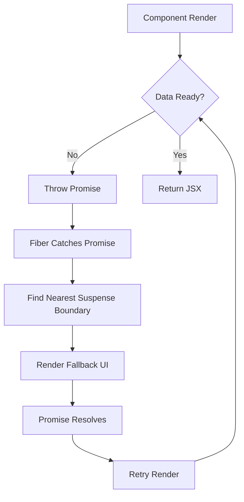

# React Suspense: Advanced Guide for Senior Developers

## 🎯 기술 개요 및 핵심 가치

### Why React Suspense Matters

React Suspense는 단순한 로딩 상태 관리를 넘어서 **선언적 비동기 UI**의 패러다임을 제시합니다. 기존의 명령형 로딩 상태 관리에서 벗어나 컴포넌트가 필요한 데이터를 "기다릴 수 있는" 능력을 제공하며, 이는 다음과 같은 비즈니스 임팩트를 창출합니다:

- **사용자 경험 향상**: 스무스한 로딩 시퀀스와 점진적 콘텐츠 렌더링
- **코드 복잡성 감소**: 로딩/에러 상태의 선언적 관리로 유지보수성 증대
- **성능 최적화**: 코드 스플리팅과 지연 로딩의 자연스러운 통합
- **SSR/스트리밍**: 서버 사이드 렌더링의 성능 혁신

### 기술의 진화

```timeline
React 16.6 (2018) → React.lazy + Suspense for Code Splitting
React 18 (2022)   → Concurrent Features + SSR Streaming
React 19 (2024)   → use() Hook + Enhanced Error Boundaries
Future            → Framework-agnostic Data Fetching API
```

### 핵심 문제 해결

**전통적인 문제점:**
```jsx
// 명령형 접근 - 복잡한 상태 관리
function UserProfile({ userId }) {
  const [user, setUser] = useState(null);
  const [loading, setLoading] = useState(true);
  const [error, setError] = useState(null);

  useEffect(() => {
    setLoading(true);
    fetchUser(userId)
      .then(setUser)
      .catch(setError)
      .finally(() => setLoading(false));
  }, [userId]);

  if (loading) return <Loading />;
  if (error) return <Error error={error} />;
  return <UserData user={user} />;
}
```

**Suspense 해결책:**
```jsx
// 선언형 접근 - 깔끔한 관심사 분리
function UserProfile({ userId }) {
  const user = use(fetchUser(userId)); // React 19+
  return <UserData user={user} />;
}

// 상위 레벨에서 로딩/에러 처리
<ErrorBoundary fallback={<Error />}>
  <Suspense fallback={<Loading />}>
    <UserProfile userId={userId} />
  </Suspense>
</ErrorBoundary>
```

### 경쟁 기술 비교

| 접근 방식 | 장점 | 단점 | 사용 사례 |
|----------|------|------|-----------|
| **React Suspense** | 선언적, 컴포지션 가능, SSR 통합 | 생태계 의존성, 러닝 커브 | 현대적 React 앱 |
| **SWR/React Query** | 캐싱, 재검증, 쉬운 도입 | 명령형 패턴, 상태 복잡성 | 기존 앱 점진적 개선 |
| **Vanilla useState** | 단순, 완전한 제어 | 보일러플레이트, 에러 처리 복잡 | 간단한 컴포넌트 |

## 🔬 내부 동작 원리 및 아키텍처

### Fiber 아키텍처와의 통합

React Suspense는 **Fiber 조정자(Reconciler)**의 핵심 기능으로 통합되어 있습니다.



### Promise Throwing Mechanism

**Legacy 방식 (여전히 지원):**
```jsx
function createResource(promise) {
  let status = 'pending';
  let result;
  let suspender = promise.then(
    (r) => {
      status = 'success';
      result = r;
    },
    (e) => {
      status = 'error';
      result = e;
    },
  );
  
  return {
    read() {
      if (status === 'pending') {
        throw suspender; // React가 이 Promise를 캐치
      } else if (status === 'error') {
        throw result;
      } else if (status === 'success') {
        return result;
      }
    },
  };
}
```

**Modern 방식 (React 19+):**
```jsx
import { use } from 'react';

function UserProfile({ userId }) {
  // use() 훅이 내부적으로 promise throwing 처리
  const user = use(fetchUser(userId));
  return <UserData user={user} />;
}
```

### Fiber Work Loop Integration

```javascript
// 단순화된 Fiber 작업 루프
function workLoop(deadline) {
  while (workInProgress && deadline.timeRemaining() > 0) {
    try {
      workInProgress = performUnitOfWork(workInProgress);
    } catch (thrownValue) {
      if (isPromise(thrownValue)) {
        // Suspense 처리
        handleSuspense(workInProgress, thrownValue);
      } else {
        // Error Boundary 처리
        handleError(workInProgress, thrownValue);
      }
    }
  }
}
```

### 메모리 및 성능 특성

**Time Complexity:**
- Suspense 바운더리 찾기: O(log n) - 트리 순회
- Promise 해결 후 재렌더링: O(n) - 영향받는 서브트리 크기

**Space Complexity:**
- 각 Suspense 바운더리당 추가 메모리: ~100-200 bytes
- Promise 캐싱: 애플리케이션 레벨에서 관리

**제약사항:**
- 서버 컴포넌트에서 클라이언트 컴포넌트로의 Promise 전달 불가
- useEffect 내부에서 던진 Promise는 Suspense로 캐치되지 않음

## 📚 고급 API 및 패턴

### 1. 중첩된 Suspense 바운더리

```jsx
function AppLayout() {
  return (
    <div>
      {/* 전체 페이지 로딩 */}
      <Suspense fallback={<PageSkeleton />}>
        <Header />
        
        {/* 개별 섹션 로딩 */}
        <main>
          <Suspense fallback={<UserSkeleton />}>
            <UserProfile />
          </Suspense>
          
          <Suspense fallback={<PostsSkeleton />}>
            <PostsList />
          </Suspense>
          
          <Suspense fallback={<CommentsSkeleton />}>
            <CommentsSection />
          </Suspense>
        </main>
        
        <Footer />
      </Suspense>
    </div>
  );
}
```

### 2. Concurrent Features 통합

```jsx
import { startTransition, useDeferredValue } from 'react';

function SearchResults({ query }) {
  const deferredQuery = useDeferredValue(query);
  
  return (
    <Suspense fallback={<SearchSkeleton />}>
      <SearchResultsList query={deferredQuery} />
    </Suspense>
  );
}

function SearchApp() {
  const [query, setQuery] = useState('');
  
  const handleSearch = (newQuery) => {
    startTransition(() => {
      setQuery(newQuery); // 낮은 우선순위 업데이트
    });
  };
  
  return (
    <div>
      <SearchInput onChange={handleSearch} />
      <SearchResults query={query} />
    </div>
  );
}
```

### 3. 조건부 Suspense

```jsx
function ConditionalSuspense({ children, condition, fallback }) {
  if (condition) {
    return <Suspense fallback={fallback}>{children}</Suspense>;
  }
  return children;
}

// 사용 예시
function UserDashboard({ user, isDataHeavy }) {
  return (
    <ConditionalSuspense 
      condition={isDataHeavy} 
      fallback={<DashboardSkeleton />}
    >
      <UserAnalytics user={user} />
    </ConditionalSuspense>
  );
}
```

### 4. Suspense with Error Recovery

```jsx
class SuspenseErrorBoundary extends Component {
  constructor(props) {
    super(props);
    this.state = { hasError: false, error: null };
  }

  static getDerivedStateFromError(error) {
    return { hasError: true, error };
  }

  componentDidCatch(error, errorInfo) {
    // 에러 로깅
    console.error('Suspense Error:', error, errorInfo);
  }

  render() {
    if (this.state.hasError) {
      return (
        <div>
          <h2>Something went wrong.</h2>
          <button onClick={() => this.setState({ hasError: false })}>
            Try Again
          </button>
        </div>
      );
    }

    return (
      <Suspense fallback={this.props.fallback}>
        {this.props.children}
      </Suspense>
    );
  }
}
```

## 🚀 실무 적용 및 최적화

### Production 환경 고려사항

**1. Bundle Size 최적화**
```jsx
// ❌ 잘못된 접근 - 모든 것을 lazy load
const Header = lazy(() => import('./Header'));
const Footer = lazy(() => import('./Footer'));

// ✅ 올바른 접근 - 의미있는 청크 단위
const AdminPanel = lazy(() => import('./admin/AdminPanel'));
const UserDashboard = lazy(() => import('./dashboard/UserDashboard'));
```

**2. 캐싱 전략**
```jsx
// 리소스 캐싱 구현
const resourceCache = new Map();

function createCachedResource(key, promiseFactory) {
  if (!resourceCache.has(key)) {
    const promise = promiseFactory();
    const resource = createResource(promise);
    resourceCache.set(key, resource);
  }
  return resourceCache.get(key);
}

function UserProfile({ userId }) {
  const user = createCachedResource(
    `user:${userId}`,
    () => fetchUser(userId)
  ).read();
  
  return <UserData user={user} />;
}
```

### SSR 스트리밍 최적화

```jsx
// Next.js App Router 예시
export default function Layout({ children }) {
  return (
    <html>
      <body>
        {/* 즉시 렌더링되는 부분 */}
        <Header />
        
        {/* 스트리밍되는 부분 */}
        <Suspense fallback={<MainSkeleton />}>
          {children}
        </Suspense>
        
        {/* 즉시 렌더링되는 부분 */}
        <Footer />
      </body>
    </html>
  );
}

// app/dashboard/page.js
export default function DashboardPage() {
  return (
    <div>
      <Suspense fallback={<UserProfileSkeleton />}>
        <UserProfile />
      </Suspense>
      
      <Suspense fallback={<ChartsSkeleton />}>
        <AnalyticsCharts />
      </Suspense>
    </div>
  );
}
```

### 성능 측정 및 모니터링

```jsx
// 성능 측정 훅
function useSuspenseMetrics(componentName) {
  const startTime = useRef();
  const [metrics, setMetrics] = useState(null);

  useLayoutEffect(() => {
    startTime.current = performance.now();
  }, []);

  useLayoutEffect(() => {
    if (startTime.current) {
      const loadTime = performance.now() - startTime.current;
      setMetrics({ componentName, loadTime });
      
      // 분석 도구로 전송
      analytics.track('suspense_load_time', {
        component: componentName,
        duration: loadTime,
      });
    }
  });

  return metrics;
}

function UserProfile({ userId }) {
  useSuspenseMetrics('UserProfile');
  const user = use(fetchUser(userId));
  return <UserData user={user} />;
}
```

## 🔧 실전 프로젝트 예제

### 완전한 데이터 페칭 시스템

```jsx
// types/api.ts
interface User {
  id: string;
  name: string;
  email: string;
  avatar: string;
}

interface Post {
  id: string;
  title: string;
  content: string;
  authorId: string;
  createdAt: string;
}

// utils/resource.ts
class ResourceManager {
  private cache = new Map<string, any>();
  private pendingRequests = new Map<string, Promise<any>>();

  async getResource<T>(
    key: string,
    fetcher: () => Promise<T>,
    ttl = 5000
  ): Promise<T> {
    const cached = this.cache.get(key);
    if (cached && Date.now() - cached.timestamp < ttl) {
      return cached.data;
    }

    if (!this.pendingRequests.has(key)) {
      this.pendingRequests.set(key, fetcher());
    }

    try {
      const data = await this.pendingRequests.get(key)!;
      this.cache.set(key, { data, timestamp: Date.now() });
      return data;
    } finally {
      this.pendingRequests.delete(key);
    }
  }

  invalidate(pattern: string) {
    for (const key of this.cache.keys()) {
      if (key.includes(pattern)) {
        this.cache.delete(key);
      }
    }
  }
}

const resourceManager = new ResourceManager();

// hooks/useResource.ts
function useResource<T>(key: string, fetcher: () => Promise<T>) {
  return use(resourceManager.getResource(key, fetcher));
}

// components/UserProfile.tsx
function UserProfile({ userId }: { userId: string }) {
  const user = useResource<User>(
    `user:${userId}`,
    () => fetch(`/api/users/${userId}`).then(r => r.json())
  );

  return (
    <div className="user-profile">
      
      <h2>{user.name}</h2>
      <p>{user.email}</p>
    </div>
  );
}

// components/UserPosts.tsx
function UserPosts({ userId }: { userId: string }) {
  const posts = useResource<Post[]>(
    `posts:user:${userId}`,
    () => fetch(`/api/users/${userId}/posts`).then(r => r.json())
  );

  return (
    <div className="user-posts">
      <h3>Recent Posts</h3>
      {posts.map(post => (
        <article key={post.id} className="post">
          <h4>{post.title}</h4>
          <p>{post.content.substring(0, 150)}...</p>
          <time>{new Date(post.createdAt).toLocaleDateString()}</time>
        </article>
      ))}
    </div>
  );
}

// components/UserDashboard.tsx
function UserDashboard({ userId }: { userId: string }) {
  return (
    <div className="dashboard">
      <Suspense fallback={<UserProfileSkeleton />}>
        <UserProfile userId={userId} />
      </Suspense>
      
      <Suspense fallback={<PostsSkeleton />}>
        <UserPosts userId={userId} />
      </Suspense>
      
      <Suspense fallback={<AnalyticsSkeleton />}>
        <UserAnalytics userId={userId} />
      </Suspense>
    </div>
  );
}

// components/App.tsx
function App() {
  const [userId, setUserId] = useState('1');

  return (
    <ErrorBoundary
      fallback={({ error, retry }) => (
        <div className="error-container">
          <h2>Something went wrong</h2>
          <p>{error.message}</p>
          <button onClick={retry}>Try Again</button>
        </div>
      )}
    >
      <div className="app">
        <nav>
          <button onClick={() => setUserId('1')}>User 1</button>
          <button onClick={() => setUserId('2')}>User 2</button>
        </nav>
        
        <main>
          <UserDashboard userId={userId} />
        </main>
      </div>
    </ErrorBoundary>
  );
}
```

### 테스트 전략

```jsx
// __tests__/UserProfile.test.tsx
import { render, screen, waitFor } from '@testing-library/react';
import { Suspense } from 'react';
import UserProfile from '../UserProfile';

// Mock fetch responses
const mockUser = {
  id: '1',
  name: 'John Doe',
  email: 'john@example.com',
  avatar: 'https://example.com/avatar.jpg'
};

beforeEach(() => {
  global.fetch = jest.fn(() =>
    Promise.resolve({
      json: () => Promise.resolve(mockUser),
    })
  ) as jest.MockedFunction<typeof fetch>;
});

describe('UserProfile with Suspense', () => {
  it('shows loading state initially', () => {
    render(
      <Suspense fallback={<div>Loading...</div>}>
        <UserProfile userId="1" />
      </Suspense>
    );

    expect(screen.getByText('Loading...')).toBeInTheDocument();
  });

  it('renders user data after loading', async () => {
    render(
      <Suspense fallback={<div>Loading...</div>}>
        <UserProfile userId="1" />
      </Suspense>
    );

    await waitFor(() => {
      expect(screen.getByText('John Doe')).toBeInTheDocument();
      expect(screen.getByText('john@example.com')).toBeInTheDocument();
    });
  });

  it('handles fetch errors gracefully', async () => {
    global.fetch = jest.fn(() => Promise.reject(new Error('API Error')));

    render(
      <ErrorBoundary fallback={<div>Error occurred</div>}>
        <Suspense fallback={<div>Loading...</div>}>
          <UserProfile userId="1" />
        </Suspense>
      </ErrorBoundary>
    );

    await waitFor(() => {
      expect(screen.getByText('Error occurred')).toBeInTheDocument();
    });
  });
});
```

## 🐛 트러블슈팅 및 문제 해결

### Common Pitfalls

**1. 무한 재렌더링**
```jsx
// ❌ 문제: 새로운 Promise가 매번 생성됨
function BadComponent() {
  const data = use(fetch('/api/data')); // 매 렌더마다 새 Promise
  return <div>{data.name}</div>;
}

// ✅ 해결책: Promise 캐싱
const dataPromise = fetch('/api/data').then(r => r.json());

function GoodComponent() {
  const data = use(dataPromise); // 캐시된 Promise 사용
  return <div>{data.name}</div>;
}
```

**2. Error Boundary 누락**
```jsx
// ❌ 문제: 에러가 상위로 버블링
function App() {
  return (
    <Suspense fallback={<Loading />}>
      <UserProfile userId="invalid" />
    </Suspense>
  );
}

// ✅ 해결책: Error Boundary 추가
function App() {
  return (
    <ErrorBoundary fallback={<ErrorMessage />}>
      <Suspense fallback={<Loading />}>
        <UserProfile userId="invalid" />
      </Suspense>
    </ErrorBoundary>
  );
}
```

### 성능 문제 해결

**1. 불필요한 Suspense 바운더리**
```jsx
// ❌ 과도한 세분화
function OverEngineered() {
  return (
    <div>
      <Suspense fallback={<span>Loading name...</span>}>
        <UserName />
      </Suspense>
      <Suspense fallback={<span>Loading email...</span>}>
        <UserEmail />
      </Suspense>
    </div>
  );
}

// ✅ 적절한 그룹화
function WellDesigned() {
  return (
    <Suspense fallback={<UserSkeleton />}>
      <div>
        <UserName />
        <UserEmail />
      </div>
    </Suspense>
  );
}
```

**2. 메모리 누수 방지**
```jsx
// 컴포넌트 언마운트 시 Promise 정리
function useCleanupResource<T>(
  key: string,
  fetcher: () => Promise<T>
) {
  const abortControllerRef = useRef<AbortController>();
  
  useEffect(() => {
    abortControllerRef.current = new AbortController();
    
    return () => {
      abortControllerRef.current?.abort();
    };
  }, []);

  const fetchWithCleanup = useCallback(() => {
    return fetcher().catch(error => {
      if (error.name === 'AbortError') {
        // 정상적인 취소, 무시
        return null;
      }
      throw error;
    });
  }, [fetcher]);

  return use(resourceManager.getResource(key, fetchWithCleanup));
}
```

### 디버깅 기법

**1. Suspense 상태 추적**
```jsx
function SuspenseDebugger({ children, name }: { 
  children: ReactNode; 
  name: string 
}) {
  const [isSuspended, setIsSuspended] = useState(false);

  return (
    <Suspense
      fallback={
        <div>
          {console.log(`${name} is suspended`)}
          {setIsSuspended(true)}
          <Loading />
        </div>
      }
    >
      {isSuspended && console.log(`${name} resumed`)}
      {setIsSuspended(false)}
      {children}
    </Suspense>
  );
}
```

**2. 성능 프로파일링**
```jsx
function useProfileSuspense(componentName: string) {
  useEffect(() => {
    const startTime = performance.now();
    console.log(`${componentName} started loading`);

    return () => {
      const endTime = performance.now();
      console.log(`${componentName} finished loading in ${endTime - startTime}ms`);
    };
  }, [componentName]);
}
```

## 🔮 미래 전망 및 발전 방향

### React 팀 로드맵

**단기 (2024-2025):**
- `use()` 훅 안정화 및 확산
- Server Components와의 더 깊은 통합
- 개발자 도구 개선

**중기 (2025-2026):**
- Framework-agnostic 데이터 페칭 API
- 더 정교한 캐싱 전략
- 네이티브 앱 지원 확대

**장기 (2026+):**
- WebAssembly 통합
- 멀티 쓰레드 렌더링
- AI 기반 성능 최적화

### 실험적 기능들

**1. Selective Hydration 개선**
```jsx
// 향후 예상되는 API
<Suspense 
  fallback={<Loading />}
  hydrationPriority="high"
  preloadStrategy="aggressive"
>
  <CriticalContent />
</Suspense>
```

**2. Cache API 통합**
```jsx
// Cache API와의 네이티브 통합
function UserProfile({ userId }) {
  const user = use(
    cache.match(`/api/users/${userId}`) || 
    fetch(`/api/users/${userId}`)
  );
  return <UserData user={user} />;
}
```

### 업계 동향

- **프레임워크 통합**: Next.js, Remix, Gatsby 등의 적극적 채택
- **상태 관리 라이브러리**: Zustand, Jotai 등의 Suspense 지원
- **테스팅 도구**: React Testing Library의 Suspense 테스트 개선

### 학습 경로

**기초 → 중급:**
1. React.lazy와 코드 스플리팅 마스터
2. Error Boundary 패턴 숙지
3. SSR과의 통합 이해

**중급 → 고급:**
1. Concurrent Features 심화 학습
2. 커스텀 Suspense 훅 개발
3. 성능 최적화 기법 습득

**고급 → 전문가:**
1. Fiber 아키텍처 깊이 있는 이해
2. 프레임워크 개발자 관점 습득
3. 오픈소스 기여 및 RFC 참여

---

> **참고 자료**
> - [React 공식 문서 - Suspense](https://react.dev/reference/react/Suspense)
> - [React 18 Working Group Discussions](https://github.com/reactwg/react-18)
> - [React Fiber Architecture](https://github.com/acdlite/react-fiber-architecture)
> - [Suspense for Data Fetching RFC](https://github.com/reactjs/rfcs/blob/main/text/0213-suspense-in-react-18.md)

**최종 업데이트**: 2024년 12월 기준  
**호환 버전**: React 18+, Next.js 13+, TypeScript 4.5+