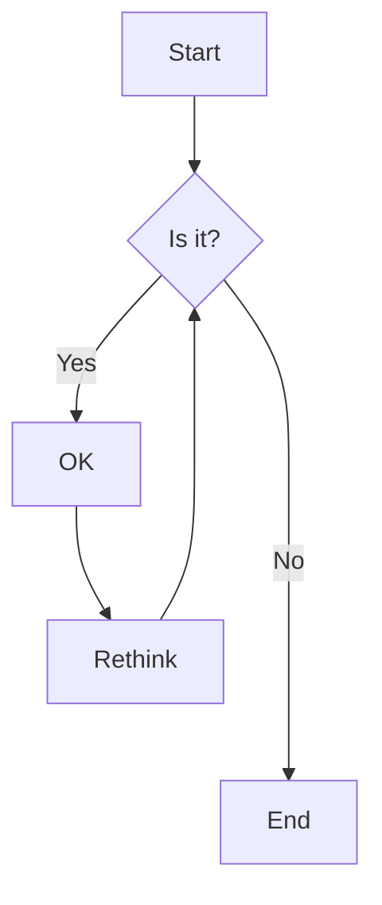
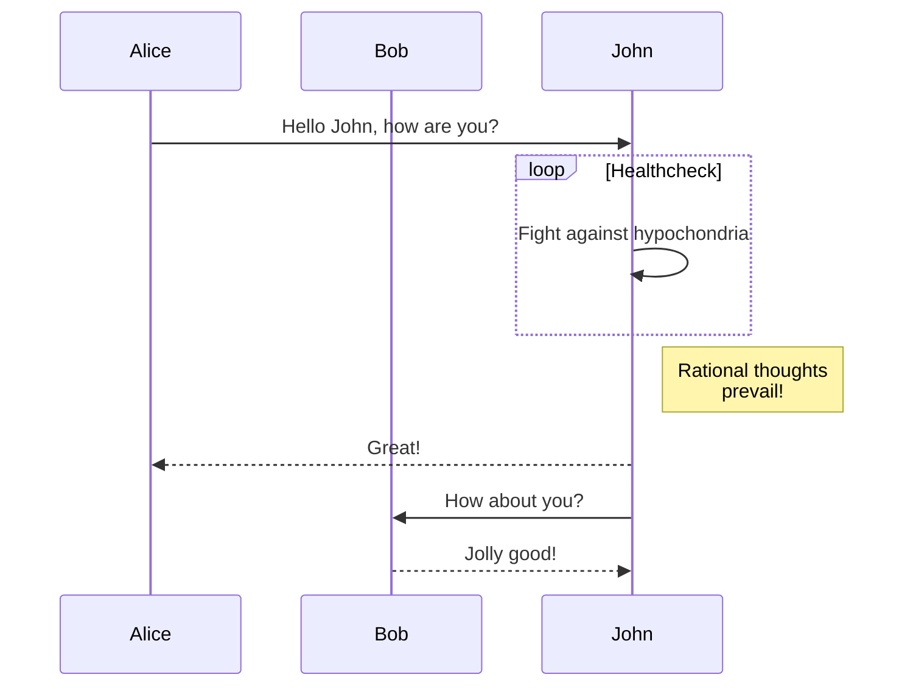
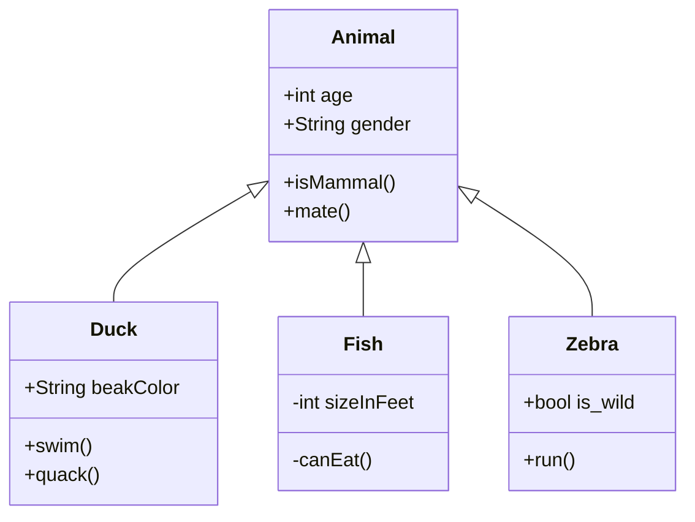

# Mermaid 테스트

이 페이지는 Mermaid 다이어그램이 정상적으로 렌더링되는지 테스트하기 위한 페이지입니다.

## 플로우차트 예제



## 시퀀스 다이어그램 예제



## 클래스 다이어그램 예제



## Git 그래프 예제

```mermaid
gitgraph
    commit
    commit
    branch develop
    checkout develop
    commit
    commit
    checkout main
    merge develop
    commit
    commit
```